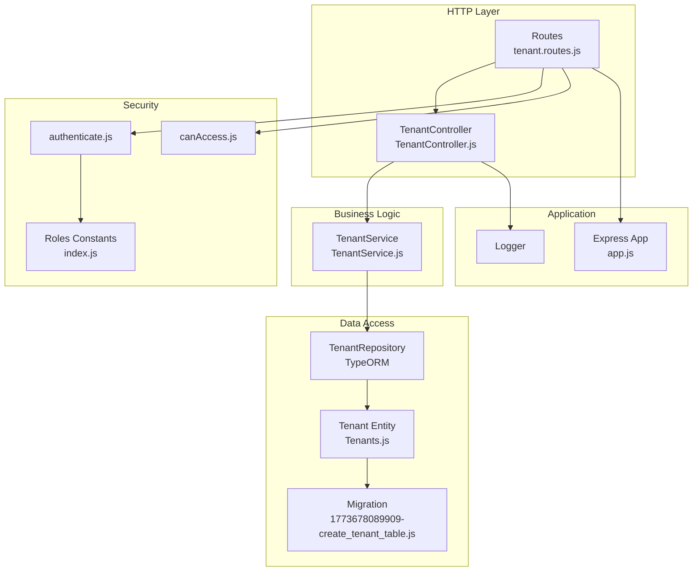
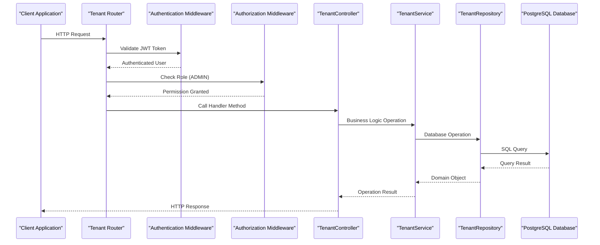
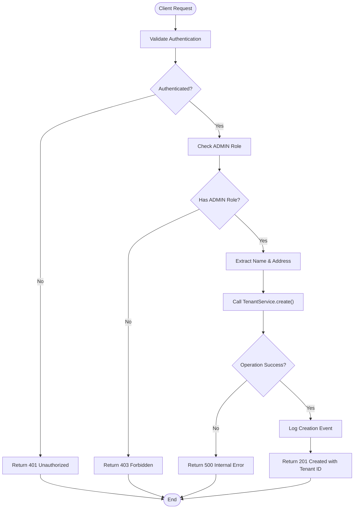
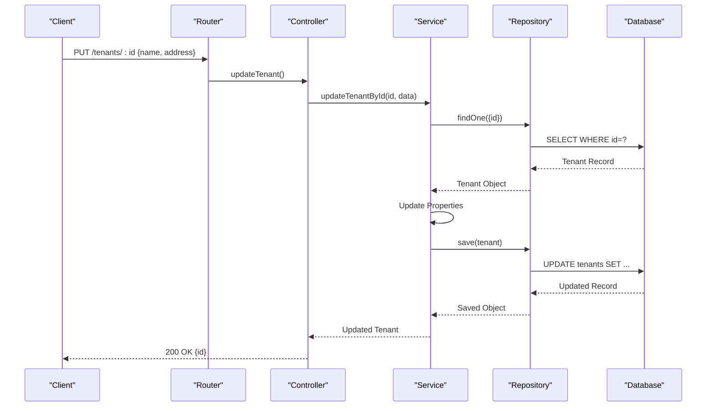
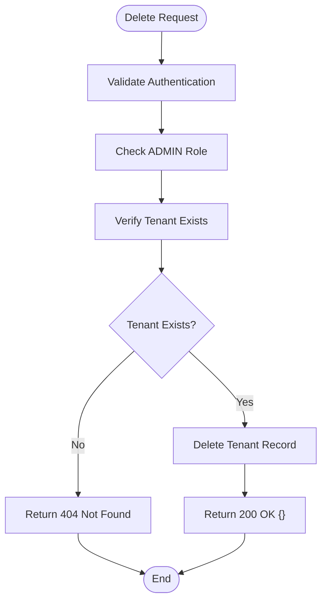
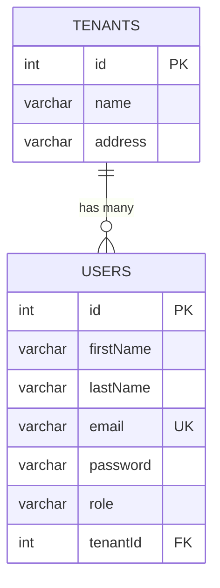
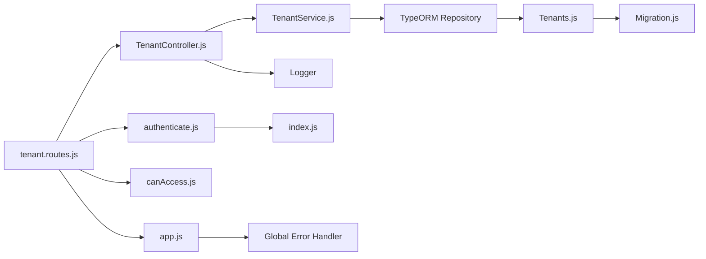

# Tenant Management Operations

<cite>
**Referenced Files in This Document**
- [TenantController.js](file://src/controllers/TenantController.js)
- [TenantService.js](file://src/services/TenantService.js)
- [tenant.routes.js](file://src/routes/tenant.routes.js)
- [Tenants.js](file://src/entity/Tenants.js)
- [1773678089909-create_tenant_table.js](file://src/migration/1773678089909-create_tenant_table.js)
- [authenticate.js](file://src/middleware/authenticate.js)
- [canAccess.js](file://src/middleware/canAccess.js)
- [index.js](file://src/constants/index.js)
- [app.js](file://src/app.js)
- [create.spec.js](file://src/test/tenant/create.spec.js)
- [User.js](file://src/entity/User.js)
</cite>

## Table of Contents
1. [Introduction](#introduction)
2. [Project Structure](#project-structure)
3. [Core Components](#core-components)
4. [Architecture Overview](#architecture-overview)
5. [Detailed Component Analysis](#detailed-component-analysis)
6. [Dependency Analysis](#dependency-analysis)
7. [Performance Considerations](#performance-considerations)
8. [Troubleshooting Guide](#troubleshooting-guide)
9. [Conclusion](#conclusion)

## Introduction
This document provides comprehensive coverage of tenant management operations within the authentication service. It documents the complete tenant lifecycle including creation, retrieval, updates, and deletion operations. The documentation explains the controller implementation with request validation, service layer integration, and response handling. It details the tenant service methods for business logic implementation including validation rules and error handling. The routing configuration and endpoint specifications are included along with practical examples of tenant creation requests, update operations, and query patterns. Error scenarios, status codes, and response formats are addressed alongside tenant ID generation, uniqueness constraints, and data validation requirements.

## Project Structure
The tenant management functionality is organized across several key modules:
- Controllers handle HTTP requests and responses
- Services encapsulate business logic and data operations
- Routes define endpoint mappings and middleware
- Entities define database schema and relationships
- Migrations manage database schema evolution
- Middleware enforces authentication and authorization
- Tests validate behavior and error conditions



**Diagram sources**
- [tenant.routes.js:1-45](file://src/routes/tenant.routes.js#L1-L45)
- [TenantController.js:1-76](file://src/controllers/TenantController.js#L1-L76)
- [TenantService.js:1-66](file://src/services/TenantService.js#L1-L66)
- [Tenants.js:1-29](file://src/entity/Tenants.js#L1-L29)
- [1773678089909-create_tenant_table.js:1-31](file://src/migration/1773678089909-create_tenant_table.js#L1-L31)
- [authenticate.js:1-26](file://src/middleware/authenticate.js#L1-L26)
- [canAccess.js:1-23](file://src/middleware/canAccess.js#L1-L23)
- [index.js:1-6](file://src/constants/index.js#L1-L6)
- [app.js:1-40](file://src/app.js#L1-L40)

**Section sources**
- [tenant.routes.js:1-45](file://src/routes/tenant.routes.js#L1-L45)
- [TenantController.js:1-76](file://src/controllers/TenantController.js#L1-L76)
- [TenantService.js:1-66](file://src/services/TenantService.js#L1-L66)
- [Tenants.js:1-29](file://src/entity/Tenants.js#L1-L29)
- [1773678089909-create_tenant_table.js:1-31](file://src/migration/1773678089909-create_tenant_table.js#L1-L31)
- [authenticate.js:1-26](file://src/middleware/authenticate.js#L1-L26)
- [canAccess.js:1-23](file://src/middleware/canAccess.js#L1-L23)
- [index.js:1-6](file://src/constants/index.js#L1-L6)
- [app.js:1-40](file://src/app.js#L1-L40)

## Core Components
The tenant management system consists of four primary components:

### TenantController
The controller handles HTTP requests and responses for tenant operations. It implements five main methods:
- POST `/tenants`: Creates new tenants
- GET `/tenants`: Retrieves all tenants
- GET `/tenants/:id`: Retrieves a specific tenant by ID
- POST `/tenants/:id`: Updates an existing tenant
- DELETE `/tenants/:id`: Deletes a tenant

Each method follows a consistent pattern of extracting data from requests, delegating to the service layer, and returning appropriate HTTP responses with status codes and JSON payloads.

### TenantService
The service layer implements business logic and data operations:
- `create()`: Validates input and saves new tenant records
- `getAllTenants()`: Retrieves all tenant records
- `getTenantById()`: Fetches a specific tenant by ID
- `updateTenantById()`: Updates existing tenant data
- `deleteTenantById()`: Removes tenant records with proper validation

The service handles database operations through TypeORM repositories and implements comprehensive error handling using HTTP error objects.

### Tenant Entity
The tenant entity defines the database schema with automatic ID generation:
- `id`: Auto-incrementing primary key
- `name`: String field with 100-character limit
- `address`: String field with 255-character limit
- Bidirectional relationship with User entity

### Routing Configuration
The routing module defines endpoint specifications and applies security middleware:
- Authentication middleware validates JWT tokens
- Authorization middleware restricts access to ADMIN role only
- Route handlers delegate to controller methods

**Section sources**
- [TenantController.js:11-76](file://src/controllers/TenantController.js#L11-L76)
- [TenantService.js:7-66](file://src/services/TenantService.js#L7-L66)
- [Tenants.js:3-29](file://src/entity/Tenants.js#L3-L29)
- [tenant.routes.js:16-42](file://src/routes/tenant.routes.js#L16-L42)

## Architecture Overview
The tenant management architecture follows a layered pattern with clear separation of concerns:



**Diagram sources**
- [tenant.routes.js:16-42](file://src/routes/tenant.routes.js#L16-L42)
- [authenticate.js:6-25](file://src/middleware/authenticate.js#L6-L25)
- [canAccess.js:4-22](file://src/middleware/canAccess.js#L4-L22)
- [TenantController.js:11-76](file://src/controllers/TenantController.js#L11-L76)
- [TenantService.js:7-66](file://src/services/TenantService.js#L7-L66)

The architecture ensures:
- Security through JWT authentication and role-based authorization
- Clean separation between HTTP handling and business logic
- Database abstraction through TypeORM repositories
- Comprehensive error handling and logging

## Detailed Component Analysis

### Tenant Creation Workflow
The tenant creation process involves multiple validation steps and follows a structured flow:



**Diagram sources**
- [tenant.routes.js:16-21](file://src/routes/tenant.routes.js#L16-L21)
- [authenticate.js:6-25](file://src/middleware/authenticate.js#L6-L25)
- [canAccess.js:4-22](file://src/middleware/canAccess.js#L4-L22)
- [TenantController.js:11-22](file://src/controllers/TenantController.js#L11-L22)
- [TenantService.js:7-14](file://src/services/TenantService.js#L7-L14)

### Tenant Retrieval Operations
The system supports multiple retrieval patterns:

#### Get All Tenants
- Endpoint: `GET /tenants`
- No authentication required
- Returns array of tenant objects with minimal information
- Response format: `{ tenants: [{ id }, ...] }`

#### Get Specific Tenant
- Endpoint: `GET /tenants/:id`
- Requires ADMIN role
- Returns tenant ID if found
- Handles 404 Not Found for missing tenants

### Tenant Update Operations
The update process maintains data integrity:



**Diagram sources**
- [tenant.routes.js:30-35](file://src/routes/tenant.routes.js#L30-L35)
- [TenantController.js:50-63](file://src/controllers/TenantController.js#L50-L63)
- [TenantService.js:34-50](file://src/services/TenantService.js#L34-L50)

### Tenant Deletion Operations
Deletion requires verification of tenant existence:



**Diagram sources**
- [tenant.routes.js:37-42](file://src/routes/tenant.routes.js#L37-L42)
- [TenantController.js:65-74](file://src/controllers/TenantController.js#L65-L74)
- [TenantService.js:52-64](file://src/services/TenantService.js#L52-L64)

**Section sources**
- [tenant.routes.js:16-42](file://src/routes/tenant.routes.js#L16-L42)
- [TenantController.js:11-76](file://src/controllers/TenantController.js#L11-L76)
- [TenantService.js:7-66](file://src/services/TenantService.js#L7-L66)

### Data Model and Schema
The tenant entity defines the database structure with automatic ID generation:



**Diagram sources**
- [Tenants.js:3-29](file://src/entity/Tenants.js#L3-L29)
- [User.js:3-50](file://src/entity/User.js#L3-L50)

Key schema characteristics:
- Auto-incrementing integer primary key (`id`)
- String fields with length constraints (name: 100 chars, address: 255 chars)
- One-to-many relationship with User entity
- Foreign key constraint linking users to tenants

**Section sources**
- [Tenants.js:3-29](file://src/entity/Tenants.js#L3-L29)
- [User.js:3-50](file://src/entity/User.js#L3-L50)
- [1773678089909-create_tenant_table.js:16-19](file://src/migration/1773678089909-create_tenant_table.js#L16-L19)

### Security and Authorization
The system implements robust security measures:

#### Authentication
- JWT-based authentication using RS256 algorithm
- JWKS URI configuration for public key validation
- Support for both Authorization header and cookie-based tokens
- Token caching and rate limiting for performance

#### Authorization
- Role-based access control (RBAC)
- ADMIN role required for tenant creation, updates, and deletions
- Manager role insufficient for tenant management operations
- Centralized role validation middleware

**Section sources**
- [authenticate.js:6-25](file://src/middleware/authenticate.js#L6-L25)
- [canAccess.js:4-22](file://src/middleware/canAccess.js#L4-L22)
- [index.js:1-6](file://src/constants/index.js#L1-L6)

### Error Handling and Validation
The system implements comprehensive error handling:

#### HTTP Status Codes
- 200: Successful operations (GET, PUT, DELETE)
- 201: Successful creation
- 401: Authentication required
- 403: Insufficient permissions
- 404: Resource not found
- 500: Internal server errors

#### Error Response Format
All errors return standardized JSON format:
```json
{
  "errors": [
    {
      "type": "ErrorName",
      "msg": "Error message",
      "path": "",
      "location": ""
    }
  ]
}
```

#### Validation Rules
- Tenant creation requires ADMIN role
- Update and delete operations require ADMIN role
- Tenant ID must be a valid integer
- Database constraints enforce data integrity

**Section sources**
- [TenantController.js:38-42](file://src/controllers/TenantController.js#L38-L42)
- [TenantService.js:56-58](file://src/services/TenantService.js#L56-L58)
- [app.js:24-37](file://src/app.js#L24-L37)

## Dependency Analysis
The tenant management system exhibits clean dependency relationships:



**Diagram sources**
- [tenant.routes.js:1-45](file://src/routes/tenant.routes.js#L1-L45)
- [TenantController.js:1-9](file://src/controllers/TenantController.js#L1-L9)
- [TenantService.js:1-6](file://src/services/TenantService.js#L1-L6)
- [Tenants.js:1-29](file://src/entity/Tenants.js#L1-L29)
- [authenticate.js:1-26](file://src/middleware/authenticate.js#L1-L26)
- [canAccess.js:1-23](file://src/middleware/canAccess.js#L1-L23)
- [index.js:1-6](file://src/constants/index.js#L1-L6)
- [app.js:24-37](file://src/app.js#L24-L37)

Key dependency characteristics:
- Loose coupling between components through dependency injection
- Clear separation of concerns with single responsibility principle
- Minimal circular dependencies
- External dependencies managed through npm packages

**Section sources**
- [tenant.routes.js:1-45](file://src/routes/tenant.routes.js#L1-L45)
- [TenantController.js:1-9](file://src/controllers/TenantController.js#L1-L9)
- [TenantService.js:1-6](file://src/services/TenantService.js#L1-L6)

## Performance Considerations
The tenant management system incorporates several performance optimizations:

### Database Design
- Auto-incrementing integer primary keys for optimal indexing
- Appropriate VARCHAR lengths to minimize storage overhead
- Foreign key constraints for referential integrity
- One-to-many relationship optimized for tenant-user queries

### Caching Strategy
- JWT token caching reduces signature verification overhead
- Rate limiting prevents abuse and protects server resources
- Connection pooling through TypeORM for efficient database access

### Request Processing
- Minimal payload processing for GET operations
- Efficient JSON serialization for response bodies
- Early validation reduces unnecessary database calls

## Troubleshooting Guide

### Common Issues and Solutions

#### Authentication Problems
**Symptoms**: 401 Unauthorized responses
**Causes**: Missing or invalid JWT tokens
**Solutions**: 
- Verify Authorization header format: `Bearer <token>`
- Check cookie-based tokens if using cookie authentication
- Validate JWKS URI configuration

#### Authorization Problems  
**Symptoms**: 403 Forbidden responses
**Causes**: Non-ADMIN role attempting tenant operations
**Solutions**:
- Ensure user has ADMIN role in JWT claims
- Verify role extraction from authentication token
- Check role-based middleware configuration

#### Data Validation Errors
**Symptoms**: 500 Internal Server Errors
**Causes**: Database constraint violations or service failures
**Solutions**:
- Verify tenant data meets schema requirements
- Check database connectivity and migrations
- Review service layer error handling

#### Endpoint Access Issues
**Symptoms**: 404 Not Found for tenant endpoints
**Causes**: Incorrect URL patterns or missing route registration
**Solutions**:
- Verify endpoint URLs match route definitions
- Check Express app route mounting
- Confirm tenant router is properly exported

**Section sources**
- [tenant.routes.js:16-42](file://src/routes/tenant.routes.js#L16-L42)
- [authenticate.js:6-25](file://src/middleware/authenticate.js#L6-L25)
- [canAccess.js:4-22](file://src/middleware/canAccess.js#L4-L22)
- [app.js:24-37](file://src/app.js#L24-L37)

## Conclusion
The tenant management system provides a comprehensive solution for multi-tenant operations with strong security, clear separation of concerns, and robust error handling. The implementation follows RESTful principles with proper HTTP status codes and standardized error responses. The layered architecture ensures maintainability and extensibility while the security middleware provides defense-in-depth protection. The system demonstrates best practices in API design, database modeling, and error handling that serve as a foundation for scalable tenant management functionality.