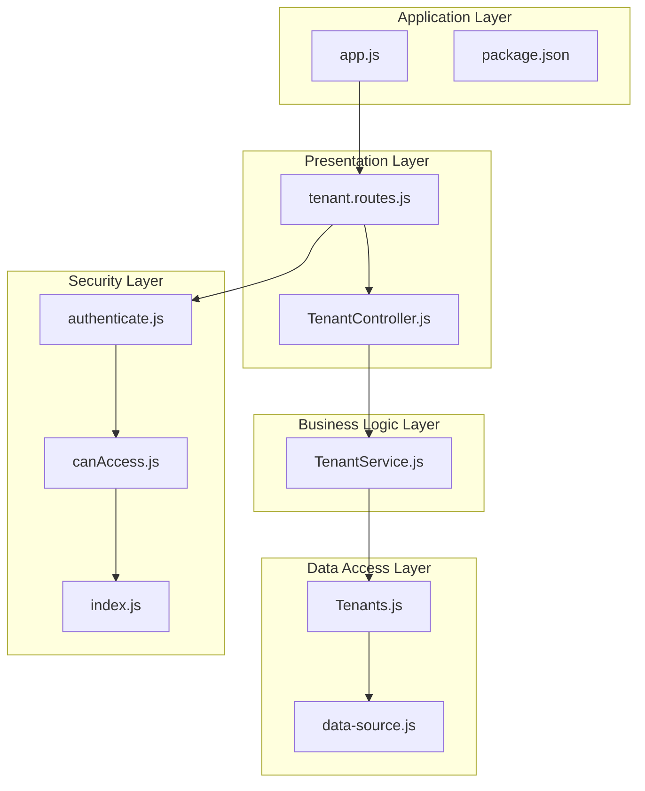
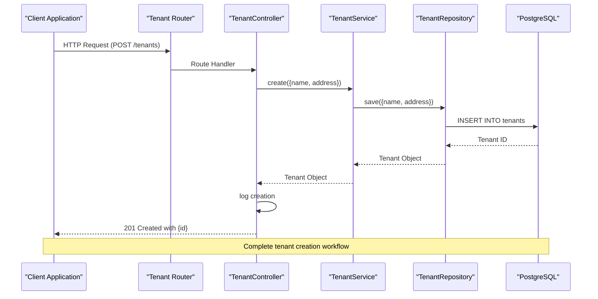
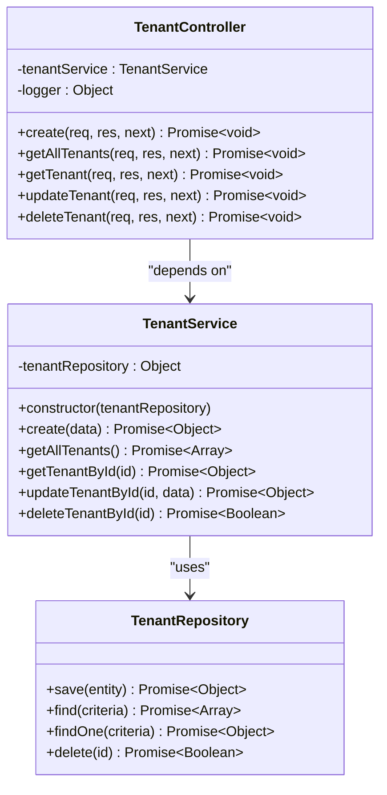
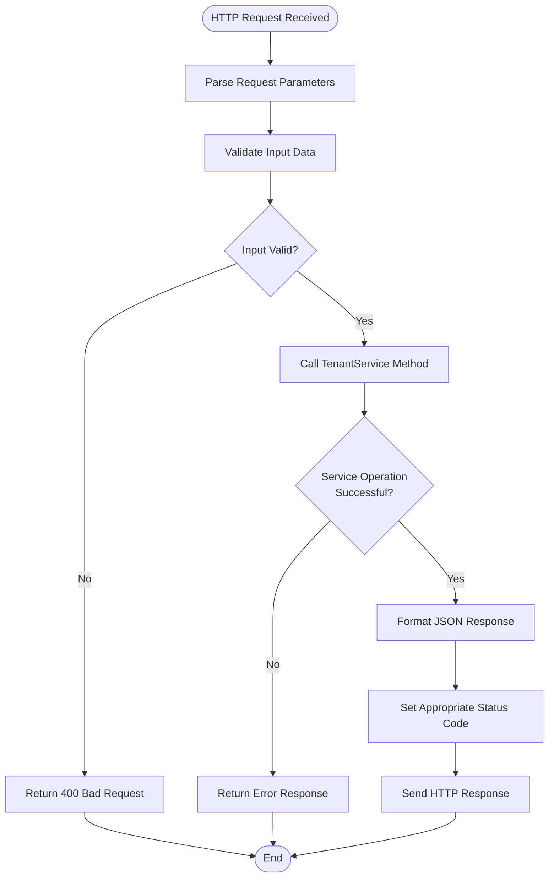
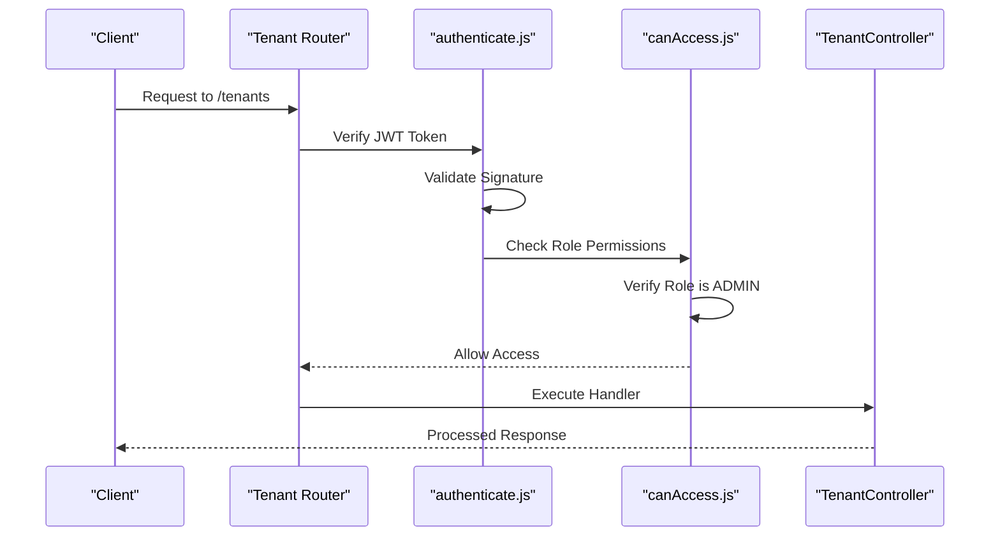
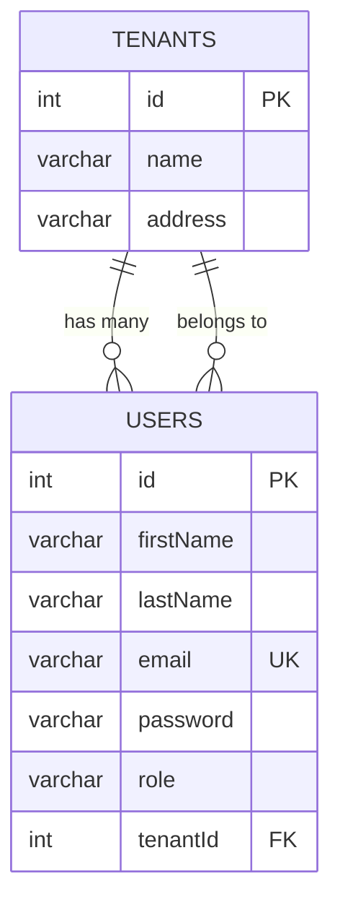
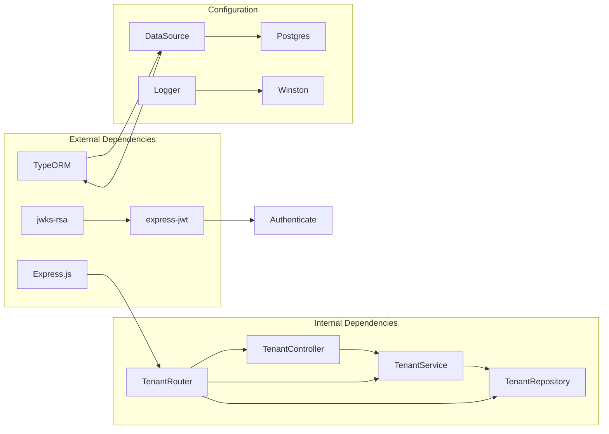

# Tenant Service Layer

<cite>
**Referenced Files in This Document**
- [TenantService.js](file://src/services/TenantService.js)
- [TenantController.js](file://src/controllers/TenantController.js)
- [Tenants.js](file://src/entity/Tenants.js)
- [tenant.routes.js](file://src/routes/tenant.routes.js)
- [data-source.js](file://src/config/data-source.js)
- [authenticate.js](file://src/middleware/authenticate.js)
- [canAccess.js](file://src/middleware/canAccess.js)
- [index.js](file://src/constants/index.js)
- [User.js](file://src/entity/User.js)
- [app.js](file://src/app.js)
- [create.spec.js](file://src/test/tenant/create.spec.js)
- [package.json](file://package.json)
</cite>

## Table of Contents
1. [Introduction](#introduction)
2. [Project Structure](#project-structure)
3. [Core Components](#core-components)
4. [Architecture Overview](#architecture-overview)
5. [Detailed Component Analysis](#detailed-component-analysis)
6. [Dependency Analysis](#dependency-analysis)
7. [Performance Considerations](#performance-considerations)
8. [Troubleshooting Guide](#troubleshooting-guide)
9. [Conclusion](#conclusion)

## Introduction

The Tenant Service Layer is a critical component of the authentication service that manages tenant-related operations in a multi-tenant architecture. This layer provides comprehensive CRUD (Create, Read, Update, Delete) functionality for tenant entities while maintaining strict security controls and proper separation of concerns between business logic, data access, and presentation layers.

The service follows modern Node.js development practices with clean architecture principles, dependency injection, and robust error handling mechanisms. It integrates seamlessly with the broader authentication service ecosystem while providing specialized tenant management capabilities.

## Project Structure

The tenant service layer is organized following a layered architecture pattern with clear separation between presentation, business logic, data access, and configuration layers:

**Diagram sources**
- [tenant.routes.js:1-45](file://src/routes/tenant.routes.js#L1-L45)
- [TenantController.js:1-76](file://src/controllers/TenantController.js#L1-L76)
- [TenantService.js:1-66](file://src/services/TenantService.js#L1-L66)
- [Tenants.js:1-29](file://src/entity/Tenants.js#L1-L29)
- [data-source.js:1-22](file://src/config/data-source.js#L1-L22)

**Section sources**
- [tenant.routes.js:1-45](file://src/routes/tenant.routes.js#L1-L45)
- [TenantController.js:1-76](file://src/controllers/TenantController.js#L1-L76)
- [TenantService.js:1-66](file://src/services/TenantService.js#L1-L66)

## Core Components

### Tenant Service Implementation

The TenantService class serves as the central business logic component responsible for all tenant-related operations. It implements a clean interface with comprehensive error handling and follows the repository pattern for data access abstraction.

Key characteristics:
- **Constructor Injection**: Accepts a tenantRepository dependency for loose coupling
- **Async/Await Pattern**: Uses modern asynchronous programming for optimal performance
- **Comprehensive CRUD Operations**: Supports create, read, update, and delete operations
- **Error Handling**: Implements centralized error handling with HTTP error codes
- **Data Validation**: Validates input parameters before processing requests

### Tenant Controller Layer

The TenantController handles HTTP request/response cycles and acts as an intermediary between the routing layer and business logic. It focuses on request parsing, response formatting, and error propagation.

Primary responsibilities:
- **Request Parameter Extraction**: Parses and validates request parameters
- **Response Formatting**: Structured JSON responses with appropriate HTTP status codes
- **Error Propagation**: Passes errors to Express error handling middleware
- **Logging Integration**: Provides audit trail through structured logging

### Tenant Entity Model

The Tenant entity defines the data structure and relationships for tenant records in the PostgreSQL database. It establishes bidirectional relationships with the User entity for proper multi-tenancy support.

**Section sources**
- [TenantService.js:1-66](file://src/services/TenantService.js#L1-L66)
- [TenantController.js:1-76](file://src/controllers/TenantController.js#L1-L76)
- [Tenants.js:1-29](file://src/entity/Tenants.js#L1-L29)

## Architecture Overview

The tenant service layer implements a layered architecture that promotes separation of concerns and maintainability:

**Diagram sources**
- [tenant.routes.js:16-21](file://src/routes/tenant.routes.js#L16-L21)
- [TenantController.js:11-22](file://src/controllers/TenantController.js#L11-L22)
- [TenantService.js:7-14](file://src/services/TenantService.js#L7-L14)

The architecture enforces several key principles:
- **Single Responsibility**: Each layer has distinct responsibilities
- **Dependency Inversion**: Higher-level modules don't depend on lower-level modules
- **Interface Segregation**: Clear boundaries between components
- **Open/Closed Principle**: Extensible without modification

**Section sources**
- [tenant.routes.js:1-45](file://src/routes/tenant.routes.js#L1-L45)
- [app.js:1-40](file://src/app.js#L1-L40)

## Detailed Component Analysis

### Tenant Service Layer Analysis

The TenantService implements comprehensive business logic with robust error handling and transaction management capabilities:

**Diagram sources**
- [TenantService.js:3-65](file://src/services/TenantService.js#L3-L65)
- [TenantController.js:3-75](file://src/controllers/TenantController.js#L3-L75)

#### Service Method Analysis

Each service method follows a consistent pattern:
1. **Input Validation**: Validates and sanitizes input parameters
2. **Business Logic Execution**: Performs required business operations
3. **Error Handling**: Catches and transforms exceptions
4. **Return Value**: Provides structured response data

#### Error Handling Strategy

The service implements centralized error handling with HTTP status codes:
- **500 Errors**: Internal server errors during operation execution
- **404 Errors**: Resource not found scenarios
- **403 Errors**: Authorization failures for protected routes

**Section sources**
- [TenantService.js:1-66](file://src/services/TenantService.js#L1-L66)

### Tenant Controller Analysis

The controller layer provides HTTP endpoint handlers with proper request/response management:

**Diagram sources**
- [TenantController.js:11-75](file://src/controllers/TenantController.js#L11-L75)

#### Controller Responsibilities

The controller handles:
- **Request Parsing**: Extracts parameters from request objects
- **Response Formatting**: Structures data for client consumption
- **Status Code Management**: Applies appropriate HTTP status codes
- **Error Forwarding**: Passes exceptions to global error handler

**Section sources**
- [TenantController.js:1-76](file://src/controllers/TenantController.js#L1-L76)

### Security and Authentication Integration

The tenant service layer integrates with comprehensive security mechanisms:

**Diagram sources**
- [tenant.routes.js:16-21](file://src/routes/tenant.routes.js#L16-L21)
- [authenticate.js:1-26](file://src/middleware/authenticate.js#L1-L26)
- [canAccess.js:1-23](file://src/middleware/canAccess.js#L1-L23)

#### Security Features

- **JWT Authentication**: Validates access tokens using JWKS
- **Role-Based Access Control**: Restricts operations to ADMIN users
- **Token Validation**: Verifies token signatures and expiration
- **Cookie Support**: Handles access tokens from cookies

**Section sources**
- [tenant.routes.js:1-45](file://src/routes/tenant.routes.js#L1-L45)
- [authenticate.js:1-26](file://src/middleware/authenticate.js#L1-L26)
- [canAccess.js:1-23](file://src/middleware/canAccess.js#L1-L23)

### Database Integration and Entity Relationships

The tenant service integrates with PostgreSQL through TypeORM entity definitions:

**Diagram sources**
- [Tenants.js:3-28](file://src/entity/Tenants.js#L3-L28)
- [User.js:3-49](file://src/entity/User.js#L3-L49)

#### Database Schema Design

The entity model supports:
- **Auto-incrementing Primary Keys**: Ensures unique tenant identification
- **String Length Constraints**: Prevents data overflow issues
- **Foreign Key Relationships**: Links users to their respective tenants
- **Nullable Tenant References**: Allows user registration without tenant assignment

**Section sources**
- [Tenants.js:1-29](file://src/entity/Tenants.js#L1-L29)
- [User.js:1-50](file://src/entity/User.js#L1-L50)

## Dependency Analysis

The tenant service layer exhibits excellent dependency management with clear inversion of control:

**Diagram sources**
- [package.json:31-48](file://package.json#L31-L48)
- [tenant.routes.js:1-45](file://src/routes/tenant.routes.js#L1-L45)

### Dependency Injection Pattern

The service implements dependency injection for testability and flexibility:
- **Constructor Injection**: Dependencies passed through constructor
- **Repository Pattern**: Abstracts data access logic
- **Interface Abstraction**: Enables mocking and testing
- **Configuration Management**: Centralized dependency configuration

### Circular Dependency Prevention

The architecture avoids circular dependencies through:
- **Layered Architecture**: Clear separation of concerns
- **Dependency Direction**: Unidirectional dependency flow
- **Interface Contracts**: Loose coupling through interfaces
- **Factory Functions**: Controlled instantiation of dependencies

**Section sources**
- [package.json:1-49](file://package.json#L1-L49)
- [data-source.js:1-22](file://src/config/data-source.js#L1-L22)

## Performance Considerations

The tenant service layer incorporates several performance optimization strategies:

### Database Performance
- **Connection Pooling**: TypeORM manages efficient database connections
- **Query Optimization**: Minimal queries for tenant operations
- **Indexing Strategy**: Primary key indexing for fast lookups
- **Transaction Management**: Proper transaction boundaries for data consistency

### Memory Management
- **Object Lifecycle**: Proper cleanup of repository instances
- **Error Handling**: Prevents memory leaks through proper exception handling
- **Resource Cleanup**: Automatic resource deallocation on service shutdown

### Network Performance
- **JWT Caching**: JWKS caching reduces token verification overhead
- **Middleware Efficiency**: Lightweight authentication and authorization checks
- **Response Optimization**: Minimal payload sizes for tenant operations

## Troubleshooting Guide

### Common Issues and Solutions

#### Authentication Failures
**Symptoms**: 401 Unauthorized responses when accessing tenant endpoints
**Causes**: Invalid or missing access tokens
**Solutions**:
- Verify JWT token validity and expiration
- Check token signature against JWKS
- Ensure proper token format (Bearer token or cookie)

#### Authorization Errors  
**Symptoms**: 403 Forbidden responses for tenant operations
**Causes**: Non-admin user attempting privileged operations
**Solutions**:
- Verify user role in JWT claims
- Ensure ADMIN role assignment
- Check JWT issuer and audience claims

#### Database Connection Issues
**Symptoms**: 500 errors during tenant operations
**Causes**: Database connectivity or configuration problems
**Solutions**:
- Verify PostgreSQL server availability
- Check database credentials and connection string
- Review TypeORM configuration settings

#### Data Validation Errors
**Symptoms**: 400 Bad Request responses
**Causes**: Invalid tenant data format
**Solutions**:
- Validate tenant name and address constraints
- Check for null or empty values
- Ensure proper data types for all fields

**Section sources**
- [TenantController.js:18-21](file://src/controllers/TenantController.js#L18-L21)
- [TenantService.js:10-13](file://src/services/TenantService.js#L10-L13)

## Conclusion

The Tenant Service Layer represents a well-architected solution for multi-tenant management within the authentication service. It demonstrates excellent software engineering practices through:

**Architectural Excellence**:
- Clean separation of concerns across multiple layers
- Dependency injection enabling testability and flexibility
- Comprehensive error handling and logging
- Robust security integration with JWT and RBAC

**Technical Implementation**:
- Modern JavaScript ES modules with proper module exports
- TypeORM integration for database abstraction
- Express.js routing with middleware composition
- Comprehensive test coverage with Jest framework

**Operational Benefits**:
- Scalable architecture supporting multiple tenants
- Secure access control preventing unauthorized operations
- Efficient database operations with proper indexing
- Comprehensive monitoring and logging capabilities

The service layer provides a solid foundation for extending multi-tenant functionality while maintaining code quality, security, and performance standards. Its modular design enables easy maintenance and future enhancements without compromising existing functionality.