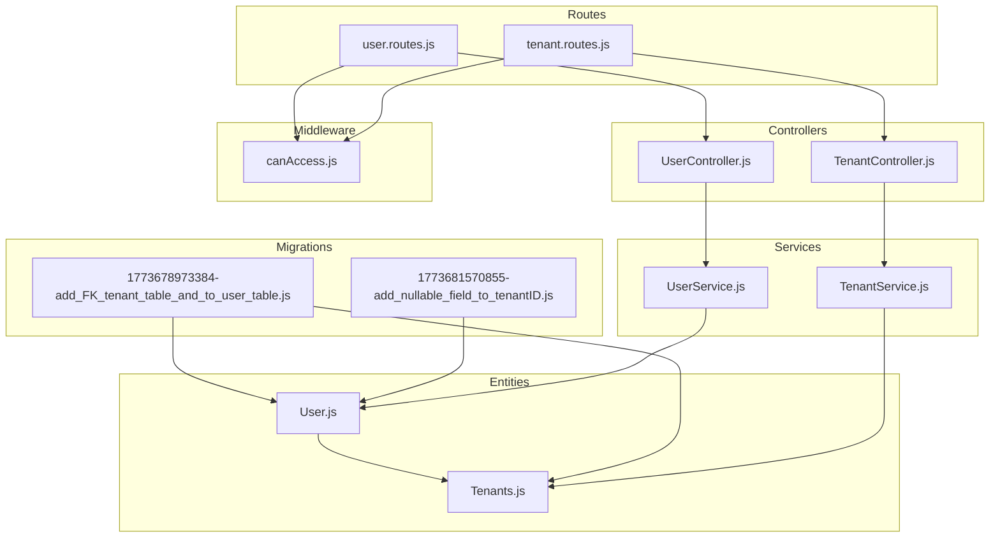
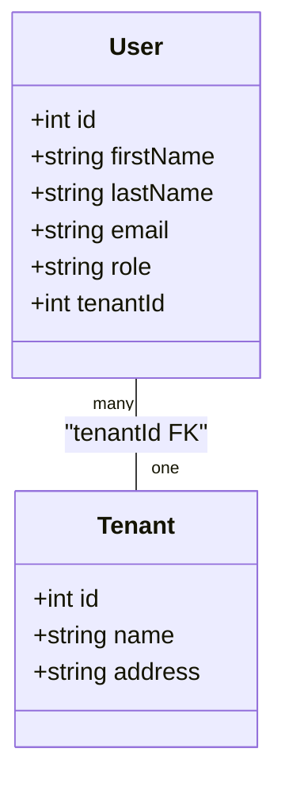
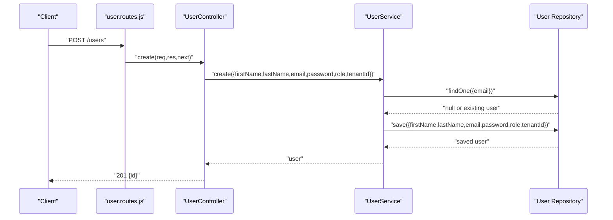
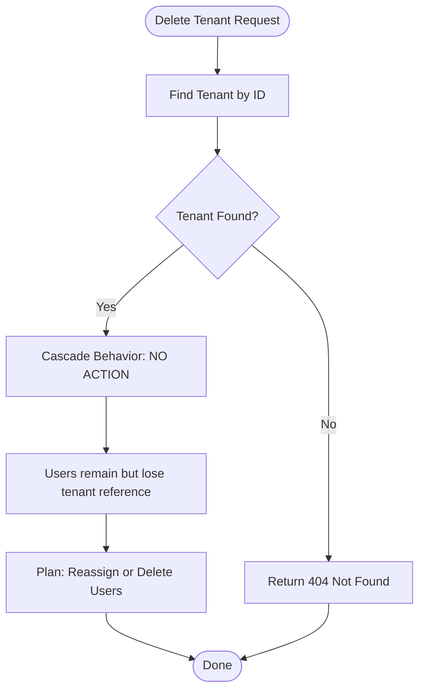
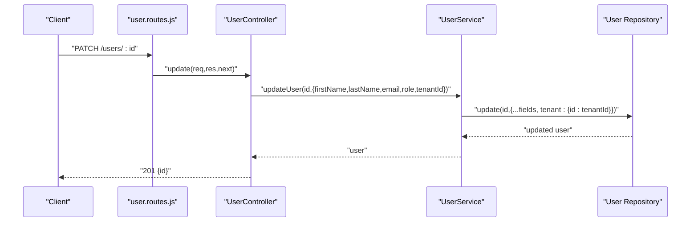
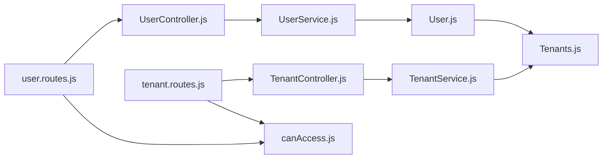

# Tenant-User Relationships

<cite>
**Referenced Files in This Document**
- [User.js](file://src/entity/User.js)
- [Tenants.js](file://src/entity/Tenants.js)
- [1773678973384-add_FK_tenant_table_and_to_user_table.js](file://src/migration/1773678973384-add_FK_tenant_table_and_to_user_table.js)
- [1773681570855-add_nullable_field_to_tenantID.js](file://src/migration/1773681570855-add_nullable_field_to_tenantID.js)
- [UserService.js](file://src/services/UserService.js)
- [TenantService.js](file://src/services/TenantService.js)
- [UserController.js](file://src/controllers/UserController.js)
- [TenantController.js](file://src/controllers/TenantController.js)
- [user.routes.js](file://src/routes/user.routes.js)
- [tenant.routes.js](file://src/routes/tenant.routes.js)
- [canAccess.js](file://src/middleware/canAccess.js)
- [create.spec.js](file://src/test/tenant/create.spec.js)
- [create.spec.js](file://src/test/users/create.spec.js)
</cite>

## Table of Contents
1. [Introduction](#introduction)
2. [Project Structure](#project-structure)
3. [Core Components](#core-components)
4. [Architecture Overview](#architecture-overview)
5. [Detailed Component Analysis](#detailed-component-analysis)
6. [Dependency Analysis](#dependency-analysis)
7. [Performance Considerations](#performance-considerations)
8. [Troubleshooting Guide](#troubleshooting-guide)
9. [Conclusion](#conclusion)
10. [Appendices](#appendices)

## Introduction
This document explains the tenant-user relationship model, focusing on foreign key associations, nullable constraints, bidirectional relationships, and cascade behaviors. It also covers how users are created with tenant assignment, how tenant removal affects users, and how users can be transferred between tenants. Guidance is provided for tenant-aware queries, bulk operations, and maintaining referential integrity. Finally, it outlines role-based access patterns and permission propagation within the tenant context.

## Project Structure
The tenant-user domain spans entity definitions, migrations, services, controllers, routes, middleware, and tests. Entities define the schema and relationships. Migrations enforce foreign keys and nullability. Services encapsulate business logic for user and tenant operations. Controllers expose endpoints protected by authentication and authorization middleware. Tests demonstrate usage patterns and validations.

**Diagram sources**
- [User.js:1-50](file://src/entity/User.js#L1-L50)
- [Tenants.js:1-29](file://src/entity/Tenants.js#L1-L29)
- [1773678973384-add_FK_tenant_table_and_to_user_table.js:1-39](file://src/migration/1773678973384-add_FK_tenant_table_and_to_user_table.js#L1-L39)
- [1773681570855-add_nullable_field_to_tenantID.js:1-31](file://src/migration/1773681570855-add_nullable_field_to_tenantID.js#L1-L31)
- [UserService.js:1-99](file://src/services/UserService.js#L1-L99)
- [TenantService.js:1-66](file://src/services/TenantService.js#L1-L66)
- [UserController.js:1-94](file://src/controllers/UserController.js#L1-L94)
- [TenantController.js:1-76](file://src/controllers/TenantController.js#L1-L76)
- [user.routes.js:1-38](file://src/routes/user.routes.js#L1-L38)
- [tenant.routes.js:1-45](file://src/routes/tenant.routes.js#L1-L45)
- [canAccess.js:1-23](file://src/middleware/canAccess.js#L1-L23)

**Section sources**
- [User.js:1-50](file://src/entity/User.js#L1-L50)
- [Tenants.js:1-29](file://src/entity/Tenants.js#L1-L29)
- [1773678973384-add_FK_tenant_table_and_to_user_table.js:1-39](file://src/migration/1773678973384-add_FK_tenant_table_and_to_user_table.js#L1-L39)
- [1773681570855-add_nullable_field_to_tenantID.js:1-31](file://src/migration/1773681570855-add_nullable_field_to_tenantID.js#L1-L31)
- [UserService.js:1-99](file://src/services/UserService.js#L1-L99)
- [TenantService.js:1-66](file://src/services/TenantService.js#L1-L66)
- [UserController.js:1-94](file://src/controllers/UserController.js#L1-L94)
- [TenantController.js:1-76](file://src/controllers/TenantController.js#L1-L76)
- [user.routes.js:1-38](file://src/routes/user.routes.js#L1-L38)
- [tenant.routes.js:1-45](file://src/routes/tenant.routes.js#L1-L45)
- [canAccess.js:1-23](file://src/middleware/canAccess.js#L1-L23)

## Core Components
- User entity
  - Columns include identifiers, credentials, and a tenant association column.
  - The tenantId column is mapped as nullable in the current state.
  - Bidirectional relation to Tenant via many-to-one and inverse one-to-many.
- Tenant entity
  - Defines a one-to-many relation to User.
- Migrations
  - Establish foreign key from users.tenantId to tenants.id.
  - Transitioned from initially NOT NULL to later allowing NULL.
- Services
  - UserService handles user creation, retrieval, updates, and deletions, including optional tenant assignment.
  - TenantService manages tenant lifecycle operations.
- Controllers and Routes
  - Expose endpoints for user and tenant operations behind authentication and role-based authorization.
- Middleware
  - Role-based access control restricts sensitive operations to allowed roles.

**Section sources**
- [User.js:1-50](file://src/entity/User.js#L1-L50)
- [Tenants.js:1-29](file://src/entity/Tenants.js#L1-L29)
- [1773678973384-add_FK_tenant_table_and_to_user_table.js:16-24](file://src/migration/1773678973384-add_FK_tenant_table_and_to_user_table.js#L16-L24)
- [1773681570855-add_nullable_field_to_tenantID.js:16-20](file://src/migration/1773681570855-add_nullable_field_to_tenantID.js#L16-L20)
- [UserService.js:7-38](file://src/services/UserService.js#L7-L38)
- [UserService.js:68-84](file://src/services/UserService.js#L68-L84)
- [TenantService.js:7-14](file://src/services/TenantService.js#L7-L14)
- [UserController.js:12-28](file://src/controllers/UserController.js#L12-L28)
- [TenantController.js:11-22](file://src/controllers/TenantController.js#L11-L22)
- [user.routes.js:15-35](file://src/routes/user.routes.js#L15-L35)
- [tenant.routes.js:16-42](file://src/routes/tenant.routes.js#L16-L42)
- [canAccess.js:4-22](file://src/middleware/canAccess.js#L4-L22)

## Architecture Overview
The system enforces a tenant-per-user model with a many-to-one relationship from User to Tenant. The relationship is represented by a foreign key in the users table referencing tenants. The current migration allows the tenantId to be NULL, enabling users to exist without a tenant. Authorization middleware ensures only authorized roles can manage users and tenants.

**Diagram sources**
- [User.js:3-48](file://src/entity/User.js#L3-L48)
- [Tenants.js:3-27](file://src/entity/Tenants.js#L3-L27)
- [1773678973384-add_FK_tenant_table_and_to_user_table.js:22](file://src/migration/1773678973384-add_FK_tenant_table_and_to_user_table.js#L22)

**Section sources**
- [User.js:3-48](file://src/entity/User.js#L3-L48)
- [Tenants.js:3-27](file://src/entity/Tenants.js#L3-L27)
- [1773678973384-add_FK_tenant_table_and_to_user_table.js:22](file://src/migration/1773678973384-add_FK_tenant_table_and_to_user_table.js#L22)

## Detailed Component Analysis

### Relationship Definition and Constraints
- Foreign key association
  - A foreign key constraint references users.tenantId to tenants.id.
  - The migration sets the constraint to NO ACTION on both delete and update.
- Nullable tenantId
  - The column is currently nullable, allowing users to exist without a tenant.
  - This supports scenarios like global administrative users or users awaiting tenant assignment.
- Bidirectional mapping
  - User entity defines a many-to-one relation to Tenant.
  - Tenant entity defines a one-to-many relation to User.
  - The join column is explicitly named tenantId on the User side.

**Section sources**
- [1773678973384-add_FK_tenant_table_and_to_user_table.js:16-24](file://src/migration/1773678973384-add_FK_tenant_table_and_to_user_table.js#L16-L24)
- [1773681570855-add_nullable_field_to_tenantID.js:16-20](file://src/migration/1773681570855-add_nullable_field_to_tenantID.js#L16-L20)
- [User.js:30-47](file://src/entity/User.js#L30-L47)
- [Tenants.js:21-27](file://src/entity/Tenants.js#L21-L27)

### User Creation with Tenant Assignment
- Endpoint and controller
  - POST /users creates a user after authentication and role checks.
- Service logic
  - Validates uniqueness of email.
  - Hashes the password.
  - Persists user with optional tenantId.
- Test evidence
  - A test demonstrates saving a user with a tenantId and retrieving users afterward.

**Diagram sources**
- [user.routes.js:15-17](file://src/routes/user.routes.js#L15-L17)
- [UserController.js:12-28](file://src/controllers/UserController.js#L12-L28)
- [UserService.js:7-38](file://src/services/UserService.js#L7-L38)

**Section sources**
- [user.routes.js:15-17](file://src/routes/user.routes.js#L15-L17)
- [UserController.js:12-28](file://src/controllers/UserController.js#L12-L28)
- [UserService.js:7-38](file://src/services/UserService.js#L7-L38)
- [create.spec.js:72-77](file://src/test/users/create.spec.js#L72-L77)

### Tenant Removal Scenarios
- Deletion behavior
  - The foreign key constraint is NO ACTION on delete, meaning deleting a tenant does not automatically remove users.
  - Users may become orphaned with respect to their former tenant.
- Service behavior
  - Tenant deletion is exposed via a route and service method.
- Recommendations
  - Before deleting a tenant, ensure users are reassigned or removed to avoid orphaned records.

**Diagram sources**
- [TenantController.js:65-74](file://src/controllers/TenantController.js#L65-L74)
- [TenantService.js:52-64](file://src/services/TenantService.js#L52-L64)
- [1773678973384-add_FK_tenant_table_and_to_user_table.js:22](file://src/migration/1773678973384-add_FK_tenant_table_and_to_user_table.js#L22)

**Section sources**
- [TenantController.js:65-74](file://src/controllers/TenantController.js#L65-L74)
- [TenantService.js:52-64](file://src/services/TenantService.js#L52-L64)
- [1773678973384-add_FK_tenant_table_and_to_user_table.js:22](file://src/migration/1773678973384-add_FK_tenant_table_and_to_user_table.js#L22)

### User Transfer Between Tenants
- Update endpoint
  - PATCH /users/:id updates user attributes, including tenantId.
- Service logic
  - The update method accepts a tenantId parameter and applies it to the user record.
- Notes
  - Since tenantId is nullable, transferring a user to no tenant is supported by passing null or omitting the field.

**Diagram sources**
- [user.routes.js:24-29](file://src/routes/user.routes.js#L24-L29)
- [UserController.js:54-77](file://src/controllers/UserController.js#L54-L77)
- [UserService.js:68-84](file://src/services/UserService.js#L68-L84)

**Section sources**
- [user.routes.js:24-29](file://src/routes/user.routes.js#L24-L29)
- [UserController.js:54-77](file://src/controllers/UserController.js#L54-L77)
- [UserService.js:68-84](file://src/services/UserService.js#L68-L84)

### Tenant-Aware Queries and Bulk Operations
- Tenant-aware query pattern
  - Use the relation mapping to fetch users per tenant or include tenant details in queries.
  - Example patterns:
    - Load users with their tenant details using joins.
    - Filter users by tenantId for tenant-specific views.
- Bulk operations
  - Batch updates or deletes can be performed via the repository layer.
  - Ensure referential constraints are respected; for NO ACTION, handle orphaning explicitly.
- Relationship maintenance
  - When reassigning users, update tenantId and persist.
  - Validate uniqueness constraints (e.g., email) before bulk inserts.

[No sources needed since this section provides general guidance]

### Role Inheritance and Permission Propagation Within Tenant Context
- Role-based access control
  - Routes protect user and tenant management endpoints with role checks.
  - Only users with allowed roles can create, update, or delete users and tenants.
- Permission propagation
  - The codebase does not implement automatic role inheritance or permission propagation.
  - Permissions are enforced at the route level based on the authenticated user’s role.

**Section sources**
- [user.routes.js:15-35](file://src/routes/user.routes.js#L15-L35)
- [tenant.routes.js:16-42](file://src/routes/tenant.routes.js#L16-L42)
- [canAccess.js:4-22](file://src/middleware/canAccess.js#L4-L22)

## Dependency Analysis
The following diagram shows how components depend on each other to implement tenant-user relationships.

**Diagram sources**
- [user.routes.js:1-38](file://src/routes/user.routes.js#L1-L38)
- [tenant.routes.js:1-45](file://src/routes/tenant.routes.js#L1-L45)
- [UserController.js:1-11](file://src/controllers/UserController.js#L1-L11)
- [TenantController.js:1-9](file://src/controllers/TenantController.js#L1-L9)
- [UserService.js:1-6](file://src/services/UserService.js#L1-L6)
- [TenantService.js:1-6](file://src/services/TenantService.js#L1-L6)
- [User.js:1-50](file://src/entity/User.js#L1-L50)
- [Tenants.js:1-29](file://src/entity/Tenants.js#L1-L29)
- [canAccess.js:1-23](file://src/middleware/canAccess.js#L1-L23)

**Section sources**
- [user.routes.js:1-38](file://src/routes/user.routes.js#L1-L38)
- [tenant.routes.js:1-45](file://src/routes/tenant.routes.js#L1-L45)
- [UserController.js:1-11](file://src/controllers/UserController.js#L1-L11)
- [TenantController.js:1-9](file://src/controllers/TenantController.js#L1-L9)
- [UserService.js:1-6](file://src/services/UserService.js#L1-L6)
- [TenantService.js:1-6](file://src/services/TenantService.js#L1-L6)
- [User.js:1-50](file://src/entity/User.js#L1-L50)
- [Tenants.js:1-29](file://src/entity/Tenants.js#L1-L29)
- [canAccess.js:1-23](file://src/middleware/canAccess.js#L1-L23)

## Performance Considerations
- Indexing
  - Consider adding an index on users.tenantId for tenant-scoped queries.
- Query patterns
  - Prefer filtered queries by tenantId to avoid scanning entire user tables.
- Cascading
  - NO ACTION on delete avoids unintended deletions but requires manual cleanup plans.

[No sources needed since this section provides general guidance]

## Troubleshooting Guide
- Foreign key violations
  - Attempting to insert or update a user with a non-existent tenantId will fail due to the foreign key constraint.
- Orphaned users after tenant deletion
  - Deleting a tenant does not remove users; users retain their tenantId as NULL or point to a missing tenant.
- Role access denials
  - Requests to protected endpoints without sufficient roles receive 403 Forbidden.

**Section sources**
- [1773678973384-add_FK_tenant_table_and_to_user_table.js:16-24](file://src/migration/1773678973384-add_FK_tenant_table_and_to_user_table.js#L16-L24)
- [TenantController.js:65-74](file://src/controllers/TenantController.js#L65-L74)
- [canAccess.js:9-21](file://src/middleware/canAccess.js#L9-L21)

## Conclusion
The tenant-user relationship is modeled as a many-to-one association with a nullable tenantId. The foreign key constraint is NO ACTION, meaning tenant deletion does not cascade to users. Users can be created with or without a tenant, and transfers between tenants are supported via updates. Authorization middleware protects sensitive operations. The codebase does not implement automatic role inheritance or permission propagation; permissions are enforced at the route level.

[No sources needed since this section summarizes without analyzing specific files]

## Appendices

### Appendix A: Example Tenant-Aware User Queries
- Fetch users belonging to a specific tenant
  - Use a query builder to filter by tenantId.
- Fetch a user with tenant details
  - Join the User relation to Tenant to include tenant metadata.
- Bulk user creation with tenant assignment
  - Persist multiple users with the same tenantId in a loop or batch operation.

[No sources needed since this section provides general guidance]

### Appendix B: Test Evidence of Tenant Assignment
- Demonstrates saving a user with a tenantId and verifying presence in the database.

**Section sources**
- [create.spec.js:72-77](file://src/test/users/create.spec.js#L72-L77)