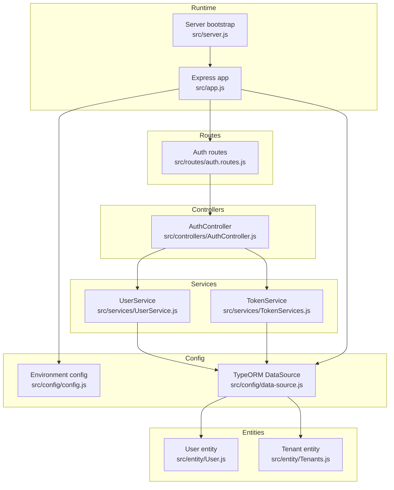
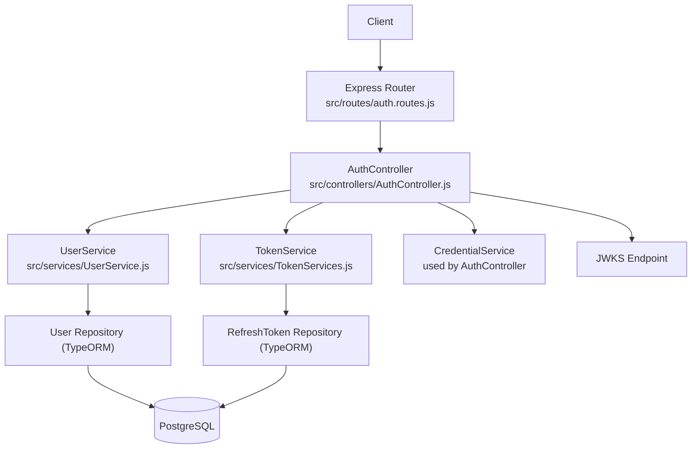
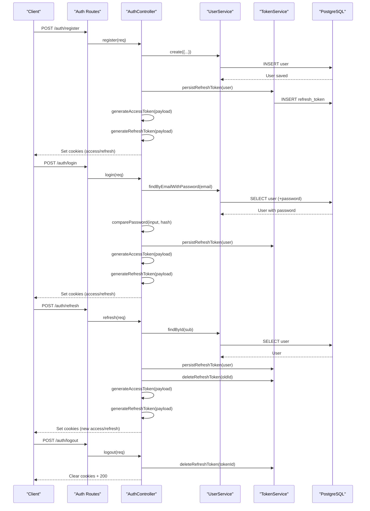
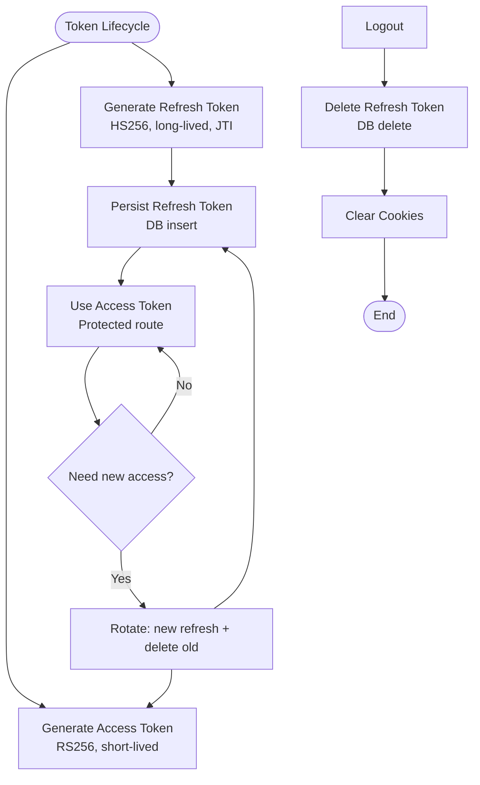
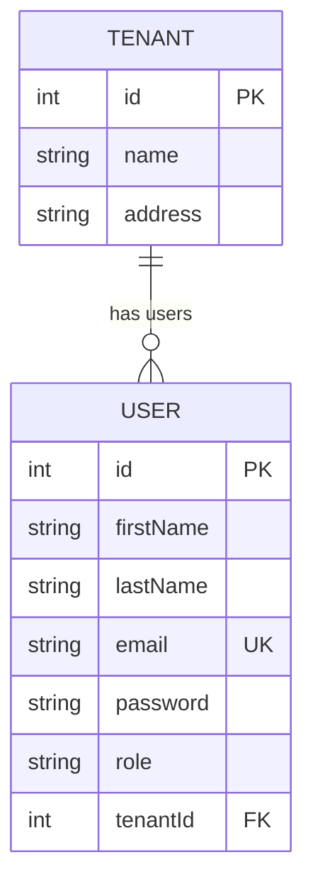
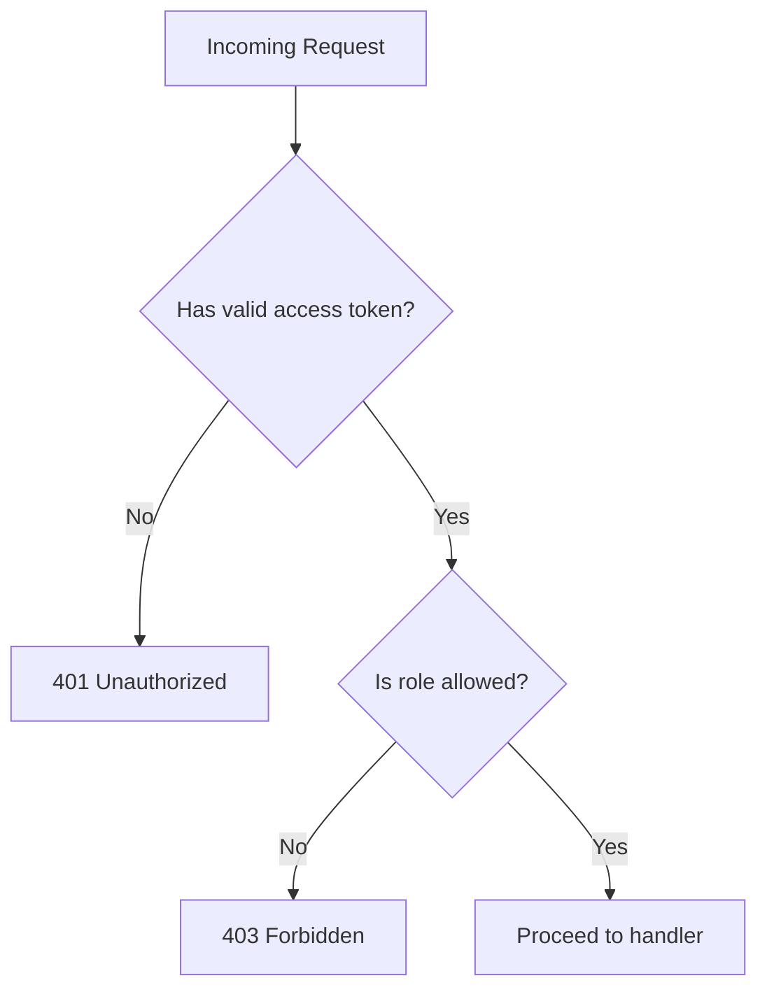
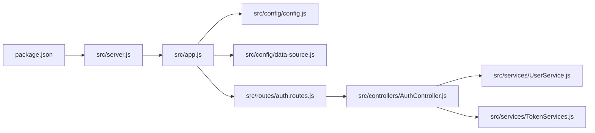

# Project Overview

<cite>
**Referenced Files in This Document**
- [README.md](file://README.md)
- [package.json](file://package.json)
- [src/server.js](file://src/server.js)
- [src/app.js](file://src/app.js)
- [src/config/config.js](file://src/config/config.js)
- [src/config/data-source.js](file://src/config/data-source.js)
- [src/routes/auth.routes.js](file://src/routes/auth.routes.js)
- [src/controllers/AuthController.js](file://src/controllers/AuthController.js)
- [src/services/TokenServices.js](file://src/services/TokenServices.js)
- [src/services/UserService.js](file://src/services/UserService.js)
- [src/middleware/authenticate.js](file://src/middleware/authenticate.js)
- [src/middleware/canAccess.js](file://src/middleware/canAccess.js)
- [src/entity/User.js](file://src/entity/User.js)
- [src/entity/Tenants.js](file://src/entity/Tenants.js)
</cite>

## Table of Contents
1. [Introduction](#introduction)
2. [Project Structure](#project-structure)
3. [Core Components](#core-components)
4. [Architecture Overview](#architecture-overview)
5. [Detailed Component Analysis](#detailed-component-analysis)
6. [Dependency Analysis](#dependency-analysis)
7. [Performance Considerations](#performance-considerations)
8. [Troubleshooting Guide](#troubleshooting-guide)
9. [Conclusion](#conclusion)

## Introduction
This authentication service is a Node.js-based system implementing secure user registration, login, session refresh, and logout using JWT-based token management. It integrates Express.js for routing and middleware, TypeORM for PostgreSQL persistence, and supports multi-tenant user isolation along with role-based access control (RBAC). The platform targets applications requiring robust identity and access management, offering both developer-friendly APIs and strong security controls suitable for SaaS and enterprise environments.

Key value propositions:
- Secure token lifecycle with access and refresh tokens, including rotation and revocation.
- Multi-tenant user model enabling tenant-scoped user isolation.
- Role-based access control to enforce authorization policies.
- Modular architecture with clear separation of concerns for maintainability and extensibility.

## Project Structure
The project follows a layered, feature-oriented structure:
- Configuration: Environment loading, database connection, and logging setup.
- Routes: HTTP endpoints grouped by feature (authentication, tenants, users).
- Controllers: Request handlers orchestrating business logic and responses.
- Services: Business logic for user management, credentials, tokens, and tenant operations.
- Entities: TypeORM models representing PostgreSQL tables.
- Middleware: Authentication and authorization guards.
- Migrations: Database schema evolution scripts.
- Tests: Unit and integration tests for core flows.

**Diagram sources**
- [src/server.js:1-21](file://src/server.js#L1-L21)
- [src/app.js:1-40](file://src/app.js#L1-L40)
- [src/config/config.js:1-34](file://src/config/config.js#L1-L34)
- [src/config/data-source.js:1-22](file://src/config/data-source.js#L1-L22)
- [src/routes/auth.routes.js:1-49](file://src/routes/auth.routes.js#L1-L49)
- [src/controllers/AuthController.js:1-212](file://src/controllers/AuthController.js#L1-L212)
- [src/services/UserService.js:1-86](file://src/services/UserService.js#L1-L86)
- [src/services/TokenServices.js:1-60](file://src/services/TokenServices.js#L1-L60)
- [src/entity/User.js:1-50](file://src/entity/User.js#L1-L50)
- [src/entity/Tenants.js:1-29](file://src/entity/Tenants.js#L1-L29)

**Section sources**
- [README.md:1-8](file://README.md#L1-L8)
- [package.json:1-48](file://package.json#L1-L48)
- [src/server.js:1-21](file://src/server.js#L1-L21)
- [src/app.js:1-40](file://src/app.js#L1-L40)
- [src/config/config.js:1-34](file://src/config/config.js#L1-L34)
- [src/config/data-source.js:1-22](file://src/config/data-source.js#L1-L22)

## Core Components
- Authentication controller: Implements registration, login, profile retrieval, token refresh, and logout. It coordinates with user and token services and manages cookies for tokens.
- Token service: Generates access and refresh tokens, persists refresh tokens, and deletes them for logout or rotation.
- User service: Handles user creation, lookup by email, retrieval by ID, and updates, including tenant association.
- Middleware:
  - Authentication guard: Validates access tokens via JWKS and extracts tokens from Authorization header or cookies.
  - Access control guard: Enforces RBAC by checking roles against the token’s claims.
- Entities:
  - User: Stores user attributes and tenant relationship.
  - Tenant: Represents multi-tenant organization with users.
- Data source: Configures PostgreSQL connection and loads entities and migrations.

Practical examples:
- Register a new user and receive access and refresh cookies.
- Login with email/password, receive short-lived access token and long-lived refresh token.
- Refresh access token using a valid refresh token.
- Logout by revoking the refresh token and clearing cookies.
- Retrieve current user profile after authentication.
- Enforce role-based access to protected routes.

**Section sources**
- [src/controllers/AuthController.js:1-212](file://src/controllers/AuthController.js#L1-L212)
- [src/services/TokenServices.js:1-60](file://src/services/TokenServices.js#L1-L60)
- [src/services/UserService.js:1-86](file://src/services/UserService.js#L1-L86)
- [src/middleware/authenticate.js:1-25](file://src/middleware/authenticate.js#L1-L25)
- [src/middleware/canAccess.js:1-17](file://src/middleware/canAccess.js#L1-L17)
- [src/entity/User.js:1-50](file://src/entity/User.js#L1-L50)
- [src/entity/Tenants.js:1-29](file://src/entity/Tenants.js#L1-L29)

## Architecture Overview
The system uses a clean architecture pattern:
- Express routes define the API surface.
- Controllers handle HTTP concerns and delegate to services.
- Services encapsulate business logic and coordinate repositories.
- TypeORM connects to PostgreSQL and manages entities and migrations.
- Middleware enforces authentication and authorization.
- Environment configuration and logging are centralized.

**Diagram sources**
- [src/routes/auth.routes.js:1-49](file://src/routes/auth.routes.js#L1-L49)
- [src/controllers/AuthController.js:1-212](file://src/controllers/AuthController.js#L1-L212)
- [src/services/UserService.js:1-86](file://src/services/UserService.js#L1-L86)
- [src/services/TokenServices.js:1-60](file://src/services/TokenServices.js#L1-L60)
- [src/config/data-source.js:1-22](file://src/config/data-source.js#L1-L22)

## Detailed Component Analysis

### Authentication Flow (Registration, Login, Refresh, Logout)

**Diagram sources**
- [src/routes/auth.routes.js:1-49](file://src/routes/auth.routes.js#L1-L49)
- [src/controllers/AuthController.js:1-212](file://src/controllers/AuthController.js#L1-L212)
- [src/services/UserService.js:1-86](file://src/services/UserService.js#L1-L86)
- [src/services/TokenServices.js:1-60](file://src/services/TokenServices.js#L1-L60)

**Section sources**
- [src/controllers/AuthController.js:19-212](file://src/controllers/AuthController.js#L19-L212)
- [src/routes/auth.routes.js:29-46](file://src/routes/auth.routes.js#L29-L46)

### Token Management Details
- Access token generation uses a private key and RS256 with a short TTL.
- Refresh token generation uses a symmetric secret and HS256 with a longer TTL and a unique JWT ID.
- Refresh tokens are persisted in the database and rotated on refresh and logout.
- Cookies are used to transmit tokens to clients with security flags.

**Diagram sources**
- [src/services/TokenServices.js:12-58](file://src/services/TokenServices.js#L12-L58)
- [src/controllers/AuthController.js:143-210](file://src/controllers/AuthController.js#L143-L210)

**Section sources**
- [src/services/TokenServices.js:1-60](file://src/services/TokenServices.js#L1-L60)
- [src/controllers/AuthController.js:42-62](file://src/controllers/AuthController.js#L42-L62)
- [src/controllers/AuthController.js:108-113](file://src/controllers/AuthController.js#L108-L113)
- [src/controllers/AuthController.js:161-169](file://src/controllers/AuthController.js#L161-L169)
- [src/controllers/AuthController.js:194-209](file://src/controllers/AuthController.js#L194-L209)

### Multi-Tenant Support
- Users can belong to a tenant via a foreign key relationship.
- The user entity includes an optional tenant identifier, enabling tenant-scoped queries and isolation.
- The tenant entity defines tenant metadata and maintains a one-to-many relationship with users.

**Diagram sources**
- [src/entity/Tenants.js:1-29](file://src/entity/Tenants.js#L1-L29)
- [src/entity/User.js:1-50](file://src/entity/User.js#L1-L50)

**Section sources**
- [src/entity/User.js:30-33](file://src/entity/User.js#L30-L33)
- [src/entity/Tenants.js:21-27](file://src/entity/Tenants.js#L21-L27)

### Role-Based Access Control (RBAC)
- Roles are defined centrally and included in access tokens.
- An access control middleware checks the token’s role against a required set and denies unauthorized requests.

**Diagram sources**
- [src/middleware/authenticate.js:5-24](file://src/middleware/authenticate.js#L5-L24)
- [src/middleware/canAccess.js:3-16](file://src/middleware/canAccess.js#L3-L16)
- [src/constants/index.js:1-6](file://src/constants/index.js#L1-L6)

**Section sources**
- [src/constants/index.js:1-6](file://src/constants/index.js#L1-L6)
- [src/middleware/canAccess.js:1-17](file://src/middleware/canAccess.js#L1-L17)

## Dependency Analysis
- Express app composes routers and error handling middleware.
- Routes instantiate repositories and services, wiring controllers to persistence.
- Services depend on repositories and external libraries (bcrypt, jsonwebtoken, jwks-rsa).
- Data source centralizes database configuration and entity registration.
- Environment variables drive configuration for ports, database credentials, and JWKS URI.

**Diagram sources**
- [package.json:1-48](file://package.json#L1-L48)
- [src/server.js:1-21](file://src/server.js#L1-L21)
- [src/app.js:1-40](file://src/app.js#L1-L40)
- [src/config/config.js:1-34](file://src/config/config.js#L1-L34)
- [src/config/data-source.js:1-22](file://src/config/data-source.js#L1-L22)
- [src/routes/auth.routes.js:1-49](file://src/routes/auth.routes.js#L1-L49)
- [src/controllers/AuthController.js:1-212](file://src/controllers/AuthController.js#L1-L212)
- [src/services/UserService.js:1-86](file://src/services/UserService.js#L1-L86)
- [src/services/TokenServices.js:1-60](file://src/services/TokenServices.js#L1-L60)

**Section sources**
- [package.json:1-48](file://package.json#L1-L48)
- [src/app.js:19-21](file://src/app.js#L19-L21)
- [src/config/data-source.js:8-21](file://src/config/data-source.js#L8-L21)

## Performance Considerations
- Token TTLs balance security and client convenience; adjust access token short lifetime and refresh token expiration per risk profile.
- Use JWKS caching and rate limiting to reduce network overhead and protect the JWKS endpoint.
- Persist refresh tokens efficiently and prune stale entries periodically.
- Index database columns frequently queried (e.g., email) to optimize user lookups.
- Centralize logging and avoid verbose logs in production to minimize I/O overhead.

## Troubleshooting Guide
Common issues and resolutions:
- Database connectivity failures during startup: Verify environment variables and database availability; confirm the data source initialization order.
- Missing or invalid environment variables: Ensure the appropriate .env file for the current NODE_ENV is present and includes required keys (database, JWKS URI, secrets).
- Token validation errors: Confirm the JWKS URI is reachable and the client sends the Authorization header or access cookie correctly.
- Refresh token errors: Ensure the refresh token is present, valid, and matches the stored JWT ID; check token rotation and deletion flows.
- Role-based access denials: Confirm the token includes the expected role and that the protected route uses the access control middleware with the correct role set.

**Section sources**
- [src/server.js:7-19](file://src/server.js#L7-L19)
- [src/config/config.js:7-21](file://src/config/config.js#L7-L21)
- [src/middleware/authenticate.js:5-24](file://src/middleware/authenticate.js#L5-L24)
- [src/middleware/canAccess.js:3-16](file://src/middleware/canAccess.js#L3-L16)

## Conclusion
This authentication service delivers a secure, scalable foundation for user management with JWT-based tokens, multi-tenancy, and RBAC. Its modular design, clear separation of concerns, and robust middleware make it suitable for diverse applications, from SaaS platforms to internal enterprise systems. By following the outlined flows and best practices, teams can integrate secure authentication with minimal friction while maintaining strong operational hygiene.