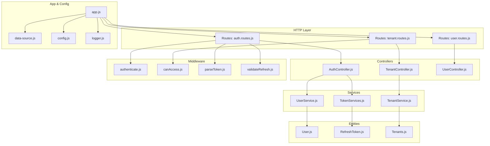
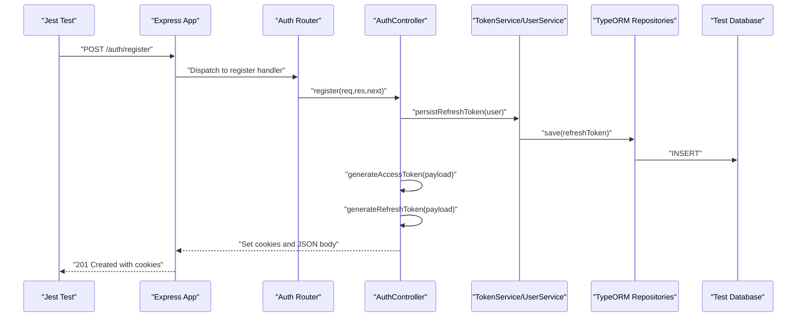
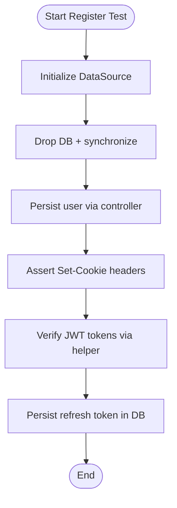
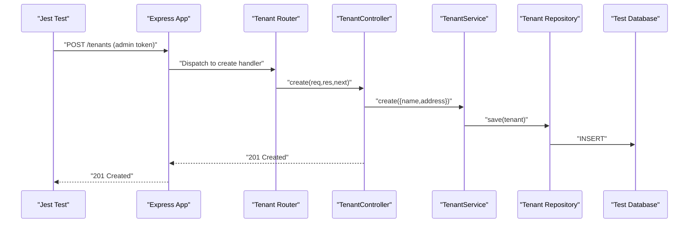
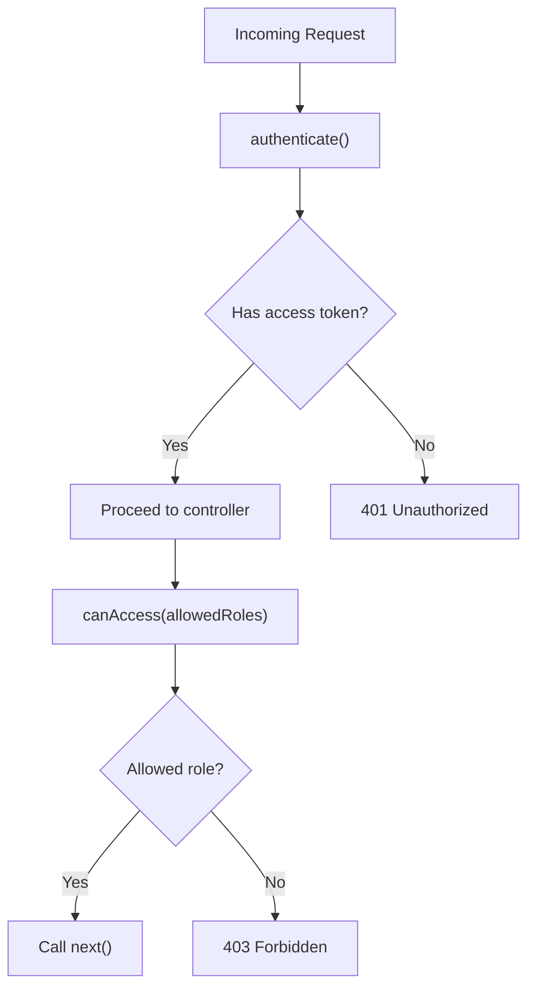
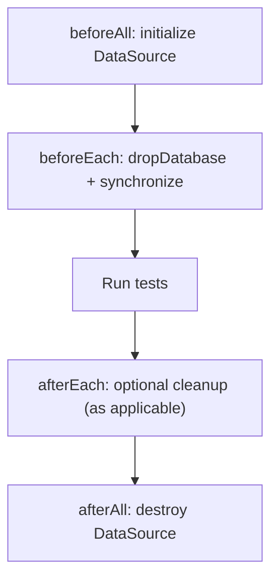
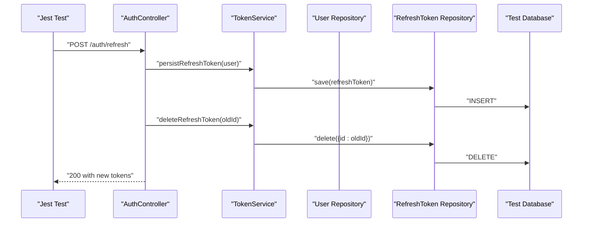
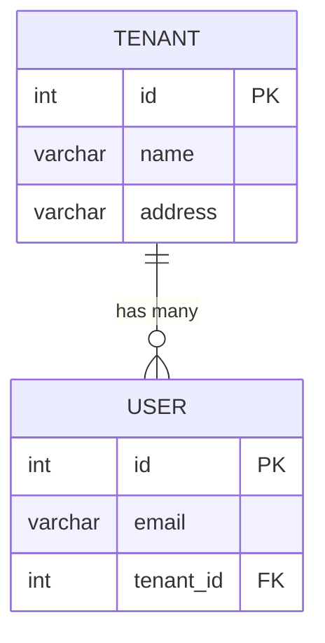
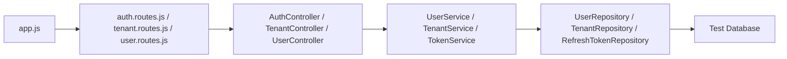

# Integration Testing

<cite>
**Referenced Files in This Document**
- [src/app.js](file://src/app.js)
- [jest.config.mjs](file://jest.config.mjs)
- [src/config/data-source.js](file://src/config/data-source.js)
- [src/config/config.js](file://src/config/config.js)
- [src/config/logger.js](file://src/config/logger.js)
- [src/controllers/AuthController.js](file://src/controllers/AuthController.js)
- [src/controllers/TenantController.js](file://src/controllers/TenantController.js)
- [src/controllers/UserController.js](file://src/controllers/UserController.js)
- [src/entity/User.js](file://src/entity/User.js)
- [src/entity/RefreshToken.js](file://src/entity/RefreshToken.js)
- [src/entity/Tenants.js](file://src/entity/Tenants.js)
- [src/middleware/authenticate.js](file://src/middleware/authenticate.js)
- [src/middleware/canAccess.js](file://src/middleware/canAccess.js)
- [src/middleware/parseToken.js](file://src/middleware/parseToken.js)
- [src/middleware/validateRefresh.js](file://src/middleware/validateRefresh.js)
- [src/routes/auth.routes.js](file://src/routes/auth.routes.js)
- [src/routes/tenant.routes.js](file://src/routes/tenant.routes.js)
- [src/routes/user.routes.js](file://src/routes/user.routes.js)
- [src/services/TokenServices.js](file://src/services/TokenServices.js)
- [src/services/TenantService.js](file://src/services/TenantService.js)
- [src/services/UserService.js](file://src/services/UserService.js)
- [src/test/users/register.spec.js](file://src/test/users/register.spec.js)
- [src/test/users/login.spec.js](file://src/test/users/login.spec.js)
- [src/test/users/refresh.spec.js](file://src/test/users/refresh.spec.js)
- [src/test/users/user.spec.js](file://src/test/users/user.spec.js)
- [src/test/tenant/create.spec.js](file://src/test/tenant/create.spec.js)
- [app.spec.mjs](file://app.spec.mjs)
</cite>

## Table of Contents
1. [Introduction](#introduction)
2. [Project Structure](#project-structure)
3. [Core Components](#core-components)
4. [Architecture Overview](#architecture-overview)
5. [Detailed Component Analysis](#detailed-component-analysis)
6. [Dependency Analysis](#dependency-analysis)
7. [Performance Considerations](#performance-considerations)
8. [Troubleshooting Guide](#troubleshooting-guide)
9. [Conclusion](#conclusion)
10. [Appendices](#appendices)

## Introduction
This document provides comprehensive integration testing guidance for the authentication and multi-tenant management services. It covers full request-response cycles for authentication endpoints, tenant creation, and user self-profile retrieval. It explains database testing strategies using TypeORM’s DataSource with test databases, proper cleanup procedures, and how to test JWT access tokens and refresh tokens, including persistence and rotation. It also documents middleware testing for authentication and authorization, error handling scenarios, and end-to-end workflows from HTTP requests through controllers to database operations.

## Project Structure
The repository follows a layered architecture with clear separation of concerns:
- Routes define endpoint contracts and wire controllers.
- Controllers orchestrate service calls and handle HTTP responses.
- Services encapsulate business logic and interact with repositories.
- Entities define database schemas.
- Middleware enforces authentication and authorization.
- Tests use Supertest for HTTP assertions and TypeORM DataSource for database setup/cleanup.

**Diagram sources**
- [src/app.js:1-40](file://src/app.js#L1-L40)
- [src/routes/auth.routes.js:1-49](file://src/routes/auth.routes.js#L1-L49)
- [src/routes/tenant.routes.js](file://src/routes/tenant.routes.js)
- [src/routes/user.routes.js](file://src/routes/user.routes.js)
- [src/controllers/AuthController.js:1-212](file://src/controllers/AuthController.js#L1-L212)
- [src/controllers/TenantController.js:1-76](file://src/controllers/TenantController.js#L1-L76)
- [src/controllers/UserController.js](file://src/controllers/UserController.js)
- [src/services/UserService.js](file://src/services/UserService.js)
- [src/services/TenantService.js:1-66](file://src/services/TenantService.js#L1-L66)
- [src/services/TokenServices.js:1-60](file://src/services/TokenServices.js#L1-L60)
- [src/entity/User.js](file://src/entity/User.js)
- [src/entity/RefreshToken.js](file://src/entity/RefreshToken.js)
- [src/entity/Tenants.js:1-29](file://src/entity/Tenants.js#L1-L29)
- [src/middleware/authenticate.js:1-26](file://src/middleware/authenticate.js#L1-L26)
- [src/middleware/canAccess.js:1-23](file://src/middleware/canAccess.js#L1-L23)
- [src/middleware/parseToken.js](file://src/middleware/parseToken.js)
- [src/middleware/validateRefresh.js](file://src/middleware/validateRefresh.js)
- [src/config/data-source.js](file://src/config/data-source.js)
- [src/config/config.js](file://src/config/config.js)
- [src/config/logger.js](file://src/config/logger.js)

**Section sources**
- [src/app.js:1-40](file://src/app.js#L1-L40)
- [jest.config.mjs:1-203](file://jest.config.mjs#L1-L203)

## Core Components
- Authentication endpoints: register, login, refresh, logout, self.
- Tenant management endpoints: create, list, get, update, delete.
- User self-profile endpoint protected by authentication middleware.
- Middleware stack: authenticate, validateRefresh, parseToken, canAccess.
- Token services: access token generation (RSA), refresh token generation (HMAC), persistence, and deletion.
- Data source: TypeORM DataSource configured for integration tests.

Key integration test patterns demonstrated:
- Real HTTP requests via Supertest against Express app.
- TypeORM DataSource initialization/drop/synchronize per suite.
- Cookie-based token handling for access/refresh tokens.
- Mocked JWKS for signing/validating tokens in tests.

**Section sources**
- [src/controllers/AuthController.js:1-212](file://src/controllers/AuthController.js#L1-L212)
- [src/controllers/TenantController.js:1-76](file://src/controllers/TenantController.js#L1-L76)
- [src/services/TokenServices.js:1-60](file://src/services/TokenServices.js#L1-L60)
- [src/middleware/authenticate.js:1-26](file://src/middleware/authenticate.js#L1-L26)
- [src/middleware/canAccess.js:1-23](file://src/middleware/canAccess.js#L1-L23)
- [src/routes/auth.routes.js:1-49](file://src/routes/auth.routes.js#L1-L49)
- [src/routes/tenant.routes.js](file://src/routes/tenant.routes.js)
- [src/routes/user.routes.js](file://src/routes/user.routes.js)

## Architecture Overview
The integration tests validate end-to-end flows from HTTP requests to database persistence and back. The typical flow includes:
- Initialize TypeORM DataSource.
- Seed data if needed.
- Send HTTP requests using Supertest.
- Assert HTTP status codes, JSON bodies, and cookies.
- Query repositories to assert database state.
- Clean up by dropping and re-synchronizing the database.

**Diagram sources**
- [src/test/users/register.spec.js:1-168](file://src/test/users/register.spec.js#L1-L168)
- [src/controllers/AuthController.js:19-70](file://src/controllers/AuthController.js#L19-L70)
- [src/services/TokenServices.js:45-52](file://src/services/TokenServices.js#L45-L52)
- [src/routes/auth.routes.js:29-31](file://src/routes/auth.routes.js#L29-L31)
- [src/config/data-source.js](file://src/config/data-source.js)

## Detailed Component Analysis

### Authentication Endpoints Integration Tests
This suite validates registration, login, refresh, logout, and self-profile retrieval with real database connections and cookie handling.

- Registration:
  - Validates 201 response, JSON content type, user persisted, customer role assignment, hashed password storage, duplicate email handling, JWT cookies, and refresh token persistence.
- Login:
  - Ensures 200 response and correct password comparison.
- Refresh:
  - Generates a refresh token via service, signs it with HS256, sends it as a cookie, and asserts 200 response and 401 without token.
- Self Profile:
  - Uses mocked JWKS to issue an access token and asserts 200 response, absence of password field, and 401 without token.

**Diagram sources**
- [src/test/users/register.spec.js:31-54](file://src/test/users/register.spec.js#L31-L54)
- [src/test/users/register.spec.js:115-154](file://src/test/users/register.spec.js#L115-L154)
- [src/controllers/AuthController.js:42-47](file://src/controllers/AuthController.js#L42-L47)
- [src/services/TokenServices.js:45-52](file://src/services/TokenServices.js#L45-L52)

**Section sources**
- [src/test/users/register.spec.js:17-168](file://src/test/users/register.spec.js#L17-L168)
- [src/test/users/login.spec.js:15-92](file://src/test/users/login.spec.js#L15-L92)
- [src/test/users/refresh.spec.js:18-109](file://src/test/users/refresh.spec.js#L18-L109)
- [src/test/users/user.spec.js:17-125](file://src/test/users/user.spec.js#L17-L125)

### Tenant Management Integration Tests
This suite validates tenant creation with role-based authorization checks using mocked JWKS tokens.

- Creation:
  - Validates 201 response, persisted tenant fields, 401 for unauthenticated requests, and 403 for non-admin roles.
- Listing/Get/Update/Delete:
  - Covered by controller/service tests; integration tests mirror similar patterns with Supertest and mocked tokens.

**Diagram sources**
- [src/test/tenant/create.spec.js:28-82](file://src/test/tenant/create.spec.js#L28-L82)
- [src/controllers/TenantController.js:11-22](file://src/controllers/TenantController.js#L11-L22)
- [src/services/TenantService.js:7-14](file://src/services/TenantService.js#L7-L14)

**Section sources**
- [src/test/tenant/create.spec.js:17-106](file://src/test/tenant/create.spec.js#L17-L106)
- [src/controllers/TenantController.js:1-76](file://src/controllers/TenantController.js#L1-L76)
- [src/services/TenantService.js:1-66](file://src/services/TenantService.js#L1-L66)

### Middleware Testing: Authentication and Authorization
- Authentication middleware:
  - Validates RS256 tokens from Authorization header or accessToken cookie using JWKS URI.
- Authorization middleware:
  - Enforces role-based access control; denies access if roles do not match.
- Token parsing and refresh validation:
  - Parse and validate refresh tokens for rotation workflows.

**Diagram sources**
- [src/middleware/authenticate.js:6-25](file://src/middleware/authenticate.js#L6-L25)
- [src/middleware/canAccess.js:4-22](file://src/middleware/canAccess.js#L4-L22)
- [src/routes/auth.routes.js:37-46](file://src/routes/auth.routes.js#L37-L46)

**Section sources**
- [src/middleware/authenticate.js:1-26](file://src/middleware/authenticate.js#L1-L26)
- [src/middleware/canAccess.js:1-23](file://src/middleware/canAccess.js#L1-L23)
- [src/middleware/parseToken.js](file://src/middleware/parseToken.js)
- [src/middleware/validateRefresh.js](file://src/middleware/validateRefresh.js)

### Database Testing Strategies and Cleanup
- DataSource lifecycle:
  - Initialize DataSource in beforeAll, drop and synchronize in beforeEach, destroy in afterAll.
- Cleanup:
  - dropDatabase() followed by synchronize() ensures a clean slate per test case.
- Repository usage:
  - Get repositories inside beforeEach to operate on fresh entities.

**Diagram sources**
- [src/test/users/register.spec.js:31-54](file://src/test/users/register.spec.js#L31-L54)
- [src/test/users/login.spec.js:37-60](file://src/test/users/login.spec.js#L37-L60)
- [src/test/users/refresh.spec.js:36-69](file://src/test/users/refresh.spec.js#L36-L69)
- [src/test/users/user.spec.js:36-65](file://src/test/users/user.spec.js#L36-L65)
- [src/test/tenant/create.spec.js:35-68](file://src/test/tenant/create.spec.js#L35-L68)

**Section sources**
- [src/test/users/register.spec.js:31-54](file://src/test/users/register.spec.js#L31-L54)
- [src/test/users/login.spec.js:37-60](file://src/test/users/login.spec.js#L37-L60)
- [src/test/users/refresh.spec.js:36-69](file://src/test/users/refresh.spec.js#L36-L69)
- [src/test/users/user.spec.js:36-65](file://src/test/users/user.spec.js#L36-L65)
- [src/test/tenant/create.spec.js:35-68](file://src/test/tenant/create.spec.js#L35-L68)

### JWT Token Generation, Refresh Token Persistence, and Rotation
- Access tokens:
  - Generated with RSA private key, signed with RS256, issued by the service, and stored in accessToken cookie.
- Refresh tokens:
  - Generated with HS256, persisted to RefreshToken entity, and stored in refreshToken cookie.
- Token rotation:
  - On refresh, a new refresh token is persisted and the old one is deleted; new access and refresh tokens are returned.

**Diagram sources**
- [src/controllers/AuthController.js:143-192](file://src/controllers/AuthController.js#L143-L192)
- [src/services/TokenServices.js:45-58](file://src/services/TokenServices.js#L45-L58)
- [src/test/users/refresh.spec.js:71-97](file://src/test/users/refresh.spec.js#L71-L97)

**Section sources**
- [src/controllers/AuthController.js:42-47](file://src/controllers/AuthController.js#L42-L47)
- [src/controllers/AuthController.js:108-113](file://src/controllers/AuthController.js#L108-L113)
- [src/controllers/AuthController.js:160-169](file://src/controllers/AuthController.js#L160-L169)
- [src/services/TokenServices.js:12-43](file://src/services/TokenServices.js#L12-L43)
- [src/test/users/register.spec.js:115-154](file://src/test/users/register.spec.js#L115-L154)
- [src/test/users/refresh.spec.js:71-97](file://src/test/users/refresh.spec.js#L71-L97)

### Multi-Tenant Data Isolation
- Tenant entity defines a one-to-many relationship with User.
- Integration tests demonstrate role-based access to tenant creation, ensuring only admins can create tenants.
- To test isolation:
  - Create tenants under different admin users.
  - Issue access tokens scoped to specific users.
  - Assert that operations remain isolated and unauthorized attempts return 403.

**Diagram sources**
- [src/entity/Tenants.js:1-29](file://src/entity/Tenants.js#L1-L29)
- [src/entity/User.js](file://src/entity/User.js)
- [src/test/tenant/create.spec.js:84-104](file://src/test/tenant/create.spec.js#L84-L104)

**Section sources**
- [src/entity/Tenants.js:1-29](file://src/entity/Tenants.js#L1-L29)
- [src/test/tenant/create.spec.js:70-104](file://src/test/tenant/create.spec.js#L70-L104)

### Service Layer Testing with Real Database Connections
- Controllers depend on services; integration tests validate end-to-end behavior.
- For service-layer focused tests:
  - Instantiate services with repositories backed by the test DataSource.
  - Seed data via repositories or services.
  - Assert outcomes and database state changes.

Examples to emulate in service tests:
- Persist refresh token and assert repository count.
- Generate access/refresh tokens and assert cookie presence.
- Rotate tokens and assert old token deletion and new token persistence.

**Section sources**
- [src/services/TokenServices.js:45-58](file://src/services/TokenServices.js#L45-L58)
- [src/controllers/AuthController.js:42-47](file://src/controllers/AuthController.js#L42-L47)
- [src/controllers/AuthController.js:160-169](file://src/controllers/AuthController.js#L160-L169)

## Dependency Analysis
The integration tests rely on:
- Express app wiring routes and middleware.
- Route handlers instantiate controllers and services with repositories from DataSource.
- Controllers call services, which persist data to repositories.
- Tests assert HTTP responses and database state.

**Diagram sources**
- [src/app.js:19-21](file://src/app.js#L19-L21)
- [src/routes/auth.routes.js:16-27](file://src/routes/auth.routes.js#L16-L27)
- [src/controllers/AuthController.js:11-16](file://src/controllers/AuthController.js#L11-L16)
- [src/services/UserService.js](file://src/services/UserService.js)
- [src/services/TenantService.js:4-6](file://src/services/TenantService.js#L4-L6)
- [src/services/TokenServices.js:9-11](file://src/services/TokenServices.js#L9-L11)

**Section sources**
- [src/app.js:1-40](file://src/app.js#L1-L40)
- [src/routes/auth.routes.js:1-49](file://src/routes/auth.routes.js#L1-L49)
- [src/controllers/AuthController.js:1-212](file://src/controllers/AuthController.js#L1-L212)
- [src/services/UserService.js](file://src/services/UserService.js)
- [src/services/TenantService.js:1-66](file://src/services/TenantService.js#L1-L66)
- [src/services/TokenServices.js:1-60](file://src/services/TokenServices.js#L1-L60)

## Performance Considerations
- Prefer lightweight test databases or in-memory SQLite for faster iterations if acceptable; current setup uses real database synchronization per test.
- Reuse a single DataSource instance across tests within a suite if safe; otherwise keep per-suite initialization to avoid cross-test contamination.
- Minimize redundant repository initializations by caching repositories in beforeEach.
- Use targeted queries (selective fields) to reduce payload sizes in assertions.

## Troubleshooting Guide
Common issues and resolutions:
- 401 Unauthorized on protected routes:
  - Ensure access token is present in Authorization header or accessToken cookie.
  - For self profile tests, confirm mocked JWKS token is issued with correct issuer and roles.
- 403 Forbidden on tenant creation:
  - Confirm the access token carries ADMIN role; MANAGER should be rejected.
- Duplicate email during registration:
  - Expect 400 when attempting to register with an existing email.
- Refresh token rotation failures:
  - Verify old refresh token is deleted and new one is persisted; assert cookie updates.
- Database state leakage:
  - Ensure dropDatabase() and synchronize() are executed in beforeEach; verify repositories are retrieved after sync.

**Section sources**
- [src/test/users/user.spec.js:115-123](file://src/test/users/user.spec.js#L115-L123)
- [src/test/tenant/create.spec.js:84-104](file://src/test/tenant/create.spec.js#L84-L104)
- [src/test/users/register.spec.js:98-113](file://src/test/users/register.spec.js#L98-L113)
- [src/test/users/refresh.spec.js:99-107](file://src/test/users/refresh.spec.js#L99-L107)

## Conclusion
The integration tests comprehensively validate authentication and tenant management workflows end-to-end. They leverage Supertest for HTTP assertions, TypeORM DataSource for real database operations, and mocked JWKS for token issuance. The patterns established here can be extended to cover user management and additional service endpoints with confidence in correctness and reliability.

## Appendices
- Test environment configuration:
  - Jest configuration supports ES modules and verbose output.
  - Coverage is configured to output to coverage directory.

**Section sources**
- [jest.config.mjs:36-93](file://jest.config.mjs#L36-L93)
- [jest.config.mjs:27-36](file://jest.config.mjs#L27-L36)