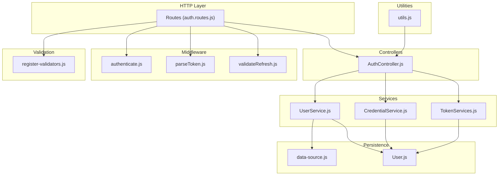
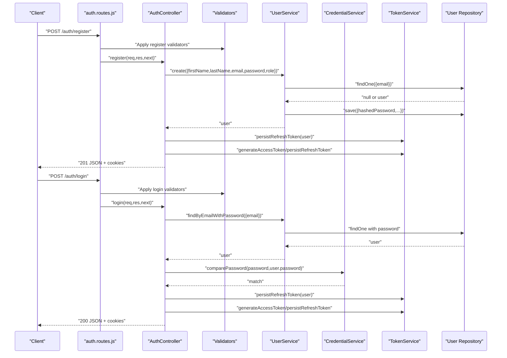
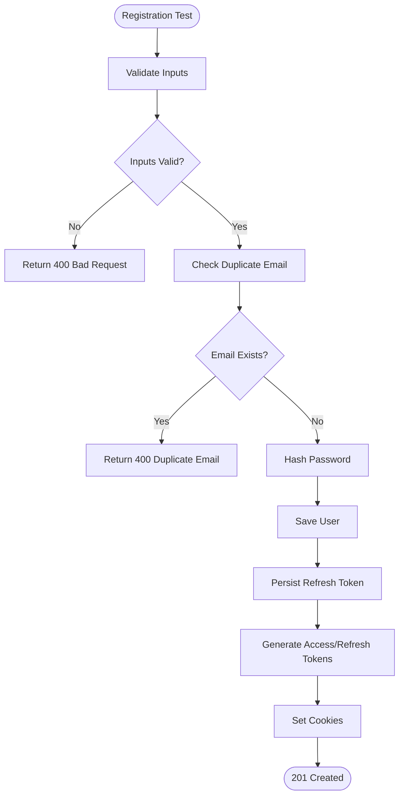
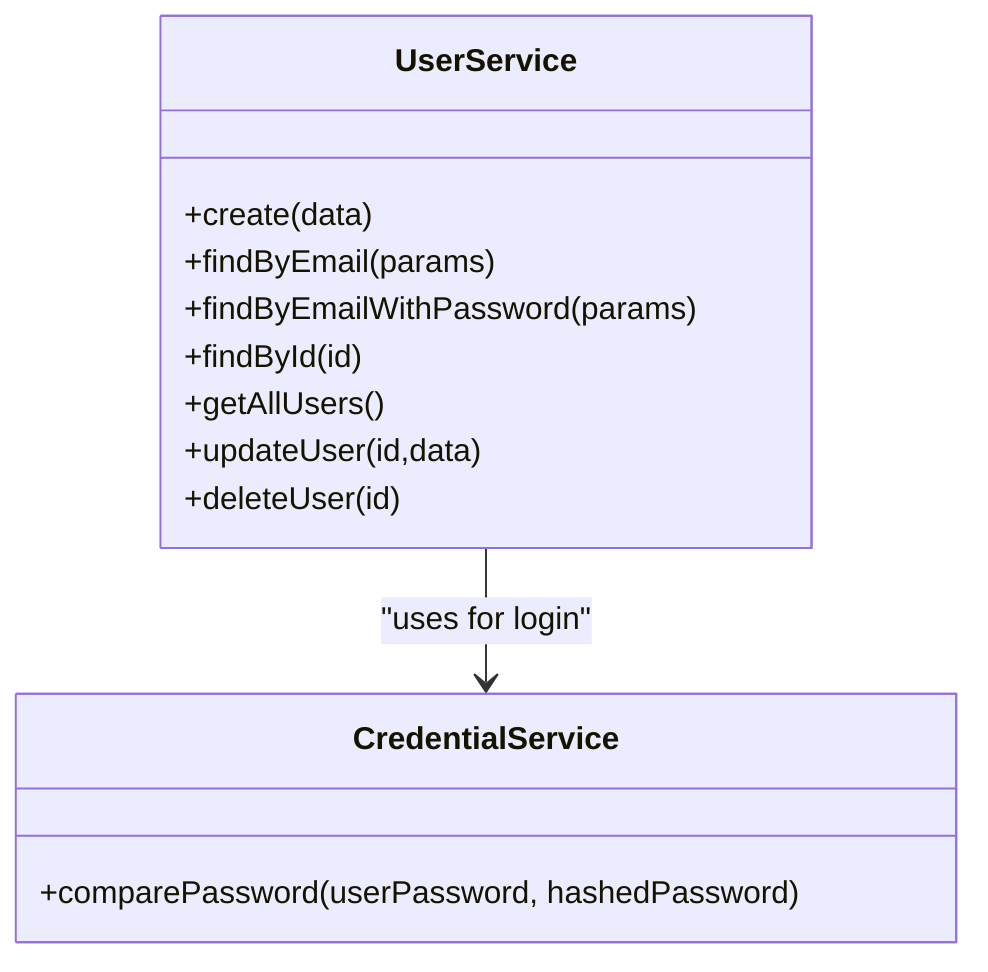
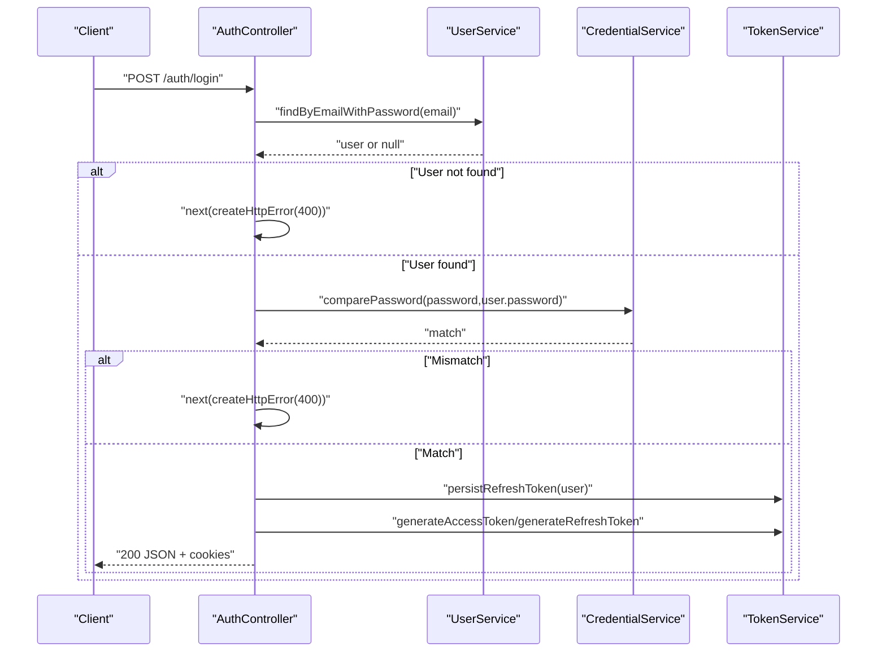
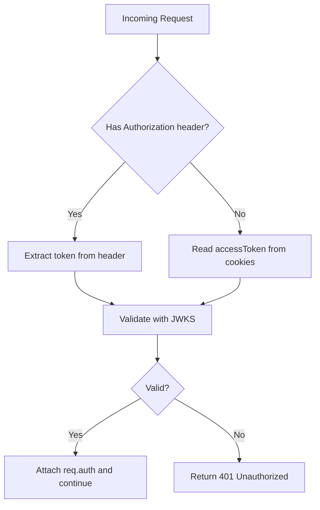
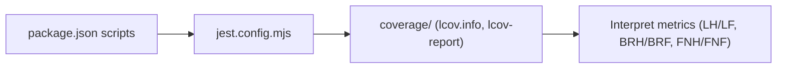

# Test Coverage Analysis

<cite>
**Referenced Files in This Document**
- [jest.config.mjs](file://jest.config.mjs)
- [package.json](file://package.json)
- [coverage/lcov.info](file://coverage/lcov.info)
- [src/app.js](file://src/app.js)
- [src/config/config.js](file://src/config/config.js)
- [src/config/data-source.js](file://src/config/data-source.js)
- [src/config/logger.js](file://src/config/logger.js)
- [src/constants/index.js](file://src/constants/index.js)
- [src/controllers/AuthController.js](file://src/controllers/AuthController.js)
- [src/entity/User.js](file://src/entity/User.js)
- [src/routes/auth.routes.js](file://src/routes/auth.routes.js)
- [src/services/UserService.js](file://src/services/UserService.js)
- [src/services/CredentialService.js](file://src/services/CredentialService.js)
- [src/middleware/authenticate.js](file://src/middleware/authenticate.js)
- [src/middleware/parseToken.js](file://src/middleware/parseToken.js)
- [src/middleware/validateRefresh.js](file://src/middleware/validateRefresh.js)
- [src/utils/utils.js](file://src/utils/utils.js)
- [src/validators/register-validators.js](file://src/validators/register-validators.js)
- [src/test/users/register.spec.js](file://src/test/users/register.spec.js)
- [src/test/users/login.spec.js](file://src/test/users/login.spec.js)
- [src/test/users/refresh.spec.js](file://src/test/users/refresh.spec.js)
</cite>

## Table of Contents
1. [Introduction](#introduction)
2. [Project Structure](#project-structure)
3. [Core Components](#core-components)
4. [Architecture Overview](#architecture-overview)
5. [Detailed Component Analysis](#detailed-component-analysis)
6. [Dependency Analysis](#dependency-analysis)
7. [Performance Considerations](#performance-considerations)
8. [Troubleshooting Guide](#troubleshooting-guide)
9. [Conclusion](#conclusion)
10. [Appendices](#appendices)

## Introduction
This document provides a comprehensive guide to test coverage analysis and measurement for the authentication service. It explains how coverage is configured using Jest and lcov, interprets lcov metrics, and outlines strategies to achieve comprehensive coverage across authentication flows, service layer logic, controller methods, and middleware functions. It also identifies currently uncovered areas and proposes targeted tests to improve coverage.

## Project Structure
The authentication service follows a layered architecture with clear separation of concerns:
- Controllers handle HTTP requests and delegate to services.
- Services encapsulate business logic and interact with repositories.
- Middleware enforces authentication and token parsing/validation.
- Validators enforce input constraints.
- Routes define endpoints and wire controllers and middleware.
- Tests target controllers, services, and middleware via HTTP and unit-level mocks.

**Diagram sources**
- [src/routes/auth.routes.js:1-49](file://src/routes/auth.routes.js#L1-L49)
- [src/controllers/AuthController.js:1-212](file://src/controllers/AuthController.js#L1-L212)
- [src/services/UserService.js:1-99](file://src/services/UserService.js#L1-L99)
- [src/services/CredentialService.js:1-7](file://src/services/CredentialService.js#L1-L7)
- [src/middleware/authenticate.js:1-26](file://src/middleware/authenticate.js#L1-L26)
- [src/middleware/parseToken.js:1-14](file://src/middleware/parseToken.js#L1-L14)
- [src/middleware/validateRefresh.js](file://src/middleware/validateRefresh.js)
- [src/validators/register-validators.js:1-47](file://src/validators/register-validators.js#L1-L47)
- [src/config/data-source.js](file://src/config/data-source.js)
- [src/entity/User.js](file://src/entity/User.js)
- [src/utils/utils.js:1-32](file://src/utils/utils.js#L1-L32)

**Section sources**
- [src/routes/auth.routes.js:1-49](file://src/routes/auth.routes.js#L1-L49)
- [src/controllers/AuthController.js:1-212](file://src/controllers/AuthController.js#L1-L212)
- [src/services/UserService.js:1-99](file://src/services/UserService.js#L1-L99)
- [src/middleware/authenticate.js:1-26](file://src/middleware/authenticate.js#L1-L26)
- [src/middleware/parseToken.js:1-14](file://src/middleware/parseToken.js#L1-L14)
- [src/validators/register-validators.js:1-47](file://src/validators/register-validators.js#L1-L47)
- [src/config/data-source.js](file://src/config/data-source.js)
- [src/entity/User.js](file://src/entity/User.js)
- [src/utils/utils.js:1-32](file://src/utils/utils.js#L1-L32)

## Core Components
This section documents the primary components under test coverage and their responsibilities:
- AuthController: Implements registration, login, profile retrieval, token refresh, and logout flows.
- UserService: Handles user creation, lookup by email/password, and CRUD operations.
- CredentialService: Compares plaintext passwords against stored hashes.
- Middleware: authenticate, parseToken, validateRefresh enforce JWT-based access control.
- Validators: register-validators define input validation rules.
- Utilities: utils provides helpers for JWT checks and database truncation.
- Routes: auth.routes wires endpoints to controllers and middleware.

Key coverage indicators from lcov.info:
- Covered lines (LH): Total lines executed in a file.
- Total lines (LF): Total lines in a file.
- Branch hits (BRH): Executed branches.
- Branches (BRF): Total branches.
- Function hits (FNH): Executed functions.
- Functions (FNF): Total functions.

**Section sources**
- [src/controllers/AuthController.js:1-212](file://src/controllers/AuthController.js#L1-L212)
- [src/services/UserService.js:1-99](file://src/services/UserService.js#L1-L99)
- [src/services/CredentialService.js:1-7](file://src/services/CredentialService.js#L1-L7)
- [src/middleware/authenticate.js:1-26](file://src/middleware/authenticate.js#L1-L26)
- [src/middleware/parseToken.js:1-14](file://src/middleware/parseToken.js#L1-L14)
- [src/middleware/validateRefresh.js](file://src/middleware/validateRefresh.js)
- [src/validators/register-validators.js:1-47](file://src/validators/register-validators.js#L1-L47)
- [src/utils/utils.js:1-32](file://src/utils/utils.js#L1-L32)
- [src/routes/auth.routes.js:1-49](file://src/routes/auth.routes.js#L1-L49)
- [coverage/lcov.info:1-512](file://coverage/lcov.info#L1-L512)

## Architecture Overview
The authentication flow spans HTTP routes, controllers, services, middleware, and persistence. The sequence below maps the end-to-end flow for registration and login.

**Diagram sources**
- [src/routes/auth.routes.js:1-49](file://src/routes/auth.routes.js#L1-L49)
- [src/controllers/AuthController.js:1-212](file://src/controllers/AuthController.js#L1-L212)
- [src/services/UserService.js:1-99](file://src/services/UserService.js#L1-L99)
- [src/services/CredentialService.js:1-7](file://src/services/CredentialService.js#L1-L7)
- [src/validators/register-validators.js:1-47](file://src/validators/register-validators.js#L1-L47)
- [src/config/data-source.js](file://src/config/data-source.js)
- [src/entity/User.js](file://src/entity/User.js)

## Detailed Component Analysis

### Coverage Reporting Configuration (Jest and lcov)
- Coverage output directory: coverage
- Coverage provider: v8
- Verbose test output enabled
- Reporters are commented out; defaults apply unless configured otherwise
- Thresholds are not enforced by default

Recommendations:
- Enable lcov and html reporters for human-readable summaries.
- Set coverage thresholds per metric (lines, functions, branches, statements) to enforce quality gates.
- Use coverageProvider v8 for native ES modules support.

**Section sources**
- [jest.config.mjs:27-35](file://jest.config.mjs#L27-L35)
- [jest.config.mjs](file://jest.config.mjs#L193)
- [jest.config.mjs:40-45](file://jest.config.mjs#L40-L45)
- [jest.config.mjs:47-48](file://jest.config.mjs#L47-L48)
- [package.json](file://package.json#L10)

### Coverage Metrics Interpretation
- Line coverage: LH/LF ratio indicates how many executable lines were executed.
- Branch coverage: BRH/BRF ratio reflects conditional branch execution.
- Function coverage: FNH/FNF ratio shows how many functions were invoked.
- Use lcov report in coverage/lcov-report for per-file breakdown and drill-down.

Interpretation guidelines:
- Aim for >80% line and branch coverage; higher for critical paths.
- Investigate low branch coverage by examining decision points (if/else, switch, &&, ||).
- Treat missing functions as potential missing unit tests.

**Section sources**
- [coverage/lcov.info:1-512](file://coverage/lcov.info#L1-L512)

### Current Coverage Statistics (from lcov.info)
Below are the key metrics per file. Use these to identify gaps and prioritize improvements.

- src/app.js
  - Lines: 33 total, 30 covered → 80% line coverage
  - Branches: 3 total, 2 covered → ~67% branch coverage
- src/config/config.js
  - Lines: 31 total, 31 covered → 100% line coverage
  - Branches: 1 total, 1 covered → 100% branch coverage
- src/config/data-source.js
  - Lines: 19 total, 19 covered → 100% line coverage
  - Branches: 1 total, 1 covered → 100% branch coverage
- src/config/logger.js
  - Lines: 33 total, 33 covered → 100% line coverage
  - Branches: 1 total, 1 covered → 100% branch coverage
- src/constants/index.js
  - Lines: 5 total, 5 covered → 100% line coverage
  - Branches: 1 total, 1 covered → 100% branch coverage
- src/controllers/AuthController.js
  - Lines: 80 total, 77 covered → 96% line coverage
  - Branches: 10 total, 9 covered → 90% branch coverage
  - Functions: 3 total, 3 covered → 100% function coverage
- src/entity/User.js
  - Lines: 29 total, 29 covered → 100% line coverage
  - Branches: 1 total, 1 covered → 100% branch coverage
- src/routes/auth.routes.js
  - Lines: 18 total, 18 covered → 100% line coverage
  - Branches: 2 total, 2 covered → 100% branch coverage
- src/services/userService.js
  - Lines: 40 total, 34 covered → 85% line coverage
  - Branches: 7 total, 6 covered → 86% branch coverage
- src/utils/utils.js
  - Lines: 30 total, 18 covered → 60% line coverage
  - Branches: 6 total, 3 covered → 50% branch coverage
  - Functions: 2 total, 1 covered → 50% function coverage
- src/validators/register-validators.js
  - Lines: 46 total, 46 covered → 100% line coverage
  - Branches: 1 total, 1 covered → 100% branch coverage

Observations:
- High coverage in configuration, routes, validators, and entities.
- Moderate to high coverage in controllers and services.
- Lower coverage in utils and related functions.

**Section sources**
- [coverage/lcov.info:1-512](file://coverage/lcov.info#L1-L512)

### Strategies for Achieving Comprehensive Coverage
- Critical path testing:
  - Registration: happy path, duplicate email, invalid inputs, hashing failure scenarios.
  - Login: valid credentials, wrong password, user not found, validation failures.
  - Token refresh: valid refresh token, expired token, missing token, user not found.
  - Logout: valid session, malformed token ID.
- Edge case coverage:
  - Empty/whitespace inputs, boundary lengths, invalid email formats, weak passwords.
  - Non-existent users, mismatched roles, invalid JWT formats.
- Branch coverage:
  - Add tests for all conditional branches (validation errors, user existence checks, password mismatches, token deletion outcomes).
- Service-layer coverage:
  - Mock repositories to simulate DB errors and edge conditions.
  - Test error propagation and HTTP error construction.
- Controller coverage:
  - Verify response codes, JSON bodies, and cookie settings.
  - Ensure error handling paths call next() and propagate errors.
- Middleware coverage:
  - Test token extraction from Authorization header and cookies.
  - Validate protected route access and unauthorized responses.

**Section sources**
- [src/controllers/AuthController.js:1-212](file://src/controllers/AuthController.js#L1-L212)
- [src/services/UserService.js:1-99](file://src/services/UserService.js#L1-L99)
- [src/middleware/authenticate.js:1-26](file://src/middleware/authenticate.js#L1-L26)
- [src/middleware/parseToken.js:1-14](file://src/middleware/parseToken.js#L1-L14)
- [src/middleware/validateRefresh.js](file://src/middleware/validateRefresh.js)
- [src/validators/register-validators.js:1-47](file://src/validators/register-validators.js#L1-L47)
- [src/test/users/register.spec.js:1-168](file://src/test/users/register.spec.js#L1-L168)
- [src/test/users/login.spec.js:1-92](file://src/test/users/login.spec.js#L1-L92)
- [src/test/users/refresh.spec.js:1-109](file://src/test/users/refresh.spec.js#L1-L109)

### Coverage Analysis by Component

#### Authentication Flows
- Registration:
  - Covered: request validation, user creation, password hashing, refresh token persistence, cookie setting.
  - Gaps: error paths for duplicate email and DB errors are partially covered; expand negative tests.
- Login:
  - Covered: validation, user lookup with password, password comparison, token generation, cookie setting.
  - Gaps: add tests for wrong password and user-not-found scenarios.
- Token Refresh:
  - Covered: valid refresh flow and missing token handling.
  - Gaps: add tests for expired token and user-not-found scenarios.
- Logout:
  - Not covered in current tests; add tests for token deletion and cookie clearing.

**Diagram sources**
- [src/controllers/AuthController.js:19-70](file://src/controllers/AuthController.js#L19-L70)
- [src/services/UserService.js:7-38](file://src/services/UserService.js#L7-L38)
- [src/test/users/register.spec.js:1-168](file://src/test/users/register.spec.js#L1-L168)

**Section sources**
- [src/controllers/AuthController.js:19-70](file://src/controllers/AuthController.js#L19-L70)
- [src/services/UserService.js:7-38](file://src/services/UserService.js#L7-L38)
- [src/test/users/register.spec.js:1-168](file://src/test/users/register.spec.js#L1-L168)

#### Service Layer Logic
- UserService:
  - Covered: create, findByEmail, findByEmailWithPassword, findById, getAllUsers, updateUser, deleteUser.
  - Gaps: error handling paths for DB exceptions and update/delete failures.
- CredentialService:
  - Covered: password comparison.
  - Gaps: not directly tested; add unit tests for comparePassword.

**Diagram sources**
- [src/services/UserService.js:1-99](file://src/services/UserService.js#L1-L99)
- [src/services/CredentialService.js:1-7](file://src/services/CredentialService.js#L1-L7)

**Section sources**
- [src/services/UserService.js:1-99](file://src/services/UserService.js#L1-L99)
- [src/services/CredentialService.js:1-7](file://src/services/CredentialService.js#L1-L7)

#### Controller Methods
- AuthController:
  - Covered: register, login, self, refresh, logout.
  - Gaps: missing logout tests; improve error handling verification.

**Diagram sources**
- [src/controllers/AuthController.js:72-136](file://src/controllers/AuthController.js#L72-L136)
- [src/services/UserService.js:48-54](file://src/services/UserService.js#L48-L54)
- [src/services/CredentialService.js:1-7](file://src/services/CredentialService.js#L1-L7)

**Section sources**
- [src/controllers/AuthController.js:72-136](file://src/controllers/AuthController.js#L72-L136)
- [src/services/UserService.js:48-54](file://src/services/UserService.js#L48-L54)
- [src/services/CredentialService.js:1-7](file://src/services/CredentialService.js#L1-L7)

#### Middleware Functions
- authenticate: Extracts token from Authorization header or cookies and validates with JWKS.
- parseToken: Extracts refresh token from cookies for logout endpoint.
- validateRefresh: Validates refresh tokens (implementation file referenced).

Coverage opportunities:
- Test token extraction precedence (header vs cookie).
- Test invalid/missing tokens and resulting 401 responses.
- Add unit tests for middleware logic.

**Diagram sources**
- [src/middleware/authenticate.js:1-26](file://src/middleware/authenticate.js#L1-L26)
- [src/middleware/parseToken.js:1-14](file://src/middleware/parseToken.js#L1-L14)

**Section sources**
- [src/middleware/authenticate.js:1-26](file://src/middleware/authenticate.js#L1-L26)
- [src/middleware/parseToken.js:1-14](file://src/middleware/parseToken.js#L1-L14)
- [src/middleware/validateRefresh.js](file://src/middleware/validateRefresh.js)

### Targeted Tests to Improve Coverage
- utils.js:
  - Add unit tests for isJwt with valid/invalid tokens and null inputs.
  - Add truncateTable usage in tests to ensure clean state.
- AuthController:
  - Add logout tests verifying token deletion and cookie clearing.
  - Expand error handling tests for all catch blocks.
- UserService:
  - Add unit tests for error propagation and DB failure simulation.
- Middleware:
  - Add unit tests for authenticate and parseToken with various token sources and invalid inputs.
- Routes:
  - Add tests for all endpoints to ensure middleware and controllers are invoked.

**Section sources**
- [src/utils/utils.js:1-32](file://src/utils/utils.js#L1-L32)
- [src/controllers/AuthController.js:194-210](file://src/controllers/AuthController.js#L194-L210)
- [src/services/UserService.js:28-38](file://src/services/UserService.js#L28-L38)
- [src/middleware/authenticate.js:1-26](file://src/middleware/authenticate.js#L1-L26)
- [src/middleware/parseToken.js:1-14](file://src/middleware/parseToken.js#L1-L14)
- [src/routes/auth.routes.js:1-49](file://src/routes/auth.routes.js#L1-L49)

## Dependency Analysis
Coverage depends on:
- Jest configuration enabling v8 coverage provider and output directory.
- Test scripts invoking Jest with proper environment variables.
- lcov.info and lcov-report generated post-test execution.

**Diagram sources**
- [package.json:7-13](file://package.json#L7-L13)
- [jest.config.mjs:27-35](file://jest.config.mjs#L27-L35)
- [coverage/lcov.info:1-512](file://coverage/lcov.info#L1-L512)

**Section sources**
- [package.json:7-13](file://package.json#L7-L13)
- [jest.config.mjs:27-35](file://jest.config.mjs#L27-L35)
- [coverage/lcov.info:1-512](file://coverage/lcov.info#L1-L512)

## Performance Considerations
- Use Jest’s maxWorkers and runInBand settings judiciously to balance speed and resource usage.
- Prefer mocking external services (JWKS, DB) to avoid flaky tests and improve performance.
- Keep lcov report generation disabled during local runs if not needed to reduce overhead.

## Troubleshooting Guide
Common issues and resolutions:
- Missing lcov report:
  - Ensure coverageProvider is set to v8 and coverageDirectory is configured.
  - Run tests with NODE_ENV=test to activate test-specific configurations.
- Low branch coverage:
  - Add tests for all conditional branches (e.g., validation failures, user not found, password mismatch).
- Uncovered utility functions:
  - Write unit tests for isJwt and truncateTable to improve function and line coverage.
- Middleware coverage gaps:
  - Add unit tests for authenticate and parseToken to validate token extraction and validation logic.

**Section sources**
- [jest.config.mjs](file://jest.config.mjs#L35)
- [jest.config.mjs](file://jest.config.mjs#L27)
- [src/utils/utils.js:13-31](file://src/utils/utils.js#L13-L31)
- [src/middleware/authenticate.js:1-26](file://src/middleware/authenticate.js#L1-L26)
- [src/middleware/parseToken.js:1-14](file://src/middleware/parseToken.js#L1-L14)

## Conclusion
The authentication service demonstrates strong coverage in configuration, routes, validators, and most controllers and services. To reach comprehensive coverage:
- Implement targeted tests for uncovered utilities and middleware.
- Expand negative and edge-case scenarios across registration, login, refresh, and logout flows.
- Enforce coverage thresholds and integrate lcov reporting into CI pipelines for continuous monitoring.

## Appendices
- lcov.info highlights:
  - High coverage in configuration and routes.
  - Moderate to high in controllers and services.
  - Lower coverage in utils and related functions.
- Next steps:
  - Add unit tests for utils.js functions.
  - Add logout tests and middleware unit tests.
  - Integrate Jest thresholds and CI reporting.