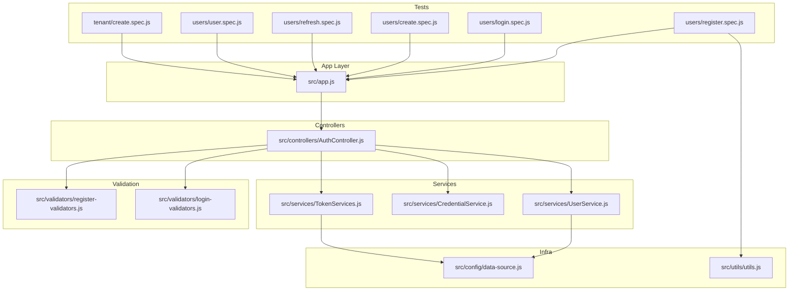
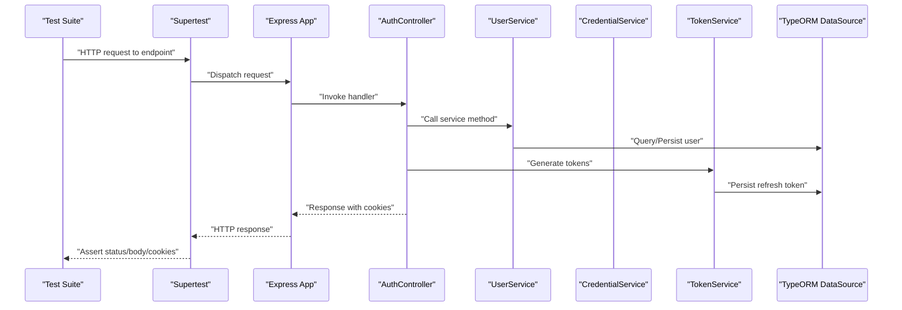
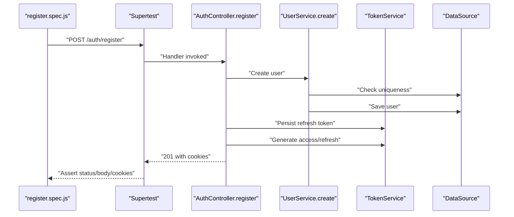
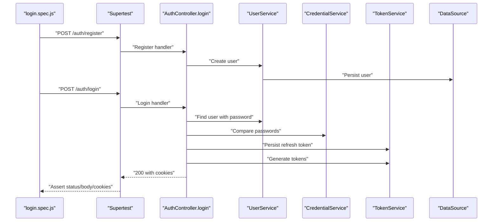
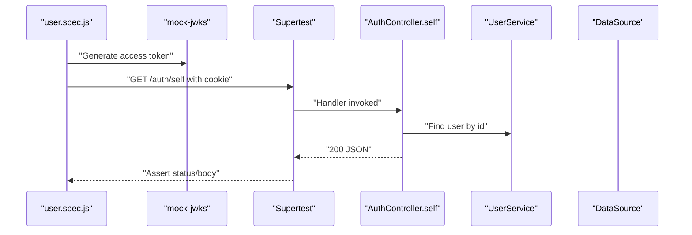
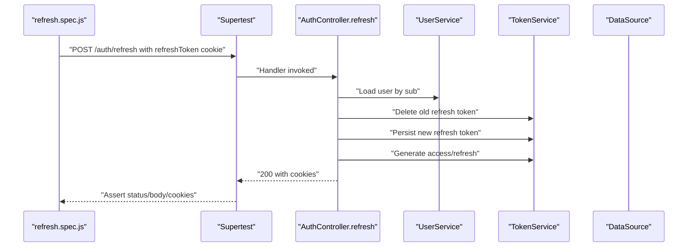
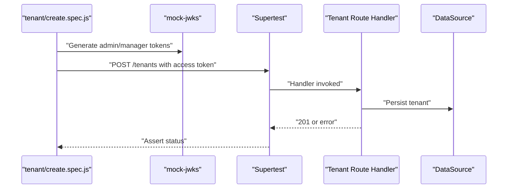
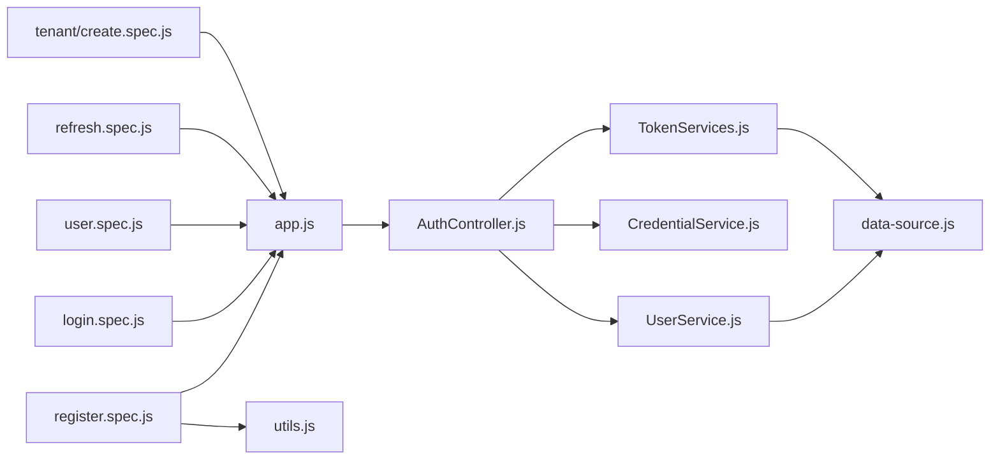

# Testing Best Practices

<cite>
**Referenced Files in This Document**
- [jest.config.mjs](file://jest.config.mjs)
- [package.json](file://package.json)
- [src/app.js](file://src/app.js)
- [src/config/data-source.js](file://src/config/data-source.js)
- [src/utils/utils.js](file://src/utils/utils.js)
- [src/validators/register-validators.js](file://src/validators/register-validators.js)
- [src/validators/login-validators.js](file://src/validators/login-validators.js)
- [src/services/UserService.js](file://src/services/UserService.js)
- [src/services/CredentialService.js](file://src/services/CredentialService.js)
- [src/services/TokenServices.js](file://src/services/TokenServices.js)
- [src/controllers/AuthController.js](file://src/controllers/AuthController.js)
- [src/test/users/register.spec.js](file://src/test/users/register.spec.js)
- [src/test/users/login.spec.js](file://src/test/users/login.spec.js)
- [src/test/users/create.spec.js](file://src/test/users/create.spec.js)
- [src/test/users/refresh.spec.js](file://src/test/users/refresh.spec.js)
- [src/test/users/user.spec.js](file://src/test/users/user.spec.js)
- [src/test/tenant/create.spec.js](file://src/test/tenant/create.spec.js)
</cite>

## Table of Contents
1. [Introduction](#introduction)
2. [Project Structure](#project-structure)
3. [Core Components](#core-components)
4. [Architecture Overview](#architecture-overview)
5. [Detailed Component Analysis](#detailed-component-analysis)
6. [Dependency Analysis](#dependency-analysis)
7. [Performance Considerations](#performance-considerations)
8. [Troubleshooting Guide](#troubleshooting-guide)
9. [Conclusion](#conclusion)
10. [Appendices](#appendices)

## Introduction
This document consolidates comprehensive testing best practices for the authentication service. It focuses on test organization, naming conventions, and file structure aligned with Jest standards; assertion patterns; setup and teardown procedures; error and validation testing; mocking strategies for JWT, database, and external dependencies; performance considerations; test data management; and CI testing setup. The guidance is grounded in the existing test suite and supporting modules.

## Project Structure
The test suite is organized by feature under a dedicated test directory. Tests are grouped by route/controller concerns and include both integration-style tests (HTTP requests via supertest) and focused tests for service-layer logic. The configuration supports ES modules and TypeScript-like extensions, and the project uses PostgreSQL via TypeORM with environment-aware synchronization.

**Diagram sources**
- [src/test/users/register.spec.js:1-168](file://src/test/users/register.spec.js#L1-L168)
- [src/test/users/login.spec.js:1-92](file://src/test/users/login.spec.js#L1-L92)
- [src/test/users/create.spec.js:1-93](file://src/test/users/create.spec.js#L1-L93)
- [src/test/users/refresh.spec.js:1-109](file://src/test/users/refresh.spec.js#L1-L109)
- [src/test/users/user.spec.js:1-125](file://src/test/users/user.spec.js#L1-L125)
- [src/test/tenant/create.spec.js:1-106](file://src/test/tenant/create.spec.js#L1-L106)
- [src/app.js:1-40](file://src/app.js#L1-L40)
- [src/controllers/AuthController.js:1-212](file://src/controllers/AuthController.js#L1-L212)
- [src/services/UserService.js:1-99](file://src/services/UserService.js#L1-L99)
- [src/services/CredentialService.js:1-7](file://src/services/CredentialService.js#L1-L7)
- [src/services/TokenServices.js:1-60](file://src/services/TokenServices.js#L1-L60)
- [src/validators/register-validators.js:1-47](file://src/validators/register-validators.js#L1-L47)
- [src/validators/login-validators.js:1-25](file://src/validators/login-validators.js#L1-L25)
- [src/config/data-source.js:1-22](file://src/config/data-source.js#L1-L22)
- [src/utils/utils.js:1-32](file://src/utils/utils.js#L1-L32)

**Section sources**
- [jest.config.mjs:82-93](file://jest.config.mjs#L82-L93)
- [package.json:7-13](file://package.json#L7-L13)
- [src/app.js:1-40](file://src/app.js#L1-L40)
- [src/config/data-source.js:1-22](file://src/config/data-source.js#L1-L22)

## Core Components
- Test runner and environment: Jest configured for Node with verbose output and ES module support.
- Test discovery: Uses default Jest patterns; tests are colocated under src/test with feature-based grouping.
- Assertion library: Built-in Jest matchers; custom helpers for JWT validation.
- Validation pipeline: Express validators integrated at controller level; tests assert validation failure responses.
- Service layer: Clear separation between user persistence, credentials comparison, and token generation/persistence.
- Controllers: HTTP endpoints for registration, login, self info, refresh, and logout; handle cookies and error propagation.
- Data access: TypeORM DataSource configured per environment; test env enables synchronization for fast setup.

Key testing patterns observed:
- Use describe blocks to group related scenarios (e.g., “Given all test fields”, “Fields are missing”).
- Use beforeAll/beforeEach/afterEach/afterAll for DB initialization, cleanup, and mock lifecycle.
- Use supertest to drive HTTP endpoints and assert status codes, headers, and body shapes.
- Validate JWT presence and shape using a custom helper.
- Assert cookie presence and token issuance for auth flows.
- Validate error paths for duplicates, validation failures, and unauthorized access.

**Section sources**
- [jest.config.mjs:36-36](file://jest.config.mjs#L36-L36)
- [jest.config.mjs:193-193](file://jest.config.mjs#L193-L193)
- [jest.config.mjs:82-93](file://jest.config.mjs#L82-L93)
- [src/test/users/register.spec.js:17-167](file://src/test/users/register.spec.js#L17-L167)
- [src/test/users/login.spec.js:15-91](file://src/test/users/login.spec.js#L15-L91)
- [src/test/users/user.spec.js:17-124](file://src/test/users/user.spec.js#L17-L124)
- [src/test/users/refresh.spec.js:18-108](file://src/test/users/refresh.spec.js#L18-L108)
- [src/test/users/create.spec.js:18-92](file://src/test/users/create.spec.js#L18-L92)
- [src/test/tenant/create.spec.js:17-105](file://src/test/tenant/create.spec.js#L17-L105)
- [src/utils/utils.js:13-31](file://src/utils/utils.js#L13-L31)
- [src/validators/register-validators.js:1-47](file://src/validators/register-validators.js#L1-L47)
- [src/validators/login-validators.js:1-25](file://src/validators/login-validators.js#L1-L25)
- [src/services/UserService.js:1-99](file://src/services/UserService.js#L1-L99)
- [src/services/CredentialService.js:1-7](file://src/services/CredentialService.js#L1-L7)
- [src/services/TokenServices.js:1-60](file://src/services/TokenServices.js#L1-L60)
- [src/controllers/AuthController.js:1-212](file://src/controllers/AuthController.js#L1-L212)
- [src/config/data-source.js:16-16](file://src/config/data-source.js#L16-L16)

## Architecture Overview
The tests exercise the HTTP surface of the service, which delegates to controllers, services, and repositories. Validation runs before service calls. Token services manage JWT lifecycle and refresh token persistence.

**Diagram sources**
- [src/test/users/register.spec.js:28-30](file://src/test/users/register.spec.js#L28-L30)
- [src/app.js:1-40](file://src/app.js#L1-L40)
- [src/controllers/AuthController.js:19-70](file://src/controllers/AuthController.js#L19-L70)
- [src/services/UserService.js:7-38](file://src/services/UserService.js#L7-L38)
- [src/services/CredentialService.js:3-5](file://src/services/CredentialService.js#L3-L5)
- [src/services/TokenServices.js:45-58](file://src/services/TokenServices.js#L45-L58)
- [src/config/data-source.js:8-21](file://src/config/data-source.js#L8-L21)

## Detailed Component Analysis

### Authentication Registration Flow Tests
Best practices demonstrated:
- Clean DB per test using dropDatabase and synchronize in beforeEach.
- Validate HTTP status, JSON content-type, and response shape.
- Verify persisted user fields and roles.
- Confirm hashed password storage and length.
- Assert JWT presence and validity via helper.
- Enforce validation failures for missing/invalid fields.
- Guard against duplicate emails.

**Diagram sources**
- [src/test/users/register.spec.js:28-30](file://src/test/users/register.spec.js#L28-L30)
- [src/controllers/AuthController.js:19-70](file://src/controllers/AuthController.js#L19-L70)
- [src/services/UserService.js:7-38](file://src/services/UserService.js#L7-L38)
- [src/services/TokenServices.js:45-58](file://src/services/TokenServices.js#L45-L58)
- [src/config/data-source.js:16-16](file://src/config/data-source.js#L16-L16)

**Section sources**
- [src/test/users/register.spec.js:31-54](file://src/test/users/register.spec.js#L31-L54)
- [src/test/users/register.spec.js:56-167](file://src/test/users/register.spec.js#L56-L167)
- [src/utils/utils.js:13-31](file://src/utils/utils.js#L13-L31)

### Authentication Login Flow Tests
Highlights:
- Register a user, then authenticate and verify password comparison.
- Assert successful login status and token issuance.
- Validate that stored password is hashed and not plaintext.

**Diagram sources**
- [src/test/users/login.spec.js:30-35](file://src/test/users/login.spec.js#L30-L35)
- [src/controllers/AuthController.js:72-136](file://src/controllers/AuthController.js#L72-L136)
- [src/services/UserService.js:40-54](file://src/services/UserService.js#L40-L54)
- [src/services/CredentialService.js:3-5](file://src/services/CredentialService.js#L3-L5)
- [src/services/TokenServices.js:45-58](file://src/services/TokenServices.js#L45-L58)

**Section sources**
- [src/test/users/login.spec.js:37-60](file://src/test/users/login.spec.js#L37-L60)
- [src/test/users/login.spec.js:62-91](file://src/test/users/login.spec.js#L62-L91)

### Self Profile Access Tests
Focus areas:
- Use mock-JWKS to mint access tokens for protected routes.
- Validate successful retrieval of user profile without sensitive fields.
- Assert 401 when no authorization is provided.

**Diagram sources**
- [src/test/users/user.spec.js:29-34](file://src/test/users/user.spec.js#L29-L34)
- [src/controllers/AuthController.js:138-141](file://src/controllers/AuthController.js#L138-L141)
- [src/services/UserService.js:56-62](file://src/services/UserService.js#L56-L62)

**Section sources**
- [src/test/users/user.spec.js:36-65](file://src/test/users/user.spec.js#L36-L65)
- [src/test/users/user.spec.js:67-124](file://src/test/users/user.spec.js#L67-L124)

### Refresh Token Flow Tests
Key validations:
- Persist a refresh token and sign a refresh token with HS256.
- Submit refresh token via cookie and assert 200 with new tokens.
- Assert 401 when no refresh token is provided.

**Diagram sources**
- [src/test/users/refresh.spec.js:29-34](file://src/test/users/refresh.spec.js#L29-L34)
- [src/controllers/AuthController.js:143-192](file://src/controllers/AuthController.js#L143-L192)
- [src/services/TokenServices.js:54-58](file://src/services/TokenServices.js#L54-L58)

**Section sources**
- [src/test/users/refresh.spec.js:36-69](file://src/test/users/refresh.spec.js#L36-L69)
- [src/test/users/refresh.spec.js:71-108](file://src/test/users/refresh.spec.js#L71-L108)

### Tenant Creation Authorization Tests
Demonstrates:
- Using mock-JWKS to simulate admin and manager roles.
- Assert 201 for admins, 401 for unauthenticated, and 403 for insufficient permissions.

**Diagram sources**
- [src/test/tenant/create.spec.js:28-33](file://src/test/tenant/create.spec.js#L28-L33)
- [src/test/tenant/create.spec.js:54-57](file://src/test/tenant/create.spec.js#L54-L57)
- [src/test/tenant/create.spec.js:84-104](file://src/test/tenant/create.spec.js#L84-L104)

**Section sources**
- [src/test/tenant/create.spec.js:35-68](file://src/test/tenant/create.spec.js#L35-L68)
- [src/test/tenant/create.spec.js:70-105](file://src/test/tenant/create.spec.js#L70-L105)

### Service Layer Testing Patterns
- Isolate service methods and assert repository interactions.
- Validate error propagation and HTTP error responses.
- Use mocks for external dependencies (e.g., token signing) when testing service logic independently.

Examples to emulate:
- Registration and login validation failures via express-validator.
- Password hashing and comparison via UserService and CredentialService.
- Token generation and refresh token persistence via TokenService.

**Section sources**
- [src/services/UserService.js:7-38](file://src/services/UserService.js#L7-L38)
- [src/services/UserService.js:48-54](file://src/services/UserService.js#L48-L54)
- [src/services/CredentialService.js:3-5](file://src/services/CredentialService.js#L3-L5)
- [src/services/TokenServices.js:12-43](file://src/services/TokenServices.js#L12-L43)
- [src/services/TokenServices.js:45-58](file://src/services/TokenServices.js#L45-L58)

## Dependency Analysis
- Test-time dependencies:
  - Supertest for HTTP assertions.
  - mock-jwks for JWT mocking in protected routes.
  - TypeORM DataSource initialized per suite for DB isolation.
  - Custom JWT validator helper.
- Controller-service coupling:
  - AuthController orchestrates validation, service calls, and token operations.
  - TokenService encapsulates key material and signing logic.
  - CredentialService abstracts password comparison.
- Validation pipeline:
  - Validators define expected input; controller responds with structured 400 errors when invalid.

**Diagram sources**
- [src/test/users/register.spec.js:1-168](file://src/test/users/register.spec.js#L1-L168)
- [src/test/users/login.spec.js:1-92](file://src/test/users/login.spec.js#L1-L92)
- [src/test/users/user.spec.js:1-125](file://src/test/users/user.spec.js#L1-L125)
- [src/test/users/refresh.spec.js:1-109](file://src/test/users/refresh.spec.js#L1-L109)
- [src/test/tenant/create.spec.js:1-106](file://src/test/tenant/create.spec.js#L1-L106)
- [src/app.js:1-40](file://src/app.js#L1-L40)
- [src/controllers/AuthController.js:1-212](file://src/controllers/AuthController.js#L1-L212)
- [src/services/UserService.js:1-99](file://src/services/UserService.js#L1-L99)
- [src/services/CredentialService.js:1-7](file://src/services/CredentialService.js#L1-L7)
- [src/services/TokenServices.js:1-60](file://src/services/TokenServices.js#L1-L60)
- [src/config/data-source.js:1-22](file://src/config/data-source.js#L1-L22)
- [src/utils/utils.js:1-32](file://src/utils/utils.js#L1-L32)

**Section sources**
- [src/app.js:1-40](file://src/app.js#L1-L40)
- [src/controllers/AuthController.js:1-212](file://src/controllers/AuthController.js#L1-L212)
- [src/services/UserService.js:1-99](file://src/services/UserService.js#L1-L99)
- [src/services/CredentialService.js:1-7](file://src/services/CredentialService.js#L1-L7)
- [src/services/TokenServices.js:1-60](file://src/services/TokenServices.js#L1-L60)
- [src/config/data-source.js:1-22](file://src/config/data-source.js#L1-L22)
- [src/utils/utils.js:1-32](file://src/utils/utils.js#L1-L32)

## Performance Considerations
- Database initialization cost: Initialize and synchronize the DataSource once per suite in beforeAll and reset state in beforeEach to avoid repeated migrations.
- Parallelism: Keep tests independent; avoid shared mutable state between tests.
- Cookie handling: Prefer minimal cookie parsing in tests; focus on status/body/headers.
- Token generation: Mock signing operations when testing service logic in isolation to reduce cryptographic overhead.
- Coverage: Enable coverage reporting to identify hotspots and redundant assertions.

[No sources needed since this section provides general guidance]

## Troubleshooting Guide
Common issues and resolutions:
- Database initialization failures: Ensure beforeAll initializes the DataSource and throws on error to fail fast.
- Duplicate email handling: Expect 400 responses when attempting to register an existing email.
- Validation failures: Assert 400 responses when required fields are missing or invalid according to validators.
- Unauthorized access: Expect 401 when accessing protected routes without a valid access token.
- Insufficient permissions: Expect 403 when lower-privileged users attempt admin-only endpoints.
- JWT verification: Use the provided helper to confirm token structure; ensure token signing keys are available in test environment if verifying signatures.

**Section sources**
- [src/test/users/register.spec.js:31-38](file://src/test/users/register.spec.js#L31-L38)
- [src/test/users/register.spec.js:98-104](file://src/test/users/register.spec.js#L98-L104)
- [src/test/users/register.spec.js:156-166](file://src/test/users/register.spec.js#L156-L166)
- [src/test/users/user.spec.js:115-123](file://src/test/users/user.spec.js#L115-L123)
- [src/test/tenant/create.spec.js:84-104](file://src/test/tenant/create.spec.js#L84-L104)
- [src/utils/utils.js:13-31](file://src/utils/utils.js#L13-L31)

## Conclusion
The test suite demonstrates robust patterns for authentication testing: clean DB setup per test, comprehensive validation and error-path coverage, JWT mocking for protected routes, and clear separation of concerns across controllers, services, and repositories. Adopting these patterns ensures reliable, maintainable, and fast tests that scale with the service.

[No sources needed since this section summarizes without analyzing specific files]

## Appendices

### Test Organization and Naming Conventions
- Group tests by feature under src/test/<feature>/.
- Name test files with .spec.js suffix and reflect the route or module being tested.
- Use nested describe blocks to categorize scenarios (e.g., “Given all test fields”, “Fields are missing”).
- Keep test names descriptive and imperative (what the test asserts).

**Section sources**
- [src/test/users/register.spec.js:17-17](file://src/test/users/register.spec.js#L17-L17)
- [src/test/users/login.spec.js:15-15](file://src/test/users/login.spec.js#L15-L15)
- [src/test/users/user.spec.js:17-17](file://src/test/users/user.spec.js#L17-L17)
- [src/test/users/refresh.spec.js:18-18](file://src/test/users/refresh.spec.js#L18-L18)
- [src/test/users/create.spec.js:18-18](file://src/test/users/create.spec.js#L18-L18)
- [src/test/tenant/create.spec.js:17-17](file://src/test/tenant/create.spec.js#L17-L17)

### Setup and Teardown Procedures
- Initialize the DataSource in beforeAll and destroy it in afterAll.
- Drop and synchronize the database in beforeEach to ensure a clean slate.
- Start/stop mock-JWKS in beforeEach/afterEach around protected-route tests.
- Clear or reset mocks as needed; rely on Jest’s automatic clearing behavior.

**Section sources**
- [src/test/users/register.spec.js:31-54](file://src/test/users/register.spec.js#L31-L54)
- [src/test/users/user.spec.js:36-65](file://src/test/users/user.spec.js#L36-L65)
- [src/test/users/create.spec.js:38-69](file://src/test/users/create.spec.js#L38-L69)
- [src/test/tenant/create.spec.js:35-68](file://src/test/tenant/create.spec.js#L35-L68)

### Assertion Patterns
- Status codes: Use expect(response.status).toBe(...) for HTTP status checks.
- Content types: Use expect(response.type).toBe("application/json").
- Body properties: Use toHaveProperty and toBe for shape and value assertions.
- Cookies: Parse Set-Cookie headers to validate token presence and shape.
- JWT validation: Use a helper to verify token structure.

**Section sources**
- [src/test/users/register.spec.js:57-78](file://src/test/users/register.spec.js#L57-L78)
- [src/test/users/register.spec.js:115-138](file://src/test/users/register.spec.js#L115-L138)
- [src/utils/utils.js:13-31](file://src/utils/utils.js#L13-L31)

### Error Scenarios, Validation Failures, and Edge Cases
- Validation failures: Assert 400 responses for missing/invalid fields using validators.
- Duplicate entries: Assert 400 for duplicate emails during registration.
- Unauthorized access: Assert 401 for missing tokens on protected routes.
- Permission denials: Assert 403 for insufficient roles on admin endpoints.
- Token rotation: Assert new tokens and deletion of old refresh tokens on refresh.

**Section sources**
- [src/test/users/register.spec.js:98-104](file://src/test/users/register.spec.js#L98-L104)
- [src/test/users/register.spec.js:156-166](file://src/test/users/register.spec.js#L156-L166)
- [src/test/users/user.spec.js:115-123](file://src/test/users/user.spec.js#L115-L123)
- [src/test/tenant/create.spec.js:84-104](file://src/test/tenant/create.spec.js#L84-L104)
- [src/test/users/refresh.spec.js:99-107](file://src/test/users/refresh.spec.js#L99-L107)

### Mocking Best Practices
- JWT: Use mock-jwks to generate access tokens for protected routes; start/stop the mock per test lifecycle.
- Database: Use TypeORM DataSource with dropDatabase/synchronize in beforeEach for isolation.
- External dependencies: Mock filesystem reads for private key and token signing when testing service logic in isolation.

**Section sources**
- [src/test/users/create.spec.js:38-69](file://src/test/users/create.spec.js#L38-L69)
- [src/test/users/user.spec.js:36-65](file://src/test/users/user.spec.js#L36-L65)
- [src/test/tenant/create.spec.js:35-68](file://src/test/tenant/create.spec.js#L35-L68)
- [src/services/TokenServices.js:16-23](file://src/services/TokenServices.js#L16-L23)

### Continuous Integration Testing Setup
- Use the provided test script to run Jest in Node with ES modules enabled.
- Configure environment variables for DB connectivity and JWT secrets in CI.
- Collect coverage and integrate with CI coverage reporting if desired.

**Section sources**
- [package.json:10-10](file://package.json#L10-L10)
- [jest.config.mjs:36-36](file://jest.config.mjs#L36-L36)
- [jest.config.mjs:27-27](file://jest.config.mjs#L27-L27)
- [jest.config.mjs:35-35](file://jest.config.mjs#L35-L35)