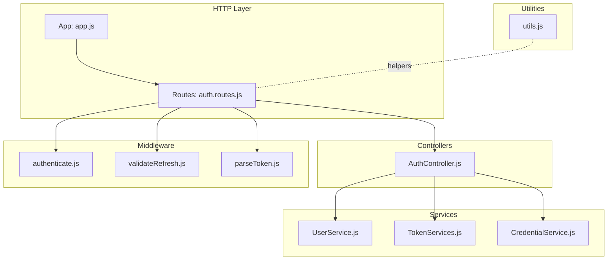
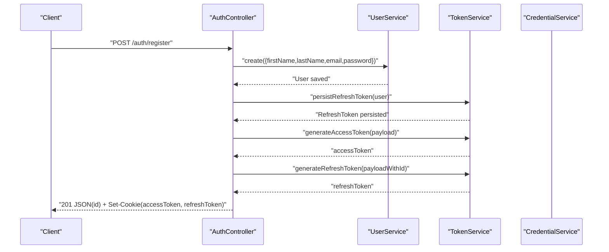
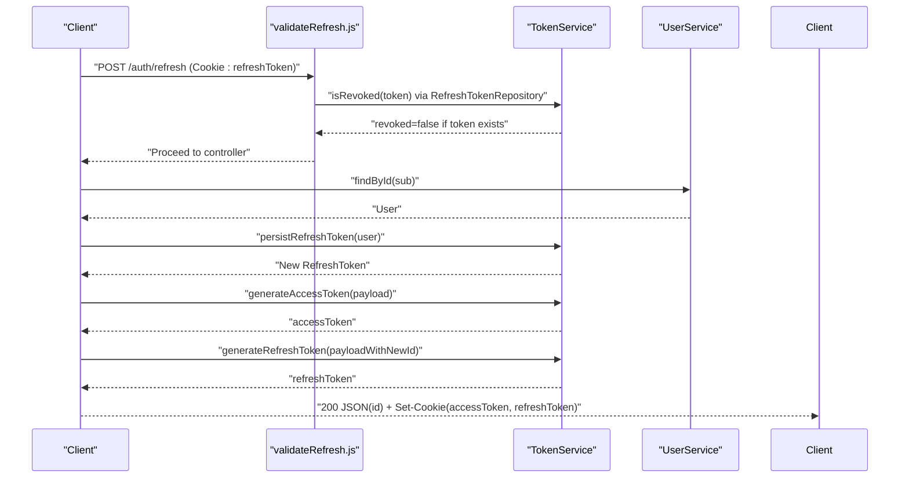
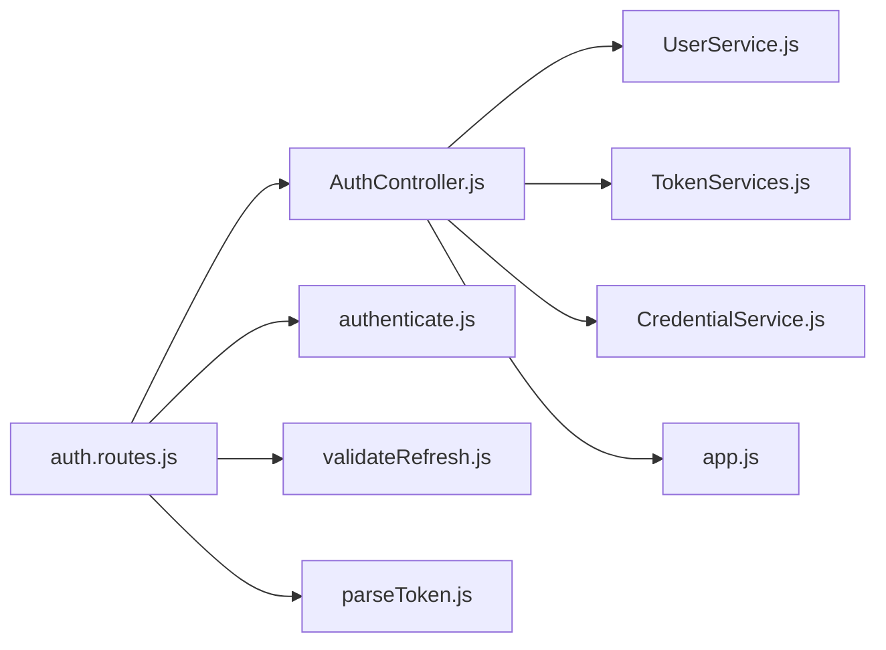

# Testing Strategy

<cite>
**Referenced Files in This Document**
- [jest.config.mjs](file://jest.config.mjs)
- [package.json](file://package.json)
- [src/app.js](file://src/app.js)
- [src/routes/auth.routes.js](file://src/routes/auth.routes.js)
- [src/controllers/AuthController.js](file://src/controllers/AuthController.js)
- [src/services/UserService.js](file://src/services/UserService.js)
- [src/services/TokenServices.js](file://src/services/TokenServices.js)
- [src/services/CredentialService.js](file://src/services/CredentialService.js)
- [src/middleware/authenticate.js](file://src/middleware/authenticate.js)
- [src/middleware/validateRefresh.js](file://src/middleware/validateRefresh.js)
- [src/middleware/parseToken.js](file://src/middleware/parseToken.js)
- [src/utils/utils.js](file://src/utils/utils.js)
- [src/test/users/register.spec.js](file://src/test/users/register.spec.js)
- [src/test/users/login.spec.js](file://src/test/users/login.spec.js)
- [src/test/users/refresh.spec.js](file://src/test/users/refresh.spec.js)
- [src/test/users/create.spec.js](file://src/test/users/create.spec.js)
- [src/test/users/user.spec.js](file://src/test/users/user.spec.js)
- [src/test/tenant/create.spec.js](file://src/test/tenant/create.spec.js)
</cite>

## Table of Contents
1. [Introduction](#introduction)
2. [Project Structure](#project-structure)
3. [Core Components](#core-components)
4. [Architecture Overview](#architecture-overview)
5. [Detailed Component Analysis](#detailed-component-analysis)
6. [Dependency Analysis](#dependency-analysis)
7. [Performance Considerations](#performance-considerations)
8. [Troubleshooting Guide](#troubleshooting-guide)
9. [Conclusion](#conclusion)
10. [Appendices](#appendices)

## Introduction
This document defines a comprehensive testing strategy for the authentication service. It covers unit testing with Jest, integration testing for API endpoints, database operations, and service-layer behavior, along with coverage analysis, mocking strategies for external dependencies and JWT operations, best practices for test organization and assertions, and guidance for performance and CI testing. The goal is to ensure robust, maintainable, and reliable authentication flows, including registration, login, token refresh, logout, and protected route access.

## Project Structure
The repository follows a layered architecture with clear separation of concerns:
- Routes define HTTP endpoints and wire them to controllers.
- Controllers orchestrate requests, delegate to services, and manage responses and cookies.
- Services encapsulate business logic and interact with repositories via TypeORM.
- Middleware enforces authentication and authorization using JWT.
- Tests are organized by feature under src/test, covering unit and integration scenarios.

**Diagram sources**
- [src/app.js:1-40](file://src/app.js#L1-L40)
- [src/routes/auth.routes.js:1-49](file://src/routes/auth.routes.js#L1-L49)
- [src/controllers/AuthController.js:1-212](file://src/controllers/AuthController.js#L1-L212)
- [src/services/UserService.js:1-99](file://src/services/UserService.js#L1-L99)
- [src/services/TokenServices.js:1-60](file://src/services/TokenServices.js#L1-L60)
- [src/services/CredentialService.js:1-7](file://src/services/CredentialService.js#L1-L7)
- [src/middleware/authenticate.js:1-26](file://src/middleware/authenticate.js#L1-L26)
- [src/middleware/validateRefresh.js:1-34](file://src/middleware/validateRefresh.js#L1-L34)
- [src/middleware/parseToken.js:1-14](file://src/middleware/parseToken.js#L1-L14)
- [src/utils/utils.js:1-32](file://src/utils/utils.js#L1-L32)

**Section sources**
- [src/app.js:1-40](file://src/app.js#L1-L40)
- [src/routes/auth.routes.js:1-49](file://src/routes/auth.routes.js#L1-L49)

## Core Components
This section outlines the primary components under test and their roles in the authentication flow.

- AuthController: Handles registration, login, profile retrieval, token refresh, and logout. It delegates to UserService, TokenService, CredentialService, and uses middleware for authentication and validation.
- UserService: Manages user persistence, password hashing, and queries.
- TokenService: Generates access and refresh tokens and persists refresh tokens.
- CredentialService: Compares passwords using bcrypt.
- Middleware:
  - authenticate: Validates access tokens via JWKS.
  - validateRefresh: Validates refresh tokens and checks revocation.
  - parseToken: Parses refresh tokens for logout.

Key testing focus areas:
- Controller method behavior and error propagation.
- Service method correctness and error handling.
- Middleware validation and revocation logic.
- Cookie setting and token parsing.

**Section sources**
- [src/controllers/AuthController.js:1-212](file://src/controllers/AuthController.js#L1-L212)
- [src/services/UserService.js:1-99](file://src/services/UserService.js#L1-L99)
- [src/services/TokenServices.js:1-60](file://src/services/TokenServices.js#L1-L60)
- [src/services/CredentialService.js:1-7](file://src/services/CredentialService.js#L1-L7)
- [src/middleware/authenticate.js:1-26](file://src/middleware/authenticate.js#L1-L26)
- [src/middleware/validateRefresh.js:1-34](file://src/middleware/validateRefresh.js#L1-L34)
- [src/middleware/parseToken.js:1-14](file://src/middleware/parseToken.js#L1-L14)

## Architecture Overview
The authentication flow integrates Express routes, controllers, services, and middleware. The following sequence diagrams illustrate typical flows.

**Diagram sources**
- [src/controllers/AuthController.js:19-70](file://src/controllers/AuthController.js#L19-L70)
- [src/services/UserService.js:7-38](file://src/services/UserService.js#L7-L38)
- [src/services/TokenServices.js:45-52](file://src/services/TokenServices.js#L45-L52)
- [src/services/TokenServices.js:12-32](file://src/services/TokenServices.js#L12-L32)
- [src/services/TokenServices.js:34-43](file://src/services/TokenServices.js#L34-L43)

**Diagram sources**
- [src/middleware/validateRefresh.js:14-30](file://src/middleware/validateRefresh.js#L14-L30)
- [src/services/TokenServices.js:45-58](file://src/services/TokenServices.js#L45-L58)
- [src/controllers/AuthController.js:143-192](file://src/controllers/AuthController.js#L143-L192)

## Detailed Component Analysis

### Unit Testing Approach with Jest
- Test organization: Feature-based directories under src/test with descriptive filenames (e.g., register.spec.js, login.spec.js).
- Assertions: Prefer explicit status codes, response body properties, and cookie presence/validity.
- Fixtures: Reuse shared data objects and helper functions to keep tests concise.
- Mocking: Use mock-jwks for JWT signing and verification in middleware tests; use Supertest for HTTP integration.

Examples from existing tests:
- Registration endpoint tests assert HTTP status, JSON response type, user creation, role assignment, password hashing, duplicate prevention, JWT issuance, refresh token persistence, and validator failures.
- Login endpoint tests assert successful login and password comparison.
- Self and refresh tests demonstrate JWT middleware integration and token revocation checks.
- Tenant creation tests show authorization checks via role-based middleware.

Best practices:
- Use beforeAll/beforeEach/afterAll/afterEach to manage DB lifecycle and JWKS mocks.
- Keep tests isolated; drop and synchronize the database per suite.
- Assert both happy-path and error-path outcomes.

**Section sources**
- [src/test/users/register.spec.js:1-168](file://src/test/users/register.spec.js#L1-L168)
- [src/test/users/login.spec.js:1-92](file://src/test/users/login.spec.js#L1-L92)
- [src/test/users/refresh.spec.js:1-109](file://src/test/users/refresh.spec.js#L1-L109)
- [src/test/users/user.spec.js:1-125](file://src/test/users/user.spec.js#L1-L125)
- [src/test/tenant/create.spec.js:1-106](file://src/test/tenant/create.spec.js#L1-L106)

### Integration Testing Patterns
- API endpoints: Use Supertest to send HTTP requests to routes and assert responses.
- Database operations: Initialize TypeORM DataSource, drop/synchronize schema per test, and query repositories to verify persistence and constraints.
- Service layer testing: Instantiate services with mocked repositories to verify business logic without DB round-trips.
- Middleware testing: Use mock-jwks to generate valid tokens and assert middleware behavior (authentication, authorization, revocation).

Representative patterns:
- Register flow: Validate HTTP status, JSON body, cookies, JWT validity, and refresh token storage.
- Login flow: Verify successful login and password comparison.
- Refresh flow: Validate token rotation and revocation checks.
- Protected routes: Confirm 401/403 responses when tokens are missing or insufficient.

**Section sources**
- [src/test/users/register.spec.js:17-168](file://src/test/users/register.spec.js#L17-L168)
- [src/test/users/login.spec.js:15-92](file://src/test/users/login.spec.js#L15-L92)
- [src/test/users/refresh.spec.js:18-109](file://src/test/users/refresh.spec.js#L18-L109)
- [src/test/users/user.spec.js:17-125](file://src/test/users/user.spec.js#L17-L125)
- [src/test/tenant/create.spec.js:17-106](file://src/test/tenant/create.spec.js#L17-L106)

### Test Coverage Analysis and Strategies
Current Jest configuration:
- Coverage directory is configured.
- Provider is v8.
- Verbose output is enabled.

Coverage strategies:
- Target high coverage for controllers, services, and middleware.
- Use coverage thresholds to enforce minimum coverage per project.
- Focus on branch coverage for conditional logic (e.g., validation, error handling, revocation checks).
- Instrument only necessary files to reduce noise.

Practical steps:
- Run coverage with the test script to generate lcov and HTML reports.
- Review coverage report pages to identify gaps.
- Add targeted tests for uncovered branches and edge cases.

**Section sources**
- [jest.config.mjs:27](file://jest.config.mjs#L27)
- [jest.config.mjs:35](file://jest.config.mjs#L35)
- [jest.config.mjs:193](file://jest.config.mjs#L193)
- [package.json:10](file://package.json#L10)

### Mocking Strategies
External dependencies and JWT operations:
- JWT signing/verification: Use mock-jwks to generate tokens signed by a local JWKS server. Start/stop the mock around tests.
- Access token validation: Use authenticate middleware with mock JWKS to validate tokens.
- Refresh token validation: Use validateRefresh middleware to check revocation against the DB.
- Private key operations: TokenService reads a private key file; in tests, ensure the key file exists or mock filesystem access.
- Cookies: Use Supertest to set cookies and assert Set-Cookie headers.

Example usage:
- Register and user self tests demonstrate mock-jwks token generation and middleware validation.
- Refresh tests manually sign a refresh token and pass it via Cookie header.

**Section sources**
- [src/test/users/register.spec.js:10-168](file://src/test/users/register.spec.js#L10-L168)
- [src/test/users/user.spec.js:17-125](file://src/test/users/user.spec.js#L17-L125)
- [src/test/users/refresh.spec.js:18-109](file://src/test/users/refresh.spec.js#L18-L109)
- [src/middleware/authenticate.js:6-25](file://src/middleware/authenticate.js#L6-L25)
- [src/middleware/validateRefresh.js:7-31](file://src/middleware/validateRefresh.js#L7-L31)
- [src/services/TokenServices.js:12-32](file://src/services/TokenServices.js#L12-L32)

### Testing Best Practices
- Organization:
  - Group related tests by feature (users/, tenant/).
  - Use descriptive describe blocks and it statements.
- Naming:
  - Use imperative phrasing (e.g., "should return 200 status code").
  - Prefix with HTTP verb and endpoint path for clarity.
- Assertions:
  - Prefer explicit status codes and body properties.
  - Validate cookies presence and structure.
  - Assert JWT validity using isJwt helper.
- Isolation:
  - Initialize and tear down DB per suite.
  - Start/stop mock JWKS per suite.
- Error scenarios:
  - Test missing credentials, invalid inputs, duplicate entries, unauthorized access, and revoked tokens.

**Section sources**
- [src/test/users/register.spec.js:17-168](file://src/test/users/register.spec.js#L17-L168)
- [src/test/users/login.spec.js:15-92](file://src/test/users/login.spec.js#L15-L92)
- [src/test/users/refresh.spec.js:18-109](file://src/test/users/refresh.spec.js#L18-L109)
- [src/test/users/user.spec.js:17-125](file://src/test/users/user.spec.js#L17-L125)
- [src/test/tenant/create.spec.js:17-106](file://src/test/tenant/create.spec.js#L17-L106)
- [src/utils/utils.js:13-31](file://src/utils/utils.js#L13-L31)

### Examples: Authentication Flows, Authorization Checks, and Error Scenarios
- Registration:
  - Positive: 201 with JSON body containing id; cookies set; JWTs valid; refresh token stored.
  - Negative: 400 for duplicate email; 400 for invalid inputs.
- Login:
  - Positive: 200 with JSON body; password comparison succeeds.
  - Negative: 400 for non-existent user or mismatched password.
- Token Refresh:
  - Positive: 200 with rotated tokens; revocation check passes.
  - Negative: 401 if refresh token is missing or revoked.
- Protected Routes:
  - Self: 200 with user data; 401 if no access token; password field excluded.
  - Tenant Creation: 201 for admin; 401 for unauthenticated; 403 for insufficient role.

**Section sources**
- [src/test/users/register.spec.js:56-168](file://src/test/users/register.spec.js#L56-L168)
- [src/test/users/login.spec.js:62-91](file://src/test/users/login.spec.js#L62-L91)
- [src/test/users/refresh.spec.js:71-108](file://src/test/users/refresh.spec.js#L71-L108)
- [src/test/users/user.spec.js:67-124](file://src/test/users/user.spec.js#L67-L124)
- [src/test/tenant/create.spec.js:70-105](file://src/test/tenant/create.spec.js#L70-L105)

## Dependency Analysis
The following diagram maps key runtime dependencies among components tested in this service.

**Diagram sources**
- [src/routes/auth.routes.js:16-48](file://src/routes/auth.routes.js#L16-L48)
- [src/controllers/AuthController.js:5-16](file://src/controllers/AuthController.js#L5-L16)
- [src/services/UserService.js:3-6](file://src/services/UserService.js#L3-L6)
- [src/services/TokenServices.js:8-11](file://src/services/TokenServices.js#L8-L11)
- [src/services/CredentialService.js:2-5](file://src/services/CredentialService.js#L2-L5)
- [src/middleware/authenticate.js:6-25](file://src/middleware/authenticate.js#L6-L25)
- [src/middleware/validateRefresh.js:7-31](file://src/middleware/validateRefresh.js#L7-L31)
- [src/middleware/parseToken.js:4-11](file://src/middleware/parseToken.js#L4-L11)
- [src/app.js:19-21](file://src/app.js#L19-L21)

**Section sources**
- [src/routes/auth.routes.js:16-48](file://src/routes/auth.routes.js#L16-L48)
- [src/controllers/AuthController.js:5-16](file://src/controllers/AuthController.js#L5-L16)

## Performance Considerations
- Test speed:
  - Use in-memory DB and lightweight fixtures to minimize setup time.
  - Avoid unnecessary DB synchronization between tests.
- Parallelization:
  - Jest worker configuration can be tuned; ensure DB isolation per process.
- Coverage overhead:
  - Use coverageProvider v8 for efficient instrumentation.
- Middleware overhead:
  - Mock JWKS locally to avoid network latency in tests.

[No sources needed since this section provides general guidance]

## Troubleshooting Guide
Common issues and resolutions:
- Database initialization failures:
  - Ensure AppDataSource initializes and destroy is called after tests.
- Missing private key for access token signing:
  - Verify certificate path and file availability; otherwise, mock filesystem access in tests.
- JWT validation failures:
  - Confirm mock JWKS is started/stopped and issuer matches middleware expectations.
- Revoked refresh tokens:
  - Ensure refresh token is persisted before signing and checked in isRevoked logic.
- Assertion failures:
  - Use explicit status codes and body properties; verify cookie parsing logic.

**Section sources**
- [src/test/users/register.spec.js:31-54](file://src/test/users/register.spec.js#L31-L54)
- [src/test/users/refresh.spec.js:36-69](file://src/test/users/refresh.spec.js#L36-L69)
- [src/services/TokenServices.js:16-23](file://src/services/TokenServices.js#L16-L23)
- [src/middleware/validateRefresh.js:14-30](file://src/middleware/validateRefresh.js#L14-L30)
- [src/utils/utils.js:4-11](file://src/utils/utils.js#L4-L11)

## Conclusion
The authentication service employs a robust testing strategy combining unit and integration tests with comprehensive coverage of registration, login, token refresh, logout, and protected routes. By leveraging Supertest, mock-jwks, and TypeORM, the suite validates both positive flows and error conditions. Adopting the recommended practices ensures maintainability, reliability, and scalability of the test suite.

[No sources needed since this section summarizes without analyzing specific files]

## Appendices

### Continuous Integration Testing Setup
- Scripts:
  - Use the test script to run Jest in Node with ES modules support.
- Environment:
  - Ensure NODE_ENV=test is set for test configuration.
- Coverage:
  - Configure coverage thresholds to enforce quality gates.

**Section sources**
- [package.json:10](file://package.json#L10)
- [jest.config.mjs:35](file://jest.config.mjs#L35)