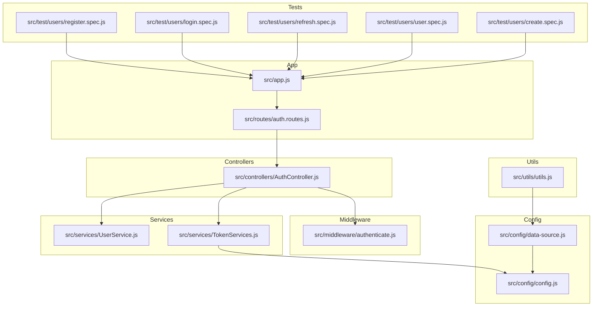
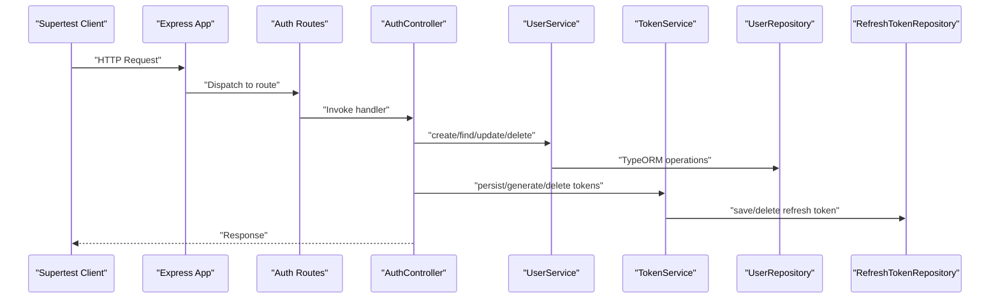
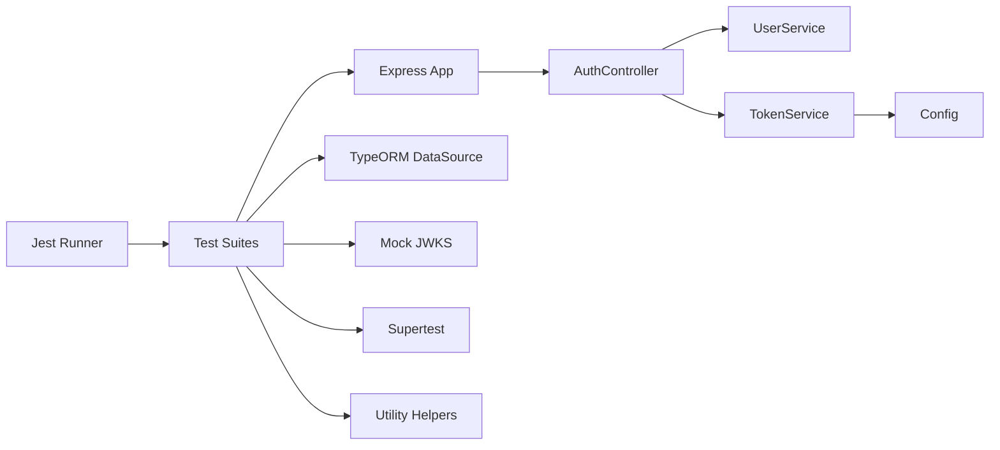

# Unit Testing

<cite>
**Referenced Files in This Document**
- [jest.config.mjs](file://jest.config.mjs)
- [package.json](file://package.json)
- [src/app.js](file://src/app.js)
- [src/config/config.js](file://src/config/config.js)
- [src/config/data-source.js](file://src/config/data-source.js)
- [src/controllers/AuthController.js](file://src/controllers/AuthController.js)
- [src/middleware/authenticate.js](file://src/middleware/authenticate.js)
- [src/services/UserService.js](file://src/services/UserService.js)
- [src/services/TokenServices.js](file://src/services/TokenServices.js)
- [src/utils/utils.js](file://src/utils/utils.js)
- [src/validators/register-validators.js](file://src/validators/register-validators.js)
- [src/validators/login-validators.js](file://src/validators/login-validators.js)
- [src/test/users/register.spec.js](file://src/test/users/register.spec.js)
- [src/test/users/login.spec.js](file://src/test/users/login.spec.js)
- [src/test/users/refresh.spec.js](file://src/test/users/refresh.spec.js)
- [src/test/users/create.spec.js](file://src/test/users/create.spec.js)
- [src/test/users/user.spec.js](file://src/test/users/user.spec.js)
</cite>

## Table of Contents
1. [Introduction](#introduction)
2. [Project Structure](#project-structure)
3. [Core Components](#core-components)
4. [Architecture Overview](#architecture-overview)
5. [Detailed Component Analysis](#detailed-component-analysis)
6. [Dependency Analysis](#dependency-analysis)
7. [Performance Considerations](#performance-considerations)
8. [Troubleshooting Guide](#troubleshooting-guide)
9. [Conclusion](#conclusion)
10. [Appendices](#appendices)

## Introduction
This document explains how unit testing is implemented in the authentication service. It covers Jest configuration, test setup, mocking strategies for external dependencies (JWT, database, bcrypt), and practical examples from existing tests. It also documents testing patterns for authentication flows (registration, login, token refresh), user self-profile retrieval, and service-layer logic independent of database operations. Guidance is provided on test isolation, cleanup, and assertion techniques.

## Project Structure
The repository organizes tests under a dedicated test directory with feature-based grouping. The test suite uses Supertest to drive HTTP endpoints and TypeORM DataSource for database lifecycle management during integration-style tests. Jest configuration supports ES modules and verbose reporting.

**Diagram sources**
- [src/test/users/register.spec.js](file://src/test/users/register.spec.js)
- [src/test/users/login.spec.js](file://src/test/users/login.spec.js)
- [src/test/users/refresh.spec.js](file://src/test/users/refresh.spec.js)
- [src/test/users/user.spec.js](file://src/test/users/user.spec.js)
- [src/test/users/create.spec.js](file://src/test/users/create.spec.js)
- [src/app.js](file://src/app.js)
- [src/controllers/AuthController.js](file://src/controllers/AuthController.js)
- [src/services/UserService.js](file://src/services/UserService.js)
- [src/services/TokenServices.js](file://src/services/TokenServices.js)
- [src/middleware/authenticate.js](file://src/middleware/authenticate.js)
- [src/config/config.js](file://src/config/config.js)
- [src/config/data-source.js](file://src/config/data-source.js)
- [src/utils/utils.js](file://src/utils/utils.js)

**Section sources**
- [jest.config.mjs](file://jest.config.mjs)
- [package.json](file://package.json)
- [src/app.js](file://src/app.js)
- [src/config/data-source.js](file://src/config/data-source.js)

## Core Components
- Jest configuration defines coverage output, Node environment, module file extensions, and verbosity. It is set up for ES modules and uses the default Node test environment.
- Test scripts use cross-env to set NODE_ENV and run Jest with explicit VM modules support.
- Tests rely on Supertest to send HTTP requests to the Express app, and TypeORM DataSource to initialize, synchronize, and tear down the database per suite.

Key configuration highlights:
- Coverage output directory and provider are configured.
- Verbose output is enabled.
- Module file extensions include JS, MJS, CJS, JSX, TS, MTX, CTS, TSX, JSON, and NODE.
- Test runner executes in band to avoid concurrency issues with shared resources.

**Section sources**
- [jest.config.mjs](file://jest.config.mjs)
- [package.json](file://package.json)

## Architecture Overview
The authentication service exposes endpoints handled by controllers. Controllers depend on services for business logic and on middleware for authentication. Services interact with repositories via TypeORM and external libraries for cryptography and JWT signing. Tests exercise controller flows and validate service behavior, often isolating external dependencies through mocks and controlled environments.

**Diagram sources**
- [src/app.js](file://src/app.js)
- [src/controllers/AuthController.js](file://src/controllers/AuthController.js)
- [src/services/UserService.js](file://src/services/UserService.js)
- [src/services/TokenServices.js](file://src/services/TokenServices.js)
- [src/config/data-source.js](file://src/config/data-source.js)

## Detailed Component Analysis

### Jest Configuration and Setup
- Coverage is written to the coverage directory with V8 provider.
- Verbose output is enabled for clearer test results.
- Module file extensions include modern JS/TS variants to support ES modules.
- The test script sets NODE_ENV=test and runs Jest with VM modules to align with ES module usage.

Best practices derived from configuration:
- Keep coverage reporting enabled for CI visibility.
- Prefer explicit module extensions to avoid resolution ambiguity.
- Use runInBand for suites that share resources to prevent race conditions.

**Section sources**
- [jest.config.mjs](file://jest.config.mjs)
- [package.json](file://package.json)

### Authentication Controller Tests
The controller tests validate registration, login, token refresh, logout, and self-profile retrieval. They demonstrate:
- Using Supertest to hit endpoints and assert HTTP status codes and response bodies.
- Extracting cookies from responses to validate JWT presence and shape.
- Verifying database persistence of users and refresh tokens.
- Ensuring password hashing and role assignment occur as expected.

Representative test patterns:
- Registration validates creation of user, role assignment, hashed password storage, duplicate prevention, and cookie issuance with JWT tokens.
- Login verifies successful authentication and password comparison.
- Refresh validates token rotation and deletion of the old refresh token.
- Self profile ensures protected route access with proper claims and absence of sensitive fields.
- Users endpoint demonstrates admin access using mocked JWKS tokens.

**Section sources**
- [src/test/users/register.spec.js](file://src/test/users/register.spec.js)
- [src/test/users/login.spec.js](file://src/test/users/login.spec.js)
- [src/test/users/refresh.spec.js](file://src/test/users/refresh.spec.js)
- [src/test/users/user.spec.js](file://src/test/users/user.spec.js)
- [src/test/users/create.spec.js](file://src/test/users/create.spec.js)

### Mocking Strategies for External Dependencies
- JWT operations: Tests use a mock JWKS server to mint tokens for protected routes, avoiding real key management and network dependencies.
- Database connections: Tests initialize TypeORM DataSource, drop and synchronize the database per suite, and destroy the connection afterward. Utility helpers clear all entities to keep tests isolated.
- Bcrypt password hashing: Tests assert hashed password characteristics (length and non-equality to plaintext) without relying on timing-sensitive comparisons.

Practical examples:
- Mock JWKS usage for admin and customer tokens in user-related tests.
- Truncate tables and synchronize the database to ensure clean state.
- Assert JWT validity using a lightweight validator utility.

**Section sources**
- [src/test/users/user.spec.js](file://src/test/users/user.spec.js)
- [src/test/users/create.spec.js](file://src/test/users/create.spec.js)
- [src/utils/utils.js](file://src/utils/utils.js)
- [src/config/data-source.js](file://src/config/data-source.js)

### Testing Patterns for Authentication Flows
- Registration flow:
  - Validation: Use express-validator schemas to enforce field constraints.
  - Persistence: Save user with hashed password and assign default role.
  - Tokens: Persist refresh token, generate access and refresh tokens, and set secure cookies.
  - Assertions: Verify HTTP status, JSON body, cookies, and database records.
- Login flow:
  - Validation: Enforce email and password constraints.
  - Lookup: Retrieve user with password field.
  - Comparison: Compare provided password with stored hash.
  - Tokens: Rotate tokens and set cookies.
- Token refresh:
  - Payload: Construct refresh token payload with user and token identifiers.
  - Rotation: Delete old refresh token and issue a new one.
  - Assertions: Validate HTTP status and cookie updates.
- Self profile:
  - Protected route: Use middleware to extract token from Authorization header or cookie.
  - Claims: Ensure sub and role are present and correct.
  - Data: Confirm response excludes sensitive fields.

**Section sources**
- [src/controllers/AuthController.js](file://src/controllers/AuthController.js)
- [src/services/UserService.js](file://src/services/UserService.js)
- [src/services/TokenServices.js](file://src/services/TokenServices.js)
- [src/middleware/authenticate.js](file://src/middleware/authenticate.js)
- [src/validators/register-validators.js](file://src/validators/register-validators.js)
- [src/validators/login-validators.js](file://src/validators/login-validators.js)

### Service Layer Testing Independent of Database
While current tests integrate with the database via TypeORM, the service layer can be unit-tested independently by:
- Mocking the repository interface to return predefined data or throw controlled errors.
- Focusing on business logic: hashing passwords, role assignment, error propagation, and data transformations.
- Using dependency injection to swap real repositories with mock objects in unit tests.

Benefits:
- Faster execution without DB overhead.
- Deterministic outcomes for edge cases.
- Isolation of logic from infrastructure concerns.

[No sources needed since this section provides general guidance]

### Practical Examples from Existing Tests
- Registration:
  - Validates HTTP status, JSON response type, user count, role assignment, hashed password, duplicate prevention, JWT presence, refresh token persistence, and validation errors.
- Login:
  - Confirms successful login status and password correctness via bcrypt comparison.
- Refresh:
  - Exercises token rotation with a valid refresh token and asserts unauthorized behavior when missing.
- Self Profile:
  - Uses mocked JWKS tokens to access protected route and validates claims and response shape.
- Users Endpoint:
  - Demonstrates admin access using a mocked JWKS token and verifies user retrieval.

**Section sources**
- [src/test/users/register.spec.js](file://src/test/users/register.spec.js)
- [src/test/users/login.spec.js](file://src/test/users/login.spec.js)
- [src/test/users/refresh.spec.js](file://src/test/users/refresh.spec.js)
- [src/test/users/user.spec.js](file://src/test/users/user.spec.js)
- [src/test/users/create.spec.js](file://src/test/users/create.spec.js)

## Dependency Analysis
The test suite depends on:
- Express app and routing for endpoint-level testing.
- TypeORM DataSource for database lifecycle management.
- Mock JWKS for JWT minting in protected route tests.
- Supertest for HTTP request simulation.
- Utility functions for table truncation and JWT validation.

**Diagram sources**
- [jest.config.mjs](file://jest.config.mjs)
- [src/app.js](file://src/app.js)
- [src/config/data-source.js](file://src/config/data-source.js)
- [src/config/config.js](file://src/config/config.js)
- [src/controllers/AuthController.js](file://src/controllers/AuthController.js)
- [src/services/UserService.js](file://src/services/UserService.js)
- [src/services/TokenServices.js](file://src/services/TokenServices.js)
- [src/test/users/user.spec.js](file://src/test/users/user.spec.js)
- [src/test/users/create.spec.js](file://src/test/users/create.spec.js)

**Section sources**
- [jest.config.mjs](file://jest.config.mjs)
- [src/app.js](file://src/app.js)
- [src/config/data-source.js](file://src/config/data-source.js)
- [src/config/config.js](file://src/config/config.js)
- [src/controllers/AuthController.js](file://src/controllers/AuthController.js)
- [src/services/UserService.js](file://src/services/UserService.js)
- [src/services/TokenServices.js](file://src/services/TokenServices.js)
- [src/test/users/user.spec.js](file://src/test/users/user.spec.js)
- [src/test/users/create.spec.js](file://src/test/users/create.spec.js)

## Performance Considerations
- Use runInBand for suites that rely on shared resources to avoid contention.
- Prefer truncating tables or dropping/synchronizing databases to maintain clean state efficiently.
- Avoid unnecessary network calls by mocking JWKS and JWT signing in unit tests.
- Keep tests focused and fast; group related assertions to minimize repeated work.

[No sources needed since this section provides general guidance]

## Troubleshooting Guide
Common issues and resolutions:
- Database initialization failures:
  - Ensure environment variables are loaded for the test environment and that the DataSource is initialized before tests run.
- Missing or malformed tokens:
  - Validate token generation paths and cookie settings; confirm mocked JWKS is started/stopped appropriately.
- Password hashing mismatches:
  - Confirm bcrypt is used consistently and assertions compare against stored hashed values rather than plaintext.
- Middleware token extraction:
  - Verify Authorization header parsing and cookie fallback logic in authentication middleware.

**Section sources**
- [src/config/data-source.js](file://src/config/data-source.js)
- [src/middleware/authenticate.js](file://src/middleware/authenticate.js)
- [src/test/users/user.spec.js](file://src/test/users/user.spec.js)
- [src/test/users/create.spec.js](file://src/test/users/create.spec.js)

## Conclusion
The authentication service’s test suite combines endpoint-level tests with service-layer logic verification. By leveraging mocks for JWT and database operations, the suite achieves reliable, fast, and isolated testing. Following the documented patterns ensures consistent coverage of registration, login, token refresh, and protected routes while maintaining clear separation between components.

## Appendices

### Appendix A: Test Lifecycle and Cleanup
- Initialize DataSource in beforeAll and destroy it in afterAll.
- Drop and synchronize the database in beforeEach to ensure a clean state.
- Stop mock JWKS in afterEach to prevent leaks across tests.

**Section sources**
- [src/test/users/register.spec.js](file://src/test/users/register.spec.js)
- [src/test/users/login.spec.js](file://src/test/users/login.spec.js)
- [src/test/users/refresh.spec.js](file://src/test/users/refresh.spec.js)
- [src/test/users/user.spec.js](file://src/test/users/user.spec.js)
- [src/test/users/create.spec.js](file://src/test/users/create.spec.js)

### Appendix B: Assertion Techniques
- HTTP status codes and response types for endpoint tests.
- Cookie extraction and JWT validation using a lightweight utility.
- Database assertions for persisted entities and counts.
- Role and claim assertions for protected routes.

**Section sources**
- [src/test/users/register.spec.js](file://src/test/users/register.spec.js)
- [src/test/users/login.spec.js](file://src/test/users/login.spec.js)
- [src/test/users/refresh.spec.js](file://src/test/users/refresh.spec.js)
- [src/test/users/user.spec.js](file://src/test/users/user.spec.js)
- [src/test/users/create.spec.js](file://src/test/users/create.spec.js)
- [src/utils/utils.js](file://src/utils/utils.js)