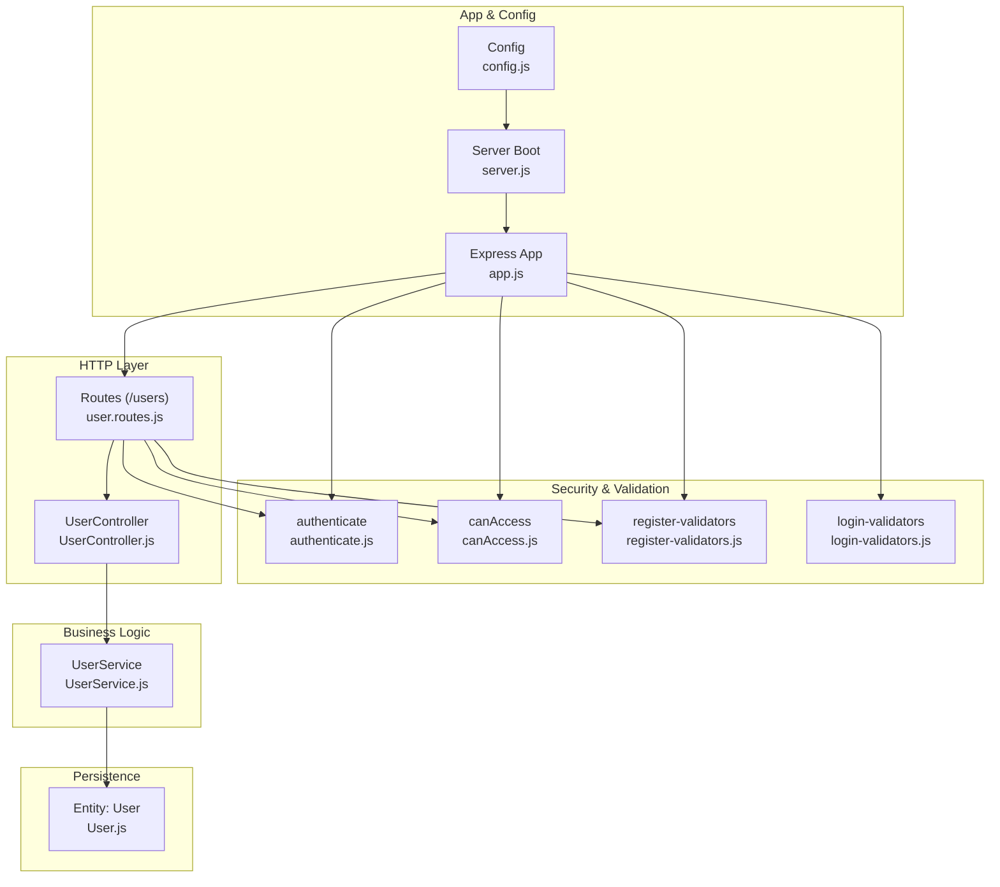
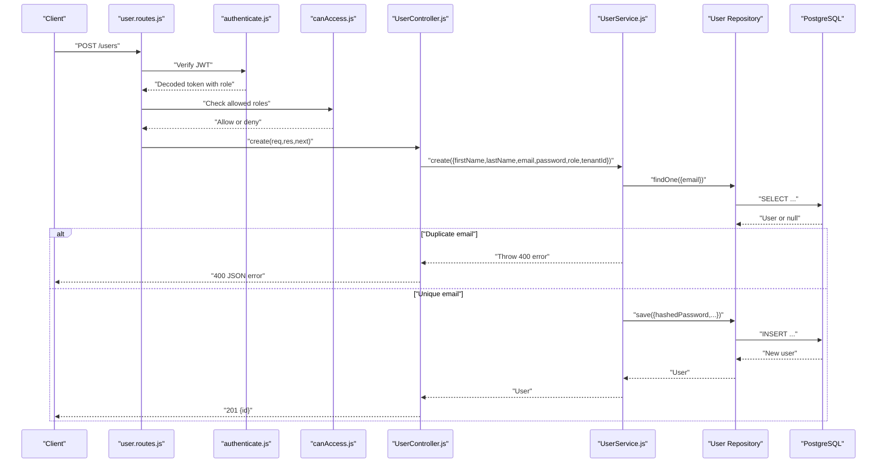
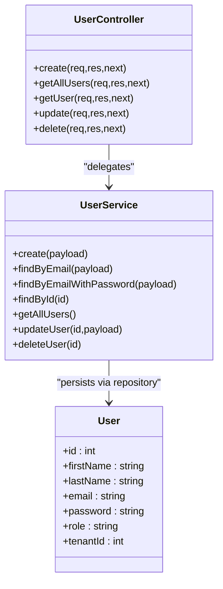

# User CRUD Operations

<cite>
**Referenced Files in This Document**
- [UserController.js](file://src/controllers/UserController.js)
- [UserService.js](file://src/services/UserService.js)
- [user.routes.js](file://src/routes/user.routes.js)
- [User.js](file://src/entity/User.js)
- [authenticate.js](file://src/middleware/authenticate.js)
- [canAccess.js](file://src/middleware/canAccess.js)
- [index.js](file://src/constants/index.js)
- [register-validators.js](file://src/validators/register-validators.js)
- [login-validators.js](file://src/validators/login-validators.js)
- [app.js](file://src/app.js)
- [config.js](file://src/config/config.js)
- [server.js](file://src/server.js)
- [create.spec.js](file://src/test/users/create.spec.js)
- [user.spec.js](file://src/test/users/user.spec.js)
</cite>

## Table of Contents
1. [Introduction](#introduction)
2. [Project Structure](#project-structure)
3. [Core Components](#core-components)
4. [Architecture Overview](#architecture-overview)
5. [Detailed Component Analysis](#detailed-component-analysis)
6. [Dependency Analysis](#dependency-analysis)
7. [Performance Considerations](#performance-considerations)
8. [Troubleshooting Guide](#troubleshooting-guide)
9. [Conclusion](#conclusion)
10. [Appendices](#appendices)

## Introduction
This document provides comprehensive documentation for user CRUD operations in the authentication service. It covers route handlers, controller implementation, service-layer business logic, validation and authorization middleware, request/response schemas, error handling patterns, and practical examples. It also outlines performance considerations, pagination strategies, and troubleshooting guidance.

## Project Structure
The user CRUD feature spans routing, controllers, services, middleware, validation, and persistence layers. The routes define endpoints under /users, controllers handle HTTP requests and responses, services encapsulate business logic and data access, middleware enforces authentication and authorization, and validation ensures request integrity.

**Diagram sources**
- [user.routes.js:1-38](file://src/routes/user.routes.js#L1-L38)
- [UserController.js:1-94](file://src/controllers/UserController.js#L1-L94)
- [UserService.js:1-99](file://src/services/UserService.js#L1-L99)
- [User.js:1-50](file://src/entity/User.js#L1-L50)
- [authenticate.js:1-26](file://src/middleware/authenticate.js#L1-L26)
- [canAccess.js:1-23](file://src/middleware/canAccess.js#L1-L23)
- [register-validators.js:1-47](file://src/validators/register-validators.js#L1-L47)
- [login-validators.js:1-24](file://src/validators/login-validators.js#L1-L24)
- [app.js:1-40](file://src/app.js#L1-L40)
- [config.js:1-34](file://src/config/config.js#L1-L34)
- [server.js:1-21](file://src/server.js#L1-L21)

**Section sources**
- [user.routes.js:1-38](file://src/routes/user.routes.js#L1-L38)
- [app.js:1-40](file://src/app.js#L1-L40)

## Core Components
- Routes: Define HTTP endpoints for user CRUD under /users with middleware for authentication and authorization.
- Controller: Orchestrates request handling, invokes service methods, and formats responses.
- Service: Implements business logic, data validation, hashing, and persistence via repository.
- Middleware: Authentication via JWT and role-based authorization.
- Validation: Request schema validation for registration and login.
- Persistence: TypeORM entity mapping for the User table.

**Section sources**
- [user.routes.js:1-38](file://src/routes/user.routes.js#L1-L38)
- [UserController.js:1-94](file://src/controllers/UserController.js#L1-L94)
- [UserService.js:1-99](file://src/services/UserService.js#L1-L99)
- [User.js:1-50](file://src/entity/User.js#L1-L50)
- [authenticate.js:1-26](file://src/middleware/authenticate.js#L1-L26)
- [canAccess.js:1-23](file://src/middleware/canAccess.js#L1-L23)
- [register-validators.js:1-47](file://src/validators/register-validators.js#L1-L47)
- [login-validators.js:1-24](file://src/validators/login-validators.js#L1-L24)

## Architecture Overview
The user CRUD flow integrates Express routes, controller actions, service methods, and repository operations. Authentication and authorization are enforced at the route level, while validation is applied for specific endpoints.

**Diagram sources**
- [user.routes.js:15-17](file://src/routes/user.routes.js#L15-L17)
- [authenticate.js:6-25](file://src/middleware/authenticate.js#L6-L25)
- [canAccess.js:4-22](file://src/middleware/canAccess.js#L4-L22)
- [UserController.js:12-28](file://src/controllers/UserController.js#L12-L28)
- [UserService.js:7-38](file://src/services/UserService.js#L7-L38)

## Detailed Component Analysis

### Routes: /users
- POST /users: Creates a new user. Requires authentication and ADMIN role.
- GET /users: Lists all users. Requires authentication and ADMIN role.
- GET /users/:id: Retrieves a user by ID. Requires authentication.
- PATCH /users/:id: Updates a user. Requires authentication and ADMIN role.
- DELETE /users/:id: Deletes a user. Requires authentication and ADMIN role.

Authorization and authentication are applied via middleware attached to each route.

**Section sources**
- [user.routes.js:15-35](file://src/routes/user.routes.js#L15-L35)
- [authenticate.js:1-26](file://src/middleware/authenticate.js#L1-L26)
- [canAccess.js:1-23](file://src/middleware/canAccess.js#L1-L23)
- [index.js:1-6](file://src/constants/index.js#L1-L6)

### Controller: UserController
Responsibilities:
- Parse request body and parameters.
- Validate inputs for update operations.
- Delegate to UserService for business logic.
- Log successful updates/deletes.
- Propagate errors to centralized error handler.

Key behaviors:
- create: Returns created user id.
- getAllUsers: Returns array of users; 404 if none.
- getUser: Returns user id by path param.
- update: Validates request using express-validator; returns updated user id.
- delete: Returns deleted user id; logs success.

**Section sources**
- [UserController.js:12-94](file://src/controllers/UserController.js#L12-L94)

### Service: UserService
Responsibilities:
- Email uniqueness check before creation.
- Password hashing prior to storage.
- Find by email (with or without password).
- Retrieve by id and list all users.
- Update user with tenant association.
- Delete user.

Error handling:
- Throws 400 for duplicate email.
- Wraps persistence errors as 500.

**Section sources**
- [UserService.js:7-99](file://src/services/UserService.js#L7-L99)

### Entity: User
Mapped fields:
- id: auto-incremented primary key
- firstName, lastName, email: required
- password: stored hashed, not selectable in default queries
- role: user role
- tenantId: optional foreign key to Tenant

Relations:
- one-to-many with RefreshToken
- many-to-one with Tenant via tenantId

**Section sources**
- [User.js:3-49](file://src/entity/User.js#L3-L49)

### Validation Middleware
- Registration validators enforce:
  - firstName: required, length bounds
  - lastName: required, length bounds
  - email: required, normalized and validated
  - password: required, minimum length
- Login validators enforce:
  - email: required and valid
  - password: required, minimum length

Note: The current update endpoint checks validation via express-validator but does not attach a validator chain to the route. This can lead to inconsistent validation behavior compared to dedicated endpoints.

**Section sources**
- [register-validators.js:1-47](file://src/validators/register-validators.js#L1-L47)
- [login-validators.js:1-24](file://src/validators/login-validators.js#L1-L24)
- [UserController.js:56-59](file://src/controllers/UserController.js#L56-L59)

### Authorization Controls
- authenticate: Verifies JWT using JWKS and extracts user identity.
- canAccess: Enforces role-based access; denies if role not included in allowed roles.

**Section sources**
- [authenticate.js:1-26](file://src/middleware/authenticate.js#L1-L26)
- [canAccess.js:1-23](file://src/middleware/canAccess.js#L1-L23)
- [index.js:1-6](file://src/constants/index.js#L1-L6)

### Request and Response Schemas

- Create User (POST /users)
  - Request body:
    - firstName: string, required
    - lastName: string, required
    - email: string, required
    - password: string, required
    - role: string, required
    - tenantId: integer, optional
  - Success response (201): { id: number }
  - Error responses:
    - 400: Duplicate email
    - 401/403: Unauthorized or insufficient permissions
    - 500: Internal server error

- Get All Users (GET /users)
  - Success response (201): { users: [{ id: number, ... }] }
  - Error responses:
    - 404: No users found
    - 401/403: Unauthorized or insufficient permissions
    - 500: Internal server error

- Get User by ID (GET /users/:id)
  - Success response (201): { id: number }
  - Error responses:
    - 404: Not found
    - 401: Unauthorized
    - 500: Internal server error

- Update User (PATCH /users/:id)
  - Request body:
    - firstName: string, optional
    - lastName: string, optional
    - email: string, optional
    - role: string, optional
    - tenantId: integer, optional
  - Success response (201): { id: number }
  - Error responses:
    - 400: Validation errors (express-validator)
    - 401/403: Unauthorized or insufficient permissions
    - 500: Internal server error

- Delete User (DELETE /users/:id)
  - Success response (201): { id: number }
  - Error responses:
    - 401: Invalid token or user not found
    - 401/403: Unauthorized or insufficient permissions
    - 500: Internal server error

Validation specifics:
- Registration validators apply to registration flows.
- Update endpoint currently validates via express-validator but lacks an attached validator chain in routes.

**Section sources**
- [UserController.js:14-23](file://src/controllers/UserController.js#L14-L23)
- [UserController.js:32-37](file://src/controllers/UserController.js#L32-L37)
- [UserController.js:46](file://src/controllers/UserController.js#L46)
- [UserController.js:61-69](file://src/controllers/UserController.js#L61-L69)
- [UserController.js:82](file://src/controllers/UserController.js#L82)
- [UserService.js:13-16](file://src/services/UserService.js#L13-L16)
- [UserService.js:68-84](file://src/services/UserService.js#L68-L84)
- [UserService.js:86-97](file://src/services/UserService.js#L86-L97)
- [User.js:6-34](file://src/entity/User.js#L6-L34)
- [register-validators.js:3-46](file://src/validators/register-validators.js#L3-L46)
- [UserController.js:56-59](file://src/controllers/UserController.js#L56-L59)

### Practical Examples

- Create User
  - Endpoint: POST /users
  - Headers: Authorization: Bearer <token>
  - Body:
    - firstName: "Alex"
    - lastName: "Johnson"
    - email: "alex.johnson@example.com"
    - password: "securePass123"
    - role: "admin"
    - tenantId: 1
  - Expected response: 201 { id: 123 }

- Get All Users
  - Endpoint: GET /users
  - Headers: Authorization: Bearer <admin-token>
  - Expected response: 201 { users: [...] }

- Get User by ID
  - Endpoint: GET /users/123
  - Headers: Authorization: Bearer <any-auth-token>
  - Expected response: 201 { id: 123 }

- Update User
  - Endpoint: PATCH /users/123
  - Headers: Authorization: Bearer <admin-token>
  - Body:
    - firstName: "Alexander"
    - role: "manager"
  - Expected response: 201 { id: 123 }

- Delete User
  - Endpoint: DELETE /users/123
  - Headers: Authorization: Bearer <admin-token>
  - Expected response: 201 { id: 123 }

Notes:
- Ensure the caller has the appropriate role for protected endpoints.
- For update, validation errors return 400 with structured errors.

**Section sources**
- [user.routes.js:15-35](file://src/routes/user.routes.js#L15-L35)
- [UserController.js:12-94](file://src/controllers/UserController.js#L12-L94)
- [UserService.js:68-97](file://src/services/UserService.js#L68-L97)
- [create.spec.js:31-91](file://src/test/users/create.spec.js#L31-L91)
- [user.spec.js:29-124](file://src/test/users/user.spec.js#L29-L124)

### Integration with Validation and Authorization
- Authentication middleware verifies JWT and attaches decoded user info to the request.
- Authorization middleware checks the user’s role against allowed roles.
- Validation middleware enforces schema rules for request bodies.

Recommendation:
- Attach validator chains to update and create routes to ensure consistent validation across all endpoints.

**Section sources**
- [authenticate.js:6-25](file://src/middleware/authenticate.js#L6-L25)
- [canAccess.js:4-22](file://src/middleware/canAccess.js#L4-L22)
- [register-validators.js:1-47](file://src/validators/register-validators.js#L1-L47)
- [UserController.js:56-59](file://src/controllers/UserController.js#L56-L59)

## Dependency Analysis

**Diagram sources**
- [UserController.js:4-11](file://src/controllers/UserController.js#L4-L11)
- [UserService.js:3-6](file://src/services/UserService.js#L3-L6)
- [User.js:3-49](file://src/entity/User.js#L3-L49)

**Section sources**
- [UserController.js:4-11](file://src/controllers/UserController.js#L4-L11)
- [UserService.js:3-6](file://src/services/UserService.js#L3-L6)
- [User.js:3-49](file://src/entity/User.js#L3-L49)

## Performance Considerations
- Pagination: Implement limit/offset or cursor-based pagination for GET /users to avoid large payloads.
- Indexing: Ensure unique indexes on email and tenantId for efficient lookups.
- Selectivity: Avoid returning sensitive fields (e.g., password) in list endpoints.
- Hashing cost: Keep bcrypt cost balanced for security vs. latency.
- Bulk operations: Introduce batch endpoints for create/update/delete when needed; validate in batches and return partial failures.

[No sources needed since this section provides general guidance]

## Troubleshooting Guide
Common issues and resolutions:
- 400 Bad Request on create:
  - Cause: Duplicate email detected by service.
  - Resolution: Use a unique email or update existing record.
  - Evidence: Service throws 400 on duplicate email.
  
- 400 Validation errors on update:
  - Cause: Missing or invalid fields; validation middleware triggered.
  - Resolution: Provide required fields and meet length/email constraints.
  - Evidence: Controller checks validation result and returns 400 with errors.
  
- 401 Unauthorized:
  - Cause: Missing or invalid JWT.
  - Resolution: Obtain a valid access token; ensure Authorization header or cookie is set.
  - Evidence: Authentication middleware extracts token from header or cookies.
  
- 403 Forbidden:
  - Cause: Insufficient role for protected endpoints.
  - Resolution: Use an admin or manager token as required.
  - Evidence: Authorization middleware checks allowed roles.
  
- 500 Internal Server Error:
  - Cause: Database failure or unhandled exception.
  - Resolution: Check server logs and retry; verify DB connectivity.
  - Evidence: Centralized error handler returns standardized error payload.

**Section sources**
- [UserService.js:13-16](file://src/services/UserService.js#L13-L16)
- [UserController.js:56-59](file://src/controllers/UserController.js#L56-L59)
- [authenticate.js:13-24](file://src/middleware/authenticate.js#L13-L24)
- [canAccess.js:10-17](file://src/middleware/canAccess.js#L10-L17)
- [app.js:24-37](file://src/app.js#L24-L37)

## Conclusion
The user CRUD implementation follows a layered architecture with clear separation of concerns. Authentication and authorization are enforced at the route level, while the service layer handles business logic and persistence. Validation is present but can be consistently applied across all endpoints. The design supports extensibility for pagination, bulk operations, and improved error reporting.

[No sources needed since this section summarizes without analyzing specific files]

## Appendices

### API Endpoints Summary
- POST /users: Create user (ADMIN required)
- GET /users: List users (ADMIN required)
- GET /users/:id: Get user by id (authenticated)
- PATCH /users/:id: Update user (ADMIN required)
- DELETE /users/:id: Delete user (ADMIN required)

**Section sources**
- [user.routes.js:15-35](file://src/routes/user.routes.js#L15-L35)