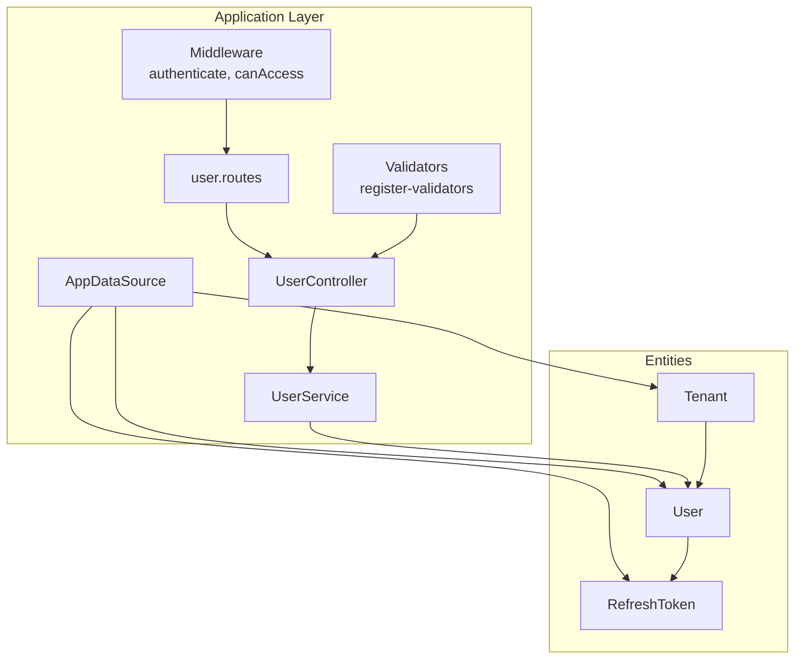
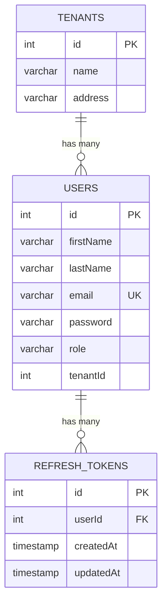
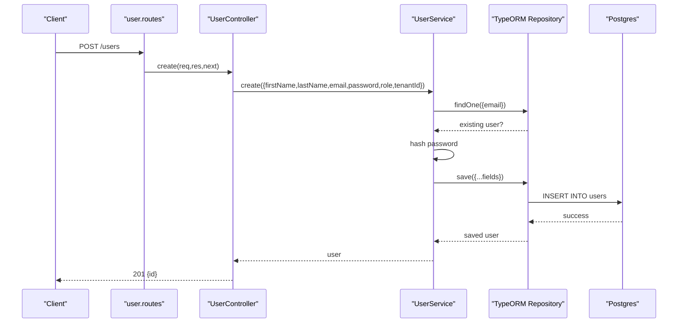
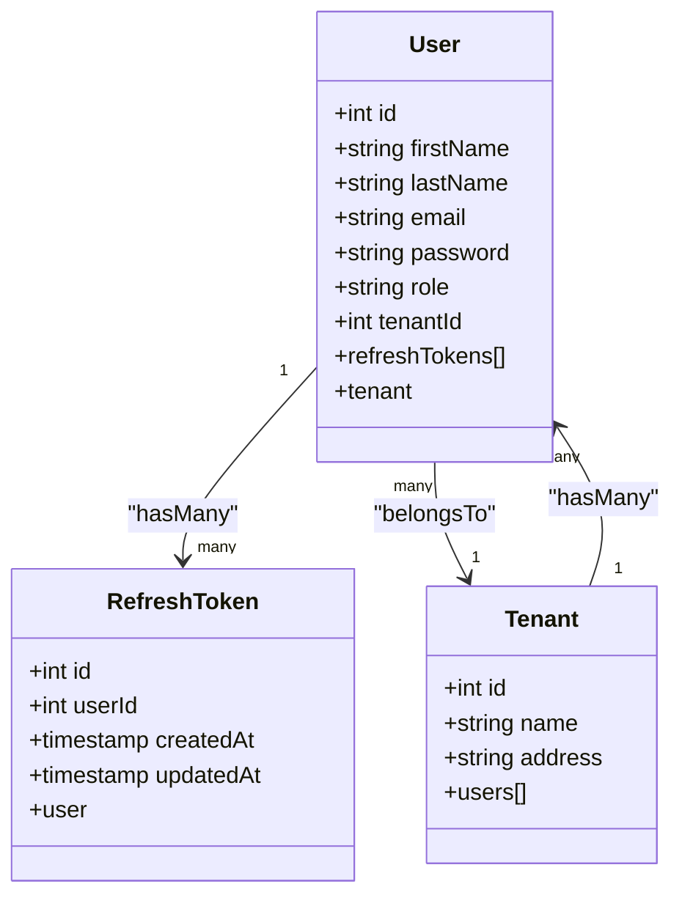
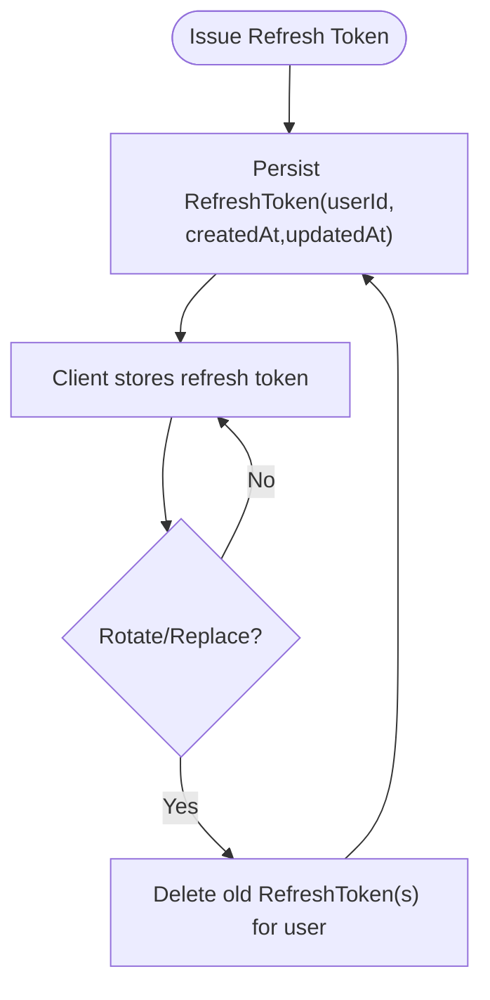
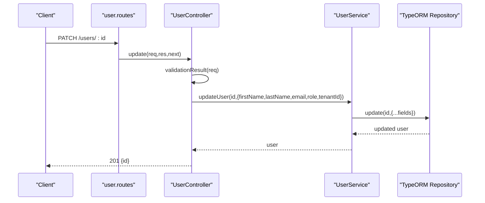
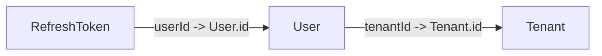
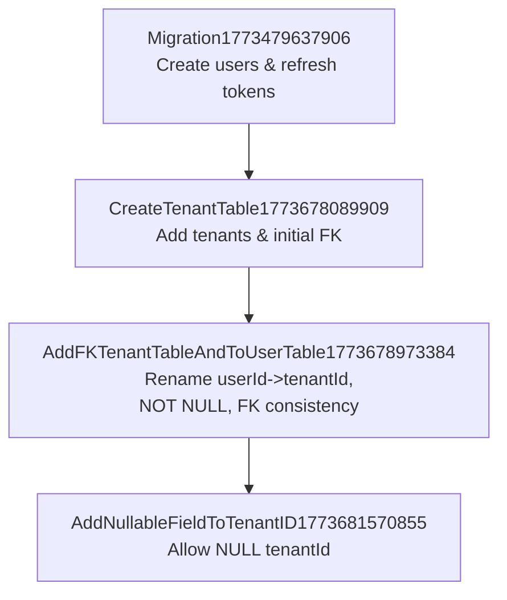

# User Entity Schema

<cite>
**Referenced Files in This Document**
- [User.js](file://src/entity/User.js)
- [RefreshToken.js](file://src/entity/RefreshToken.js)
- [Tenants.js](file://src/entity/Tenants.js)
- [data-source.js](file://src/config/data-source.js)
- [UserService.js](file://src/services/UserService.js)
- [UserController.js](file://src/controllers/UserController.js)
- [user.routes.js](file://src/routes/user.routes.js)
- [canAccess.js](file://src/middleware/canAccess.js)
- [register-validators.js](file://src/validators/register-validators.js)
- [Migration1773479637906.js](file://src/migration/1773479637906-migration.js)
- [CreateTenantTable1773678089909.js](file://src/migration/1773678089909-create_tenant_table.js)
- [AddFKTenantTableAndToUserTable1773678973384.js](file://src/migration/1773678973384-add_FK_tenant_table_and_to_user_table.js)
- [AddNullableFieldToTenantID1773681570855.js](file://src/migration/1773681570855-add_nullable_field_to_tenantID.js)
- [user.spec.js](file://src/test/users/user.spec.js)
- [create.spec.js](file://src/test/users/create.spec.js)
</cite>

## Table of Contents
1. [Introduction](#introduction)
2. [Project Structure](#project-structure)
3. [Core Components](#core-components)
4. [Architecture Overview](#architecture-overview)
5. [Detailed Component Analysis](#detailed-component-analysis)
6. [Dependency Analysis](#dependency-analysis)
7. [Performance Considerations](#performance-considerations)
8. [Troubleshooting Guide](#troubleshooting-guide)
9. [Conclusion](#conclusion)
10. [Appendices](#appendices)

## Introduction
This document provides comprehensive documentation for the User entity schema and related database models. It covers the User entity fields, data types, constraints, and relationships with Tenants and RefreshToken. It explains database schema design choices, indexing strategies, and data integrity constraints. It also details entity relationships, foreign key associations, cascade behaviors, field validation rules, default values, optional field handling, and token lifecycle management via RefreshToken. Examples of entity instantiation, query patterns, and data access operations are included, along with migration considerations and schema evolution strategies.

## Project Structure
The User-related models and supporting infrastructure are organized under the src/ directory:
- Entities: User, RefreshToken, Tenant
- Configuration: AppDataSource for Postgres connection and entity registration
- Services and Controllers: User service and controller for CRUD operations
- Routes: Express routes for user management
- Middleware: Authentication and authorization checks
- Validators: Input validation rules for user creation
- Migrations: Schema evolution history for users, refresh tokens, and tenants
- Tests: Behavioral tests demonstrating usage patterns

**Diagram sources**
- [data-source.js:8-21](file://src/config/data-source.js#L8-L21)
- [User.js:3-49](file://src/entity/User.js#L3-L49)
- [RefreshToken.js:3-34](file://src/entity/RefreshToken.js#L3-L34)
- [Tenants.js:3-28](file://src/entity/Tenants.js#L3-L28)
- [UserService.js:3-98](file://src/services/UserService.js#L3-L98)
- [UserController.js:4-93](file://src/controllers/UserController.js#L4-L93)
- [user.routes.js:9-35](file://src/routes/user.routes.js#L9-L35)
- [register-validators.js:3-46](file://src/validators/register-validators.js#L3-L46)

**Section sources**
- [data-source.js:8-21](file://src/config/data-source.js#L8-L21)
- [user.routes.js:9-35](file://src/routes/user.routes.js#L9-L35)

## Core Components
This section documents the three core entities and their relationships.

- User entity
  - Fields: id (primary key), firstName, lastName, email (unique), password (hidden from selects), role, tenantId (nullable)
  - Relationships: one-to-many with RefreshToken via refreshTokens; many-to-one with Tenant via tenantId
  - Constraints: unique email enforced at the database level; password visibility controlled via select: false
  - Optional fields: tenantId allows null, enabling single-tenant or multi-tenant scenarios

- RefreshToken entity
  - Fields: id (primary key), userId (foreign key to User), createdAt (default current timestamp), updatedAt (default current timestamp with on update)
  - Relationships: many-to-one with User via userId
  - Lifecycle: supports token issuance and rotation; deletion removes refresh tokens for a user

- Tenant entity
  - Fields: id (primary key), name, address
  - Relationships: one-to-many with User via users
  - Purpose: multi-tenancy support; users can belong to a tenant or be unaffiliated (tenantId null)

**Diagram sources**
- [User.js:6-48](file://src/entity/User.js#L6-L48)
- [RefreshToken.js:6-33](file://src/entity/RefreshToken.js#L6-L33)
- [Tenants.js:6-27](file://src/entity/Tenants.js#L6-L27)

**Section sources**
- [User.js:3-49](file://src/entity/User.js#L3-L49)
- [RefreshToken.js:3-34](file://src/entity/RefreshToken.js#L3-L34)
- [Tenants.js:3-28](file://src/entity/Tenants.js#L3-L28)

## Architecture Overview
The application uses TypeORM with a Postgres data source. The User entity integrates with RefreshToken and Tenant entities. Controllers orchestrate requests, services encapsulate business logic, and middleware enforces authentication and authorization. Validators ensure input correctness before persistence.

**Diagram sources**
- [user.routes.js:15-17](file://src/routes/user.routes.js#L15-L17)
- [UserController.js:12-28](file://src/controllers/UserController.js#L12-L28)
- [UserService.js:7-38](file://src/services/UserService.js#L7-L38)
- [User.js:6-33](file://src/entity/User.js#L6-L33)

**Section sources**
- [UserController.js:4-93](file://src/controllers/UserController.js#L4-L93)
- [UserService.js:3-98](file://src/services/UserService.js#L3-L98)
- [user.routes.js:9-35](file://src/routes/user.routes.js#L9-L35)

## Detailed Component Analysis

### User Entity Schema Details
- Data types and constraints
  - id: integer, auto-generated primary key
  - firstName, lastName: variable-length strings
  - email: unique variable-length string
  - password: hidden from default selects
  - role: variable-length string
  - tenantId: integer, nullable (supports optional tenant association)
- Indexing and uniqueness
  - Unique constraint on email ensures referential integrity and efficient lookups
  - Primary key on id
- Optional field handling
  - tenantId is nullable, allowing users without tenant affiliation
- Relationships
  - One-to-many with RefreshToken via refreshTokens
  - Many-to-one with Tenant via tenantId

**Diagram sources**
- [User.js:3-49](file://src/entity/User.js#L3-L49)
- [RefreshToken.js:3-34](file://src/entity/RefreshToken.js#L3-L34)
- [Tenants.js:3-28](file://src/entity/Tenants.js#L3-L28)

**Section sources**
- [User.js:6-48](file://src/entity/User.js#L6-L48)

### RefreshToken Entity Schema Details
- Data types and defaults
  - id: integer, auto-generated primary key
  - userId: integer, foreign key to User
  - createdAt: timestamp with default current timestamp
  - updatedAt: timestamp with default current timestamp and on update trigger
- Relationships
  - Many-to-one with User via userId
- Lifecycle management
  - Supports token issuance and rotation; deletion removes refresh tokens for a user

**Diagram sources**
- [RefreshToken.js:6-33](file://src/entity/RefreshToken.js#L6-L33)

**Section sources**
- [RefreshToken.js:6-33](file://src/entity/RefreshToken.js#L6-L33)

### Tenant Entity Schema Details
- Data types and constraints
  - id: integer, auto-generated primary key
  - name: variable-length string with length limit
  - address: variable-length string with length limit
- Relationships
  - One-to-many with User via users
- Purpose
  - Enables multi-tenancy; users can be associated with a tenant or remain unaffiliated

**Section sources**
- [Tenants.js:6-27](file://src/entity/Tenants.js#L6-L27)

### Field Validation Rules and Defaults
- Validation rules (creation)
  - firstName: required, trimmed, length 2–50
  - lastName: required, trimmed, length 2–50
  - email: required, normalized, valid format
  - password: required, minimum 8 characters
- Defaults and hidden fields
  - Password is hidden from default selects; retrieved explicitly when needed for authentication
  - createdAt and updatedAt timestamps managed by database defaults

**Section sources**
- [register-validators.js:3-46](file://src/validators/register-validators.js#L3-L46)
- [UserService.js:48-54](file://src/services/UserService.js#L48-L54)
- [RefreshToken.js:15-25](file://src/entity/RefreshToken.js#L15-L25)

### Data Access Patterns and Instantiation Examples
- Creating a user
  - Controller receives validated request body
  - Service checks for existing email, hashes password, persists user
  - Returns created user id
- Querying users
  - Find by email (with or without password)
  - Find by id
  - List all users
- Updating users
  - Validates input, updates fields, optionally sets tenant association
- Deleting users
  - Removes user record

**Diagram sources**
- [user.routes.js:24-29](file://src/routes/user.routes.js#L24-L29)
- [UserController.js:54-77](file://src/controllers/UserController.js#L54-L77)
- [UserService.js:68-84](file://src/services/UserService.js#L68-L84)

**Section sources**
- [UserController.js:12-28](file://src/controllers/UserController.js#L12-L28)
- [UserController.js:54-77](file://src/controllers/UserController.js#L54-L77)
- [UserService.js:7-38](file://src/services/UserService.js#L7-L38)
- [UserService.js:68-84](file://src/services/UserService.js#L68-L84)

## Dependency Analysis
Entity relationships and foreign keys:
- User.tenantId -> Tenant.id (nullable)
- RefreshToken.userId -> User.id
- No explicit cascade behavior configured in the schema; migrations reflect NO ACTION for ON DELETE/ON UPDATE

**Diagram sources**
- [User.js:36-47](file://src/entity/User.js#L36-L47)
- [RefreshToken.js:27-32](file://src/entity/RefreshToken.js#L27-L32)
- [Tenants.js:21-26](file://src/entity/Tenants.js#L21-L26)

**Section sources**
- [User.js:36-47](file://src/entity/User.js#L36-L47)
- [RefreshToken.js:27-32](file://src/entity/RefreshToken.js#L27-L32)
- [Tenants.js:21-26](file://src/entity/Tenants.js#L21-L26)

## Performance Considerations
- Indexing
  - Unique index on email for fast lookups and uniqueness enforcement
  - Consider adding an index on tenantId if frequent queries filter by tenant
- Query patterns
  - Use selective field retrieval (e.g., addSelect for password only when needed)
  - Prefer filtering by indexed columns (email, tenantId)
- Data types
  - Use appropriate varchar lengths to minimize storage and improve index performance
- Cascades
  - Current NO ACTION policies prevent unintended deletions; consider soft deletes or explicit cascade rules if required by business logic

## Troubleshooting Guide
- Duplicate email error
  - Occurs when attempting to create a user with an existing email
  - Service throws a 400 error; handle gracefully in controller
- Missing or invalid authorization token
  - Access denied if role is insufficient or token is missing
  - Middleware returns 403 or 401 depending on presence of token
- Password visibility
  - Password is hidden by default; explicitly select when verifying credentials
- Tenant association
  - tenantId is nullable; ensure proper validation if multi-tenancy is mandatory

**Section sources**
- [UserService.js:13-16](file://src/services/UserService.js#L13-L16)
- [canAccess.js:10-17](file://src/middleware/canAccess.js#L10-L17)
- [UserController.js:115-123](file://src/controllers/UserController.js#L115-L123)
- [UserService.js:48-54](file://src/services/UserService.js#L48-L54)

## Conclusion
The User entity schema is designed to support secure, multi-tenant user management with robust token lifecycle handling via RefreshToken. The schema enforces data integrity through unique constraints and careful field visibility. Relationships with Tenant and RefreshToken enable flexible tenant scoping and secure authentication flows. Migration history demonstrates incremental schema evolution, including tenant table creation, foreign key adjustments, and nullable tenantId handling. Input validation and middleware ensure secure and predictable data access patterns.

## Appendices

### Database Schema Evolution and Migrations
- Initial users and refresh tokens table creation
  - Creates users and refresh tokens tables with primary keys and unique constraints
  - Establishes foreign key from refresh tokens to users
- Tenant table creation and initial FK
  - Adds tenant table and initially creates a userId column in users
  - Adds foreign key constraint from users.userId to tenants.id
- Adjustments to tenantId and FK consistency
  - Renames userId to tenantId in users
  - Sets tenantId to NOT NULL and re-applies foreign key
  - Ensures refresh tokens userId is NOT NULL and re-applies foreign key to users.id
- Nullable tenantId adjustment
  - Drops and re-adds foreign key with tenantId set to nullable

**Diagram sources**
- [Migration1773479637906.js:16-22](file://src/migration/1773479637906-migration.js#L16-L22)
- [CreateTenantTable1773678089909.js:16-20](file://src/migration/1773678089909-create_tenant_table.js#L16-L20)
- [AddFKTenantTableAndToUserTable1773678973384.js:16-23](file://src/migration/1773678973384-add_FK_tenant_table_and_to_user_table.js#L16-L23)
- [AddNullableFieldToTenantID1773681570855.js:16-19](file://src/migration/1773681570855-add_nullable_field_to_tenantID.js#L16-L19)

**Section sources**
- [Migration1773479637906.js:16-32](file://src/migration/1773479637906-migration.js#L16-L32)
- [CreateTenantTable1773678089909.js:16-30](file://src/migration/1773678089909-create_tenant_table.js#L16-L30)
- [AddFKTenantTableAndToUserTable1773678973384.js:16-37](file://src/migration/1773678973384-add_FK_tenant_table_and_to_user_table.js#L16-L37)
- [AddNullableFieldToTenantID1773681570855.js:16-29](file://src/migration/1773681570855-add_nullable_field_to_tenantID.js#L16-L29)

### Example Usage References
- User creation and tenant association in tests
  - Demonstrates saving a tenant, then saving a user with tenantId and role
- Password visibility behavior in tests
  - Confirms password is not returned by default and is selectable when explicitly requested
- Route-level authorization
  - Admin-only endpoints enforce role-based access control

**Section sources**
- [create.spec.js:72-77](file://src/test/users/create.spec.js#L72-L77)
- [user.spec.js:97-113](file://src/test/users/user.spec.js#L97-L113)
- [user.routes.js:15-17](file://src/routes/user.routes.js#L15-L17)
- [canAccess.js:4-22](file://src/middleware/canAccess.js#L4-L22)