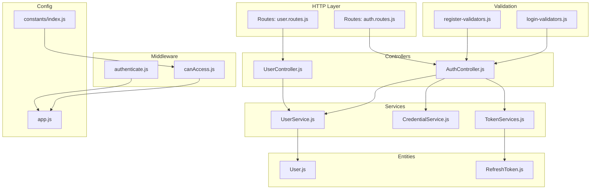
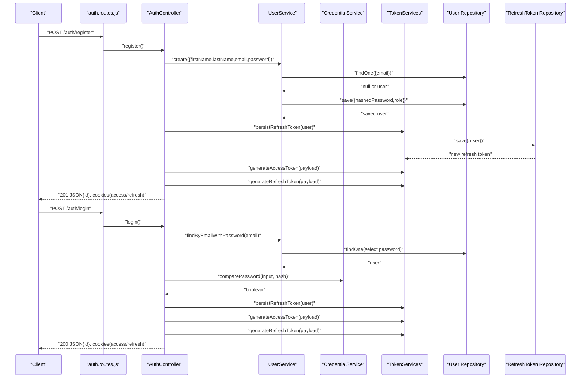
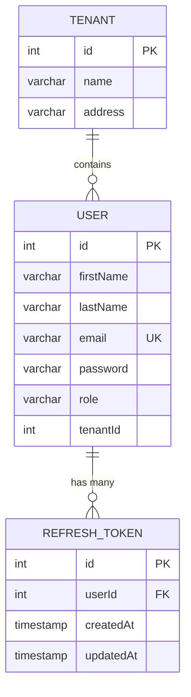
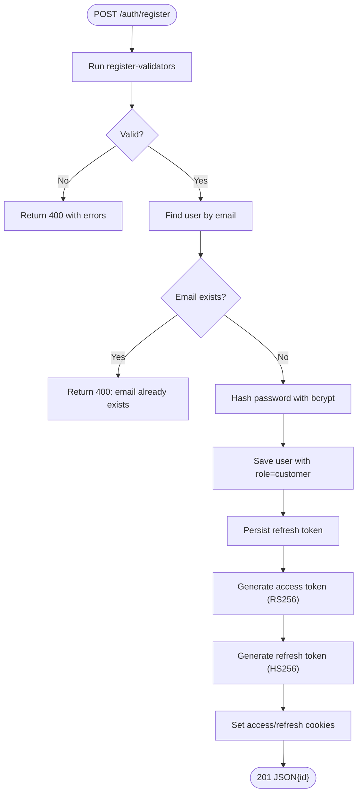
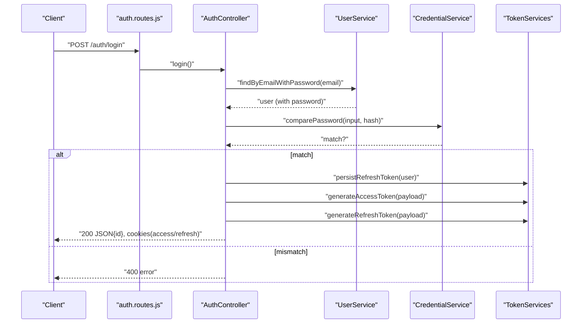
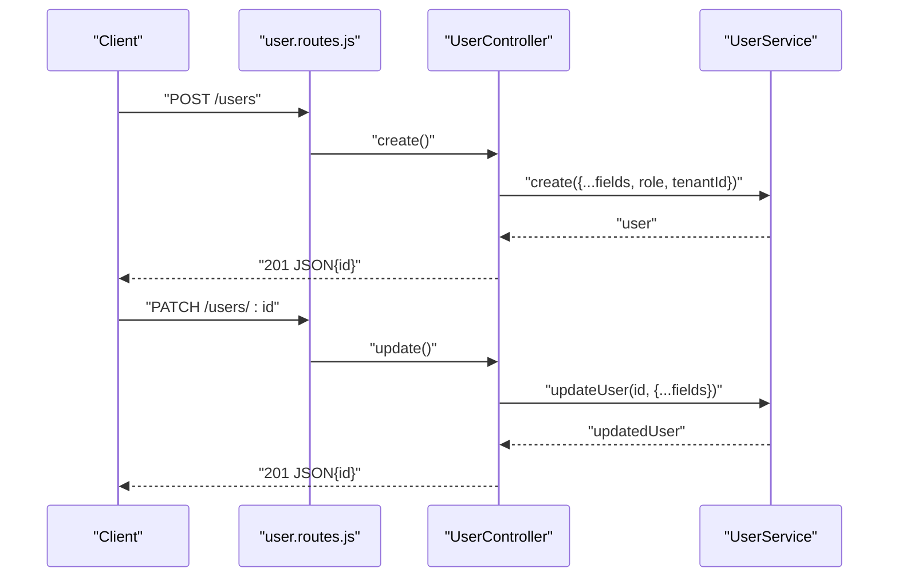
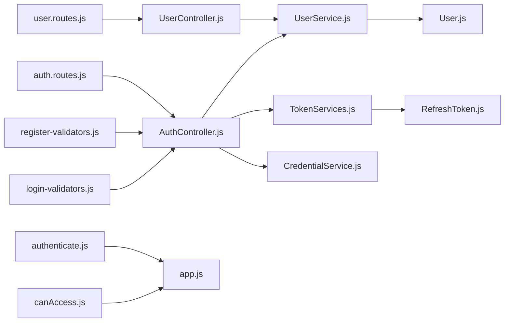

# User Management

<cite>
**Referenced Files in This Document**
- [src/entity/User.js](file://src/entity/User.js)
- [src/entity/RefreshToken.js](file://src/entity/RefreshToken.js)
- [src/controllers/UserController.js](file://src/controllers/UserController.js)
- [src/controllers/AuthController.js](file://src/controllers/AuthController.js)
- [src/services/UserService.js](file://src/services/UserService.js)
- [src/services/CredentialService.js](file://src/services/CredentialService.js)
- [src/services/TokenServices.js](file://src/services/TokenServices.js)
- [src/middleware/authenticate.js](file://src/middleware/authenticate.js)
- [src/middleware/canAccess.js](file://src/middleware/canAccess.js)
- [src/validators/register-validators.js](file://src/validators/register-validators.js)
- [src/validators/login-validators.js](file://src/validators/login-validators.js)
- [src/routes/user.routes.js](file://src/routes/user.routes.js)
- [src/routes/auth.routes.js](file://src/routes/auth.routes.js)
- [src/constants/index.js](file://src/constants/index.js)
- [src/app.js](file://src/app.js)
- [src/test/users/register.spec.js](file://src/test/users/register.spec.js)
- [src/test/users/login.spec.js](file://src/test/users/login.spec.js)
- [src/test/users/create.spec.js](file://src/test/users/create.spec.js)
</cite>

## Table of Contents
1. [Introduction](#introduction)
2. [Project Structure](#project-structure)
3. [Core Components](#core-components)
4. [Architecture Overview](#architecture-overview)
5. [Detailed Component Analysis](#detailed-component-analysis)
6. [Dependency Analysis](#dependency-analysis)
7. [Performance Considerations](#performance-considerations)
8. [Troubleshooting Guide](#troubleshooting-guide)
9. [Conclusion](#conclusion)
10. [Appendices](#appendices)

## Introduction
This document describes the user management functionality of the authentication service. It covers user registration (input validation, password hashing, role assignment), authentication (credential validation, JWT access and refresh tokens), the User entity schema, and CRUD operations via dedicated controllers and services. It also documents validation rules, error handling, security measures, privacy considerations, access control patterns, and integration points with other system components.

## Project Structure
The user management feature spans several layers:
- Routes define HTTP endpoints and apply middleware for authentication and authorization.
- Controllers handle request parsing, validation outcomes, and orchestrate service calls.
- Services encapsulate business logic, including password hashing, credential comparison, and persistence.
- Validators enforce input constraints using express-validator schemas.
- Middleware enforces JWT-based authentication and role-based access control.
- Entities define the User and RefreshToken relational model.
- Constants define roles used across the system.

**Diagram sources**
- [src/routes/user.routes.js:1-38](file://src/routes/user.routes.js#L1-L38)
- [src/routes/auth.routes.js](file://src/routes/auth.routes.js)
- [src/controllers/UserController.js:1-95](file://src/controllers/UserController.js#L1-L95)
- [src/controllers/AuthController.js:1-212](file://src/controllers/AuthController.js#L1-L212)
- [src/services/UserService.js:1-86](file://src/services/UserService.js#L1-L86)
- [src/services/CredentialService.js:1-7](file://src/services/CredentialService.js#L1-L7)
- [src/services/TokenServices.js:1-60](file://src/services/TokenServices.js#L1-L60)
- [src/validators/register-validators.js:1-47](file://src/validators/register-validators.js#L1-L47)
- [src/validators/login-validators.js:1-25](file://src/validators/login-validators.js#L1-L25)
- [src/middleware/authenticate.js:1-26](file://src/middleware/authenticate.js#L1-L26)
- [src/middleware/canAccess.js:1-18](file://src/middleware/canAccess.js#L1-L18)
- [src/entity/User.js:1-50](file://src/entity/User.js#L1-L50)
- [src/entity/RefreshToken.js:1-35](file://src/entity/RefreshToken.js#L1-L35)
- [src/constants/index.js:1-6](file://src/constants/index.js#L1-L6)
- [src/app.js:1-40](file://src/app.js#L1-L40)

**Section sources**
- [src/app.js:1-40](file://src/app.js#L1-L40)
- [src/routes/user.routes.js:1-38](file://src/routes/user.routes.js#L1-L38)
- [src/routes/auth.routes.js](file://src/routes/auth.routes.js)

## Core Components
- User entity: Defines fields, uniqueness constraints, and relationships to RefreshToken and Tenant.
- RefreshToken entity: Stores refresh tokens linked to users with timestamps.
- AuthController: Implements registration, login, token refresh, logout, and self-profile retrieval.
- UserController: Provides administrative endpoints for listing, retrieving, updating, and deleting users.
- UserService: Encapsulates user creation, lookup by email/password visibility, ID lookup, listing, and updates.
- CredentialService: Compares plaintext passwords against stored hashes.
- TokenService: Generates access and refresh tokens, persists refresh tokens, and deletes them.
- Validation schemas: Enforce registration and login input rules.
- Middleware: JWT authentication and role-based authorization.

**Section sources**
- [src/entity/User.js:1-50](file://src/entity/User.js#L1-L50)
- [src/entity/RefreshToken.js:1-35](file://src/entity/RefreshToken.js#L1-L35)
- [src/controllers/AuthController.js:1-212](file://src/controllers/AuthController.js#L1-L212)
- [src/controllers/UserController.js:1-95](file://src/controllers/UserController.js#L1-L95)
- [src/services/UserService.js:1-86](file://src/services/UserService.js#L1-L86)
- [src/services/CredentialService.js:1-7](file://src/services/CredentialService.js#L1-L7)
- [src/services/TokenServices.js:1-60](file://src/services/TokenServices.js#L1-L60)
- [src/validators/register-validators.js:1-47](file://src/validators/register-validators.js#L1-L47)
- [src/validators/login-validators.js:1-25](file://src/validators/login-validators.js#L1-L25)
- [src/middleware/authenticate.js:1-26](file://src/middleware/authenticate.js#L1-L26)
- [src/middleware/canAccess.js:1-18](file://src/middleware/canAccess.js#L1-L18)

## Architecture Overview
The user management architecture follows layered separation of concerns:
- HTTP routes bind endpoints to controllers.
- Controllers delegate to services for business logic.
- Services interact with repositories (TypeORM) to manage persistence.
- Middleware enforces authentication and authorization.
- Validators ensure request payloads meet defined constraints.

**Diagram sources**
- [src/routes/auth.routes.js](file://src/routes/auth.routes.js)
- [src/controllers/AuthController.js:19-136](file://src/controllers/AuthController.js#L19-L136)
- [src/services/UserService.js:7-54](file://src/services/UserService.js#L7-L54)
- [src/services/CredentialService.js:1-7](file://src/services/CredentialService.js#L1-L7)
- [src/services/TokenServices.js:45-58](file://src/services/TokenServices.js#L45-L58)
- [src/entity/User.js:1-50](file://src/entity/User.js#L1-L50)
- [src/entity/RefreshToken.js:1-35](file://src/entity/RefreshToken.js#L1-L35)

## Detailed Component Analysis

### User Entity Schema
The User entity defines the persisted representation of a user account:
- Fields: id (auto-increment PK), firstName, lastName, email (unique), password (hidden from queries), role, tenantId (nullable).
- Relationships:
  - One-to-many with RefreshToken via refreshTokens.
  - Many-to-one with Tenant via tenantId.

**Diagram sources**
- [src/entity/User.js:3-49](file://src/entity/User.js#L3-L49)
- [src/entity/RefreshToken.js:3-34](file://src/entity/RefreshToken.js#L3-L34)

**Section sources**
- [src/entity/User.js:1-50](file://src/entity/User.js#L1-L50)
- [src/entity/RefreshToken.js:1-35](file://src/entity/RefreshToken.js#L1-L35)

### Registration Flow
- Input validation: firstName, lastName, email, password validated via register-validators.
- Role assignment: Defaults to customer role during registration.
- Password hashing: bcrypt with salt rounds is applied before storage.
- Persistence: Unique email constraint enforced; duplicate emails produce a 400 error.
- Token issuance: Access and refresh tokens generated and returned as cookies.

**Diagram sources**
- [src/controllers/AuthController.js:19-70](file://src/controllers/AuthController.js#L19-L70)
- [src/services/UserService.js:7-38](file://src/services/UserService.js#L7-L38)
- [src/services/TokenServices.js:45-58](file://src/services/TokenServices.js#L45-L58)
- [src/validators/register-validators.js:1-47](file://src/validators/register-validators.js#L1-L47)

**Section sources**
- [src/controllers/AuthController.js:19-70](file://src/controllers/AuthController.js#L19-L70)
- [src/services/UserService.js:7-38](file://src/services/UserService.js#L7-L38)
- [src/services/TokenServices.js:45-58](file://src/services/TokenServices.js#L45-L58)
- [src/validators/register-validators.js:1-47](file://src/validators/register-validators.js#L1-L47)
- [src/constants/index.js:1-6](file://src/constants/index.js#L1-L6)

### Authentication Flow
- Input validation: email and password validated via login-validators.
- Credential verification: Retrieves user with password, compares plaintext vs stored hash.
- Token rotation: On successful login, a new refresh token is persisted and used to issue new access and refresh tokens.
- Response: Returns user id and sets access/refresh cookies.

**Diagram sources**
- [src/controllers/AuthController.js:72-136](file://src/controllers/AuthController.js#L72-L136)
- [src/services/UserService.js:48-54](file://src/services/UserService.js#L48-L54)
- [src/services/CredentialService.js:1-7](file://src/services/CredentialService.js#L1-L7)
- [src/services/TokenServices.js:45-58](file://src/services/TokenServices.js#L45-L58)
- [src/validators/login-validators.js:1-25](file://src/validators/login-validators.js#L1-L25)

**Section sources**
- [src/controllers/AuthController.js:72-136](file://src/controllers/AuthController.js#L72-L136)
- [src/services/UserService.js:48-54](file://src/services/UserService.js#L48-L54)
- [src/services/CredentialService.js:1-7](file://src/services/CredentialService.js#L1-L7)
- [src/services/TokenServices.js:45-58](file://src/services/TokenServices.js#L45-L58)
- [src/validators/login-validators.js:1-25](file://src/validators/login-validators.js#L1-L25)

### User CRUD Operations
Administrative endpoints:
- POST /users: Requires authentication and admin role; creates a user with provided fields and optional tenantId.
- GET /users: Lists all users; requires admin role.
- GET /users/:id: Retrieves a user by id; requires authentication.
- PATCH /users/:id: Updates a user by id; requires admin role.
- DELETE /users/:id: Deletes a user by id; requires admin role.

**Diagram sources**
- [src/routes/user.routes.js:15-35](file://src/routes/user.routes.js#L15-L35)
- [src/controllers/UserController.js:12-95](file://src/controllers/UserController.js#L12-L95)
- [src/services/UserService.js:68-84](file://src/services/UserService.js#L68-L84)

**Section sources**
- [src/routes/user.routes.js:15-35](file://src/routes/user.routes.js#L15-L35)
- [src/controllers/UserController.js:12-95](file://src/controllers/UserController.js#L12-L95)
- [src/services/UserService.js:68-84](file://src/services/UserService.js#L68-L84)

### Validation Rules and Error Handling
- Registration:
  - firstName: required, trimmed, length 2–50.
  - lastName: required, trimmed, length 2–50.
  - email: required, normalized, valid format.
  - password: required, minimum 8 characters.
- Login:
  - email: required, normalized, valid format.
  - password: required, minimum 8 characters.
- Errors:
  - Validation failures return 400 with structured errors.
  - Duplicate email returns 400.
  - General persistence/update errors return 500.
  - Authentication middleware returns 401/403 for invalid/expired tokens or insufficient permissions.

**Section sources**
- [src/validators/register-validators.js:1-47](file://src/validators/register-validators.js#L1-L47)
- [src/validators/login-validators.js:1-25](file://src/validators/login-validators.js#L1-L25)
- [src/controllers/UserController.js:56-59](file://src/controllers/UserController.js#L56-L59)
- [src/services/UserService.js:13-16](file://src/services/UserService.js#L13-L16)
- [src/middleware/authenticate.js:1-26](file://src/middleware/authenticate.js#L1-L26)
- [src/middleware/canAccess.js:1-18](file://src/middleware/canAccess.js#L1-L18)

### Security Measures
- Password hashing: bcrypt with salt rounds ensures irreversible storage.
- Access token signing: RS256 with a private key; short-lived access tokens.
- Refresh token signing: HS256 with a shared secret; persisted in DB with rotation on refresh.
- Secure cookies: httpOnly and SameSite strict; configurable domain.
- Authentication: express-jwt validates RS256 tokens from JWKS URI.
- Authorization: role-based gating via canAccess middleware.

**Section sources**
- [src/services/UserService.js:17-18](file://src/services/UserService.js#L17-L18)
- [src/services/TokenServices.js:12-43](file://src/services/TokenServices.js#L12-L43)
- [src/middleware/authenticate.js:1-26](file://src/middleware/authenticate.js#L1-L26)
- [src/middleware/canAccess.js:1-18](file://src/middleware/canAccess.js#L1-L18)
- [src/controllers/AuthController.js:50-62](file://src/controllers/AuthController.js#L50-L62)
- [src/controllers/AuthController.js:116-129](file://src/controllers/AuthController.js#L116-L129)

### Practical Examples
- Create a user:
  - Endpoint: POST /auth/register
  - Body: { firstName, lastName, email, password }
  - Behavior: Validates inputs, hashes password, assigns role customer, persists user, issues access/refresh tokens.
  - Expected response: 201 JSON with user id; cookies set.
  - Reference test: [src/test/users/register.spec.js:56-78](file://src/test/users/register.spec.js#L56-L78)
- Login:
  - Endpoint: POST /auth/login
  - Body: { email, password }
  - Behavior: Validates inputs, checks credentials, rotates refresh token, issues new tokens.
  - Expected response: 200 JSON with user id; cookies set.
  - Reference test: [src/test/users/login.spec.js:62-74](file://src/test/users/login.spec.js#L62-L74)
- List users (admin):
  - Endpoint: GET /users
  - Headers: Cookie with access token
  - Behavior: Requires admin role; returns array of users.
  - Reference test: [src/test/users/create.spec.js:31-36](file://src/test/users/create.spec.js#L31-L36)
- Retrieve user by id:
  - Endpoint: GET /users/:id
  - Headers: Cookie with access token
  - Behavior: Requires authentication; returns user id.
  - Implementation: [src/controllers/UserController.js:43-52](file://src/controllers/UserController.js#L43-L52)
- Update user (admin):
  - Endpoint: PATCH /users/:id
  - Headers: Cookie with access token
  - Body: { firstName, lastName, email, role, tenantId }
  - Behavior: Requires admin role; updates user record.
  - Implementation: [src/controllers/UserController.js:54-77](file://src/controllers/UserController.js#L54-L77)
- Delete user (admin):
  - Endpoint: DELETE /users/:id
  - Headers: Cookie with access token
  - Behavior: Requires admin role; deletes user.
  - Implementation: [src/controllers/UserController.js:79-94](file://src/controllers/UserController.js#L79-L94)

**Section sources**
- [src/test/users/register.spec.js:56-138](file://src/test/users/register.spec.js#L56-L138)
- [src/test/users/login.spec.js:62-90](file://src/test/users/login.spec.js#L62-L90)
- [src/test/users/create.spec.js:31-36](file://src/test/users/create.spec.js#L31-L36)
- [src/controllers/UserController.js:43-94](file://src/controllers/UserController.js#L43-L94)

### Access Control Patterns
- authenticate middleware validates RS256 JWT from Authorization header or accessToken cookie.
- canAccess middleware restricts endpoints to specific roles (e.g., ADMIN).
- Self profile endpoint retrieves current user based on auth claims.

**Section sources**
- [src/middleware/authenticate.js:1-26](file://src/middleware/authenticate.js#L1-L26)
- [src/middleware/canAccess.js:1-18](file://src/middleware/canAccess.js#L1-L18)
- [src/controllers/AuthController.js:138-141](file://src/controllers/AuthController.js#L138-L141)

### Privacy Considerations
- Passwords are hashed and never exposed in queries; the User entity marks password as non-selectable by default.
- Access tokens are short-lived; refresh tokens are persisted server-side and rotated on refresh.
- Cookies are httpOnly and SameSite strict to mitigate XSS and CSRF risks.

**Section sources**
- [src/entity/User.js:23-26](file://src/entity/User.js#L23-L26)
- [src/services/TokenServices.js:45-58](file://src/services/TokenServices.js#L45-L58)
- [src/controllers/AuthController.js:50-62](file://src/controllers/AuthController.js#L50-L62)

## Dependency Analysis
Key dependencies and relationships:
- Routes depend on controllers and middleware.
- Controllers depend on services and validators.
- Services depend on repositories and external libraries (bcrypt, jsonwebtoken, jwks-rsa).
- Entities define relationships and constraints.
- Middleware depends on configuration for JWKS and secrets.

**Diagram sources**
- [src/routes/user.routes.js:1-38](file://src/routes/user.routes.js#L1-L38)
- [src/routes/auth.routes.js](file://src/routes/auth.routes.js)
- [src/controllers/UserController.js:1-95](file://src/controllers/UserController.js#L1-L95)
- [src/controllers/AuthController.js:1-212](file://src/controllers/AuthController.js#L1-L212)
- [src/services/UserService.js:1-86](file://src/services/UserService.js#L1-L86)
- [src/services/TokenServices.js:1-60](file://src/services/TokenServices.js#L1-L60)
- [src/services/CredentialService.js:1-7](file://src/services/CredentialService.js#L1-L7)
- [src/middleware/authenticate.js:1-26](file://src/middleware/authenticate.js#L1-L26)
- [src/middleware/canAccess.js:1-18](file://src/middleware/canAccess.js#L1-L18)
- [src/validators/register-validators.js:1-47](file://src/validators/register-validators.js#L1-L47)
- [src/validators/login-validators.js:1-25](file://src/validators/login-validators.js#L1-L25)
- [src/entity/User.js:1-50](file://src/entity/User.js#L1-L50)
- [src/entity/RefreshToken.js:1-35](file://src/entity/RefreshToken.js#L1-L35)
- [src/app.js:1-40](file://src/app.js#L1-L40)

**Section sources**
- [src/app.js:1-40](file://src/app.js#L1-L40)
- [src/routes/user.routes.js:1-38](file://src/routes/user.routes.js#L1-L38)
- [src/routes/auth.routes.js](file://src/routes/auth.routes.js)

## Performance Considerations
- Password hashing cost: Salt rounds are configured in the service; adjust based on hardware capacity.
- Token operations: Persisting refresh tokens adds DB round-trips; consider caching frequently accessed user roles if needed.
- Validation overhead: express-validator schemas run before controller logic; keep rules minimal and efficient.
- Database indexing: Ensure unique indexes exist on email and tenantId for fast lookups.

[No sources needed since this section provides general guidance]

## Troubleshooting Guide
Common issues and resolutions:
- 400 Bad Request on registration:
  - Cause: Validation failure or duplicate email.
  - Resolution: Verify firstName/lastName/email/password meet constraints; ensure email is unique.
  - References: [src/validators/register-validators.js:1-47](file://src/validators/register-validators.js#L1-L47), [src/services/UserService.js:13-16](file://src/services/UserService.js#L13-L16)
- 400 Bad Request on login:
  - Cause: Invalid credentials or malformed payload.
  - Resolution: Confirm email and password lengths and formats; ensure user exists with password.
  - References: [src/validators/login-validators.js:1-25](file://src/validators/login-validators.js#L1-L25), [src/services/UserService.js:48-54](file://src/services/UserService.js#L48-L54)
- 401 Unauthorized:
  - Cause: Missing or invalid access token.
  - Resolution: Ensure Authorization header or accessToken cookie is present and valid.
  - References: [src/middleware/authenticate.js:1-26](file://src/middleware/authenticate.js#L1-L26)
- 403 Forbidden:
  - Cause: Insufficient role for protected endpoints.
  - Resolution: Use admin credentials for admin-only routes.
  - References: [src/middleware/canAccess.js:1-18](file://src/middleware/canAccess.js#L1-L18)
- 500 Internal Server Error:
  - Cause: Database or key loading failures.
  - Resolution: Check private key availability and DB connectivity.
  - References: [src/services/TokenServices.js:16-23](file://src/services/TokenServices.js#L16-L23), [src/services/UserService.js:32-37](file://src/services/UserService.js#L32-L37)

**Section sources**
- [src/validators/register-validators.js:1-47](file://src/validators/register-validators.js#L1-L47)
- [src/validators/login-validators.js:1-25](file://src/validators/login-validators.js#L1-L25)
- [src/services/UserService.js:13-16](file://src/services/UserService.js#L13-L16)
- [src/services/UserService.js:32-37](file://src/services/UserService.js#L32-L37)
- [src/middleware/authenticate.js:1-26](file://src/middleware/authenticate.js#L1-L26)
- [src/middleware/canAccess.js:1-18](file://src/middleware/canAccess.js#L1-L18)
- [src/services/TokenServices.js:16-23](file://src/services/TokenServices.js#L16-L23)

## Conclusion
The user management subsystem provides robust registration, authentication, and administrative CRUD operations with strong validation, secure credential handling, and clear access control. The layered design promotes maintainability and testability, while JWT-based tokens and cookie policies support modern web security practices.

[No sources needed since this section summarizes without analyzing specific files]

## Appendices

### API Endpoints Summary
- POST /auth/register
  - Body: { firstName, lastName, email, password }
  - Response: 201 JSON { id }; cookies: accessToken, refreshToken
  - Validation: register-validators
- POST /auth/login
  - Body: { email, password }
  - Response: 200 JSON { id }; cookies: accessToken, refreshToken
  - Validation: login-validators
- GET /users
  - Response: 200 JSON { users }
  - Auth: authenticate, canAccess([ADMIN])
- GET /users/:id
  - Response: 200 JSON { id }
  - Auth: authenticate
- PATCH /users/:id
  - Body: { firstName, lastName, email, role, tenantId }
  - Response: 201 JSON { id }
  - Auth: authenticate, canAccess([ADMIN])
- DELETE /users/:id
  - Response: 201 JSON { id }
  - Auth: authenticate, canAccess([ADMIN])

**Section sources**
- [src/routes/auth.routes.js](file://src/routes/auth.routes.js)
- [src/routes/user.routes.js:15-35](file://src/routes/user.routes.js#L15-L35)
- [src/validators/register-validators.js:1-47](file://src/validators/register-validators.js#L1-L47)
- [src/validators/login-validators.js:1-25](file://src/validators/login-validators.js#L1-L25)
- [src/middleware/authenticate.js:1-26](file://src/middleware/authenticate.js#L1-L26)
- [src/middleware/canAccess.js:1-18](file://src/middleware/canAccess.js#L1-L18)