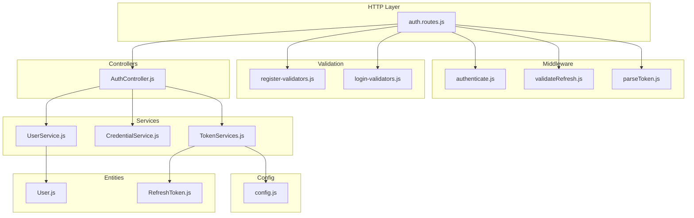
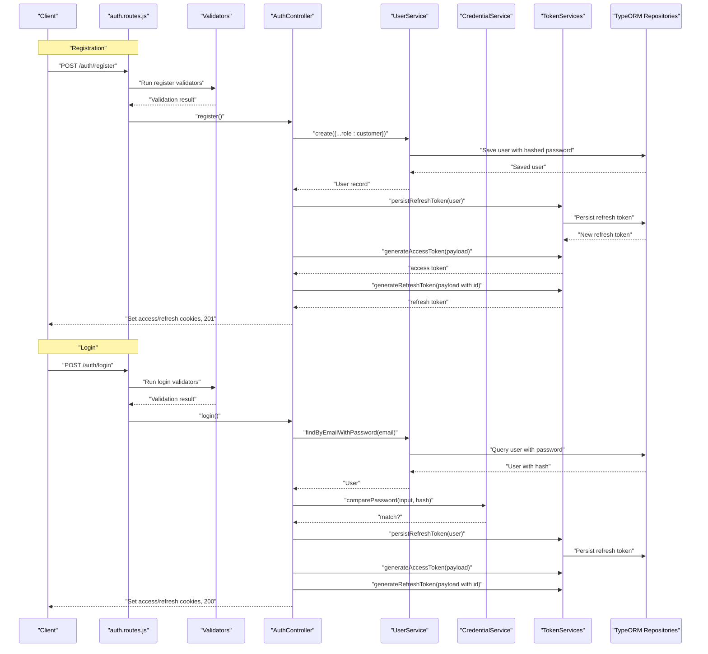
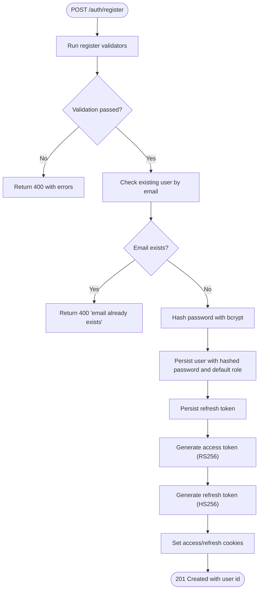
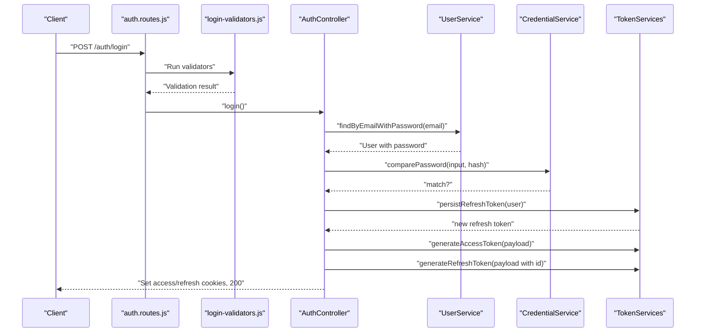
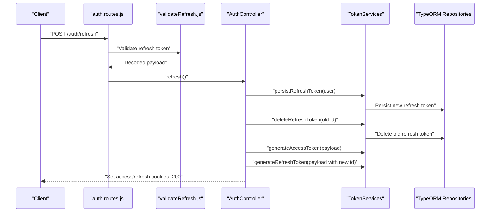
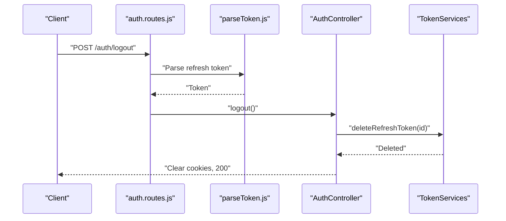
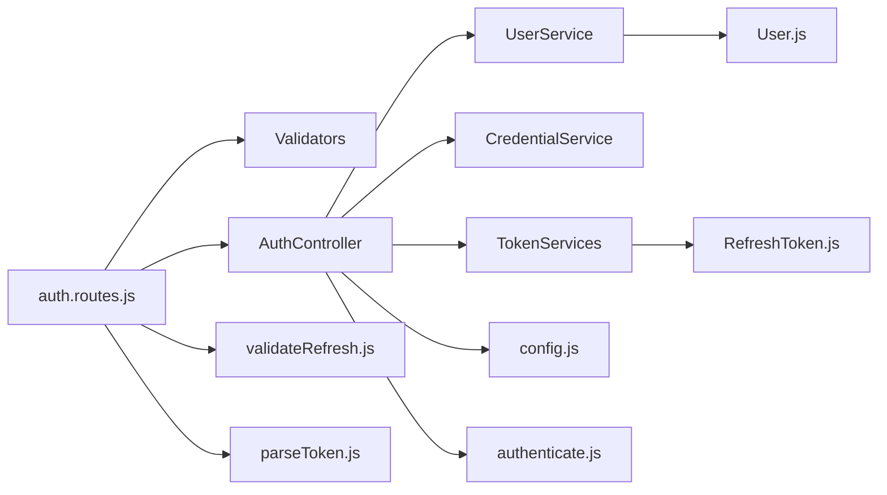
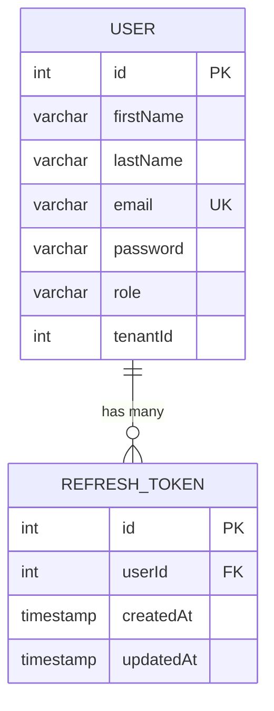

# User Registration and Authentication

<cite>
**Referenced Files in This Document**
- [AuthController.js](file://src/controllers/AuthController.js)
- [UserService.js](file://src/services/UserService.js)
- [CredentialService.js](file://src/services/CredentialService.js)
- [TokenServices.js](file://src/services/TokenServices.js)
- [register-validators.js](file://src/validators/register-validators.js)
- [login-validators.js](file://src/validators/login-validators.js)
- [auth.routes.js](file://src/routes/auth.routes.js)
- [authenticate.js](file://src/middleware/authenticate.js)
- [validateRefresh.js](file://src/middleware/validateRefresh.js)
- [parseToken.js](file://src/middleware/parseToken.js)
- [config.js](file://src/config/config.js)
- [index.js](file://src/constants/index.js)
- [User.js](file://src/entity/User.js)
- [RefreshToken.js](file://src/entity/RefreshToken.js)
- [README.md](file://README.md)
</cite>

## Table of Contents
1. [Introduction](#introduction)
2. [Project Structure](#project-structure)
3. [Core Components](#core-components)
4. [Architecture Overview](#architecture-overview)
5. [Detailed Component Analysis](#detailed-component-analysis)
6. [Dependency Analysis](#dependency-analysis)
7. [Performance Considerations](#performance-considerations)
8. [Troubleshooting Guide](#troubleshooting-guide)
9. [Conclusion](#conclusion)
10. [Appendices](#appendices)

## Introduction
This document explains the user registration and authentication system implemented in the backend service. It covers the complete registration workflow (input validation, password hashing, default role assignment), the login flow (credential verification, JWT access token generation, refresh token lifecycle), and the supporting infrastructure (validators, middleware, services, repositories, and entities). Practical examples, error handling scenarios, security measures, and integration patterns are included to help developers implement and troubleshoot authentication reliably.

## Project Structure
The authentication module is organized around controllers, services, validators, middleware, routes, entities, and configuration. The routes define endpoints for registration, login, profile retrieval, token refresh, and logout. Controllers orchestrate validation, service calls, and response handling. Services encapsulate business logic for user persistence, credential comparison, and token signing/rotation. Validators enforce input constraints. Middleware handles JWT parsing and validation. Entities model the database schema for users and refresh tokens.

**Diagram sources**
- [auth.routes.js:1-49](file://src/routes/auth.routes.js#L1-L49)
- [AuthController.js:1-212](file://src/controllers/AuthController.js#L1-L212)
- [UserService.js:1-99](file://src/services/UserService.js#L1-L99)
- [CredentialService.js:1-7](file://src/services/CredentialService.js#L1-L7)
- [TokenServices.js:1-60](file://src/services/TokenServices.js#L1-L60)
- [register-validators.js:1-47](file://src/validators/register-validators.js#L1-L47)
- [login-validators.js:1-25](file://src/validators/login-validators.js#L1-L25)
- [authenticate.js:1-26](file://src/middleware/authenticate.js#L1-L26)
- [validateRefresh.js:1-34](file://src/middleware/validateRefresh.js#L1-L34)
- [parseToken.js:1-14](file://src/middleware/parseToken.js#L1-L14)
- [User.js:1-50](file://src/entity/User.js#L1-L50)
- [RefreshToken.js:1-35](file://src/entity/RefreshToken.js#L1-L35)
- [config.js:1-34](file://src/config/config.js#L1-L34)

**Section sources**
- [auth.routes.js:1-49](file://src/routes/auth.routes.js#L1-L49)
- [README.md:1-8](file://README.md#L1-L8)

## Core Components
- AuthController: Implements registration, login, profile retrieval, token refresh, and logout. It coordinates validation, service calls, and cookie-based token delivery.
- UserService: Handles user creation, existence checks, email lookup with password, and ID-based retrieval. Uses bcrypt for password hashing.
- CredentialService: Compares plaintext passwords against stored hashes using bcrypt.
- TokenServices: Generates RS256-signed access tokens and HS256-signed refresh tokens, persists refresh tokens, and deletes them on logout.
- Validators: Enforce input constraints for registration and login via express-validator.
- Middleware: authenticate parses and validates access tokens; validateRefresh verifies refresh tokens and checks revocation; parseToken extracts refresh tokens for logout.
- Entities: Define the User and RefreshToken tables and their relationships.
- Configuration: Loads environment variables for secrets and JWKS URI.

**Section sources**
- [AuthController.js:1-212](file://src/controllers/AuthController.js#L1-L212)
- [UserService.js:1-99](file://src/services/UserService.js#L1-L99)
- [CredentialService.js:1-7](file://src/services/CredentialService.js#L1-L7)
- [TokenServices.js:1-60](file://src/services/TokenServices.js#L1-L60)
- [register-validators.js:1-47](file://src/validators/register-validators.js#L1-L47)
- [login-validators.js:1-25](file://src/validators/login-validators.js#L1-L25)
- [authenticate.js:1-26](file://src/middleware/authenticate.js#L1-L26)
- [validateRefresh.js:1-34](file://src/middleware/validateRefresh.js#L1-L34)
- [parseToken.js:1-14](file://src/middleware/parseToken.js#L1-L14)
- [User.js:1-50](file://src/entity/User.js#L1-L50)
- [RefreshToken.js:1-35](file://src/entity/RefreshToken.js#L1-L35)
- [config.js:1-34](file://src/config/config.js#L1-L34)

## Architecture Overview
The authentication flow integrates route handlers, validation, controller actions, services, middleware, and persistence. Access tokens are RS256-signed and validated via JWKS; refresh tokens are HS256-signed and persisted to a dedicated table with revocation checks.

**Diagram sources**
- [auth.routes.js:29-35](file://src/routes/auth.routes.js#L29-L35)
- [register-validators.js:1-47](file://src/validators/register-validators.js#L1-L47)
- [login-validators.js:1-25](file://src/validators/login-validators.js#L1-L25)
- [AuthController.js:19-70](file://src/controllers/AuthController.js#L19-L70)
- [AuthController.js:72-136](file://src/controllers/AuthController.js#L72-L136)
- [UserService.js:7-38](file://src/services/UserService.js#L7-L38)
- [CredentialService.js:3-5](file://src/services/CredentialService.js#L3-L5)
- [TokenServices.js:45-58](file://src/services/TokenServices.js#L45-L58)

## Detailed Component Analysis

### Registration Workflow
- Input validation: firstName, lastName, email, password enforced with length and format rules; email normalization applied.
- Password hashing: bcrypt with a fixed salt round count is used to hash the password before storage.
- Role assignment: New users are assigned the default role.
- Token issuance: On successful registration, a refresh token is persisted and both access and refresh tokens are returned via cookies.
- Response: Returns user id and HTTP 201 on success.

**Diagram sources**
- [register-validators.js:1-47](file://src/validators/register-validators.js#L1-L47)
- [UserService.js:7-38](file://src/services/UserService.js#L7-L38)
- [AuthController.js:19-70](file://src/controllers/AuthController.js#L19-L70)
- [TokenServices.js:45-58](file://src/services/TokenServices.js#L45-L58)

**Section sources**
- [register-validators.js:1-47](file://src/validators/register-validators.js#L1-L47)
- [UserService.js:7-38](file://src/services/UserService.js#L7-L38)
- [AuthController.js:19-70](file://src/controllers/AuthController.js#L19-L70)
- [index.js:1-6](file://src/constants/index.js#L1-L6)

### Login Workflow
- Input validation: email and password required and minimally checked.
- Credential verification: fetches user with password, compares input against stored hash.
- Token issuance: refresh token persisted, then new access and refresh tokens generated and returned via cookies.
- Response: Returns user id and HTTP 200 on success.

**Diagram sources**
- [login-validators.js:1-25](file://src/validators/login-validators.js#L1-L25)
- [AuthController.js:72-136](file://src/controllers/AuthController.js#L72-L136)
- [UserService.js:48-54](file://src/services/UserService.js#L48-L54)
- [CredentialService.js:3-5](file://src/services/CredentialService.js#L3-L5)
- [TokenServices.js:45-58](file://src/services/TokenServices.js#L45-L58)

**Section sources**
- [login-validators.js:1-25](file://src/validators/login-validators.js#L1-L25)
- [AuthController.js:72-136](file://src/controllers/AuthController.js#L72-L136)
- [UserService.js:48-54](file://src/services/UserService.js#L48-L54)
- [CredentialService.js:3-5](file://src/services/CredentialService.js#L3-L5)

### Token Management and Refresh Flow
- Access tokens: RS256-signed with a private key; validated via JWKS in middleware.
- Refresh tokens: HS256-signed with a shared secret; persisted in the refresh token table; validated with revocation checks.
- Refresh endpoint: Validates refresh token, rotates tokens by persisting a new refresh token, deleting the old one, and issuing new access and refresh tokens.
- Logout endpoint: Parses refresh token, deletes it from the database, clears cookies.

**Diagram sources**
- [auth.routes.js:41-43](file://src/routes/auth.routes.js#L41-L43)
- [validateRefresh.js:7-31](file://src/middleware/validateRefresh.js#L7-L31)
- [AuthController.js:143-192](file://src/controllers/AuthController.js#L143-L192)
- [TokenServices.js:45-58](file://src/services/TokenServices.js#L45-L58)

**Section sources**
- [TokenServices.js:12-58](file://src/services/TokenServices.js#L12-L58)
- [validateRefresh.js:1-34](file://src/middleware/validateRefresh.js#L1-L34)
- [AuthController.js:143-192](file://src/controllers/AuthController.js#L143-L192)

### Logout Flow
- Parses refresh token from cookies.
- Deletes the refresh token from the database.
- Clears access and refresh cookies.
- Returns success message.

**Diagram sources**
- [auth.routes.js:44-46](file://src/routes/auth.routes.js#L44-L46)
- [parseToken.js:4-11](file://src/middleware/parseToken.js#L4-L11)
- [AuthController.js:194-210](file://src/controllers/AuthController.js#L194-L210)
- [TokenServices.js:54-58](file://src/services/TokenServices.js#L54-L58)

**Section sources**
- [auth.routes.js:44-46](file://src/routes/auth.routes.js#L44-L46)
- [parseToken.js:1-14](file://src/middleware/parseToken.js#L1-L14)
- [AuthController.js:194-210](file://src/controllers/AuthController.js#L194-L210)
- [TokenServices.js:54-58](file://src/services/TokenServices.js#L54-L58)

### Validation Rules and Sanitization
- Registration:
  - firstName: required, trimmed, length between configured bounds.
  - lastName: required, trimmed, length between configured bounds.
  - email: required, normalized to lowercase with domain normalization.
  - password: required, minimum length enforced.
- Login:
  - email: required, normalized email.
  - password: required, minimum length enforced.

These rules are enforced by express-validator schemas and surfaced as structured validation errors when violated.

**Section sources**
- [register-validators.js:1-47](file://src/validators/register-validators.js#L1-L47)
- [login-validators.js:1-25](file://src/validators/login-validators.js#L1-L25)

### Security Measures
- Password encryption: bcrypt hashing with a fixed salt round count ensures irreversible password storage.
- Input sanitization: email normalization reduces variability and prevents trivial spoofing.
- Access token validation: RS256 with JWKS-based secret management enables robust access token verification.
- Refresh token lifecycle: HS256-signed tokens with persistence and revocation checks; rotation on refresh and logout.
- Cookie security: httpOnly and SameSite strict flags mitigate XSS and CSRF risks; maxAge controls TTL.
- Environment-driven secrets: Private keys and shared secrets loaded from environment variables.

**Section sources**
- [UserService.js:17-18](file://src/services/UserService.js#L17-L18)
- [register-validators.js:28](file://src/validators/register-validators.js#L28)
- [login-validators.js:6](file://src/validators/login-validators.js#L6)
- [authenticate.js:6-25](file://src/middleware/authenticate.js#L6-L25)
- [validateRefresh.js:7-31](file://src/middleware/validateRefresh.js#L7-L31)
- [TokenServices.js:12-43](file://src/services/TokenServices.js#L12-L43)
- [AuthController.js:50-62](file://src/controllers/AuthController.js#L50-L62)
- [AuthController.js:115-129](file://src/controllers/AuthController.js#L115-L129)
- [AuthController.js:171-185](file://src/controllers/AuthController.js#L171-L185)
- [config.js:11-33](file://src/config/config.js#L11-L33)

### Practical Examples

- Registration Request
  - Endpoint: POST /auth/register
  - Body fields: firstName, lastName, email, password
  - Example fields: "firstName":"Alex","lastName":"Smith","email":"alex.smith@example.com","password":"SecurePass123"
  - Expected response: 201 with user id

- Authentication Response
  - Endpoint: POST /auth/login
  - Body fields: email, password
  - Successful response: 200 with user id; sets access and refresh cookies

- Refresh Token Response
  - Endpoint: POST /auth/refresh
  - Cookie: refreshToken
  - Successful response: 200 with user id; sets new access and refresh cookies

- Logout Response
  - Endpoint: POST /auth/logout
  - Cookie: refreshToken
  - Successful response: 200 with success message; clears cookies

- Error Scenarios
  - Validation errors: 400 with array of validation errors
  - Duplicate email: 400 during registration
  - Invalid credentials: 400 during login
  - Token not found or revoked: 400 during refresh
  - Internal errors: 500 with generic messages

**Section sources**
- [auth.routes.js:29-46](file://src/routes/auth.routes.js#L29-L46)
- [AuthController.js:19-70](file://src/controllers/AuthController.js#L19-L70)
- [AuthController.js:72-136](file://src/controllers/AuthController.js#L72-L136)
- [AuthController.js:143-192](file://src/controllers/AuthController.js#L143-L192)
- [AuthController.js:194-210](file://src/controllers/AuthController.js#L194-L210)

### Integration Patterns
- Frontend integration: Submit registration/login forms to the endpoints; store access/refresh cookies securely; send Authorization header with bearer tokens for protected routes; use refresh endpoint transparently when access tokens expire.
- Backend-to-backend: Use the self endpoint (/auth/self) behind authenticate middleware to retrieve current user claims after validating access tokens.
- Tenant-awareness: User entity supports optional tenant association; pass tenantId during registration if applicable.

**Section sources**
- [auth.routes.js:37-39](file://src/routes/auth.routes.js#L37-L39)
- [User.js:30-33](file://src/entity/User.js#L30-L33)

## Dependency Analysis
The system exhibits clear separation of concerns:
- Routes depend on validators, controllers, and middleware.
- Controllers depend on services and configuration.
- Services depend on repositories and external libraries (bcrypt, jsonwebtoken).
- Middleware depends on configuration and repositories for token validation and revocation.
- Entities define persistence contracts for users and refresh tokens.

**Diagram sources**
- [auth.routes.js:1-49](file://src/routes/auth.routes.js#L1-L49)
- [AuthController.js:1-212](file://src/controllers/AuthController.js#L1-L212)
- [UserService.js:1-99](file://src/services/UserService.js#L1-L99)
- [CredentialService.js:1-7](file://src/services/CredentialService.js#L1-L7)
- [TokenServices.js:1-60](file://src/services/TokenServices.js#L1-L60)
- [authenticate.js:1-26](file://src/middleware/authenticate.js#L1-L26)
- [validateRefresh.js:1-34](file://src/middleware/validateRefresh.js#L1-L34)
- [parseToken.js:1-14](file://src/middleware/parseToken.js#L1-L14)
- [User.js:1-50](file://src/entity/User.js#L1-L50)
- [RefreshToken.js:1-35](file://src/entity/RefreshToken.js#L1-L35)
- [config.js:1-34](file://src/config/config.js#L1-L34)

**Section sources**
- [auth.routes.js:1-49](file://src/routes/auth.routes.js#L1-L49)
- [AuthController.js:1-212](file://src/controllers/AuthController.js#L1-L212)
- [UserService.js:1-99](file://src/services/UserService.js#L1-L99)
- [TokenServices.js:1-60](file://src/services/TokenServices.js#L1-L60)

## Performance Considerations
- Password hashing cost: bcrypt salt rounds are fixed; adjust according to hardware capacity to balance security and latency.
- Token signing: RS256 requires filesystem access to private key; ensure file permissions and caching are configured to avoid repeated reads.
- Validation overhead: express-validator schemas are lightweight; keep rules minimal and targeted.
- Database queries: findOne and save operations are O(1) with proper indexing; ensure unique indexes on email and refresh token ids.
- Cookie sizes: Keep token payloads small to minimize cookie overhead.

[No sources needed since this section provides general guidance]

## Troubleshooting Guide
- Registration fails with validation errors:
  - Verify input matches validator rules (length, format, presence).
  - Check for duplicate emails before attempting registration.
- Registration fails with duplicate email:
  - Ensure uniqueness constraint is enforced and handle 400 responses gracefully.
- Login fails with invalid credentials:
  - Confirm email normalization and password length requirements.
  - Verify that the user exists and the password hash matches.
- Access token rejected:
  - Ensure Authorization header uses Bearer scheme and token is unexpired.
  - Confirm JWKS URI and algorithm alignment.
- Refresh token invalid or revoked:
  - Confirm refresh cookie is present and not expired.
  - Check that the refresh token exists in the database and is associated with the user.
- Logout does not clear session:
  - Ensure refresh cookie is sent; confirm deletion succeeds and cookies are cleared.
- Internal errors:
  - Review logs for database write failures or missing private key.

**Section sources**
- [register-validators.js:1-47](file://src/validators/register-validators.js#L1-L47)
- [login-validators.js:1-25](file://src/validators/login-validators.js#L1-L25)
- [UserService.js:13-16](file://src/services/UserService.js#L13-L16)
- [CredentialService.js:3-5](file://src/services/CredentialService.js#L3-L5)
- [authenticate.js:6-25](file://src/middleware/authenticate.js#L6-L25)
- [validateRefresh.js:14-30](file://src/middleware/validateRefresh.js#L14-L30)
- [TokenServices.js:16-23](file://src/services/TokenServices.js#L16-L23)

## Conclusion
The authentication system provides a secure, modular foundation for user registration and login. It enforces strong input validation, uses industry-standard cryptographic practices for password hashing and token signing, and implements robust refresh and logout flows. By following the documented patterns and troubleshooting steps, teams can integrate and maintain the authentication service effectively.

[No sources needed since this section summarizes without analyzing specific files]

## Appendices

### Data Model Overview

**Diagram sources**
- [User.js:3-48](file://src/entity/User.js#L3-L48)
- [RefreshToken.js:3-34](file://src/entity/RefreshToken.js#L3-L34)

### Configuration Reference
- Required environment variables:
  - PRIVATE_KEY_SECRET: Shared secret for HS256 refresh tokens.
  - JWKS_URI: URL for public keys to validate access tokens.
  - NODE_ENV: Controls environment-specific .env loading.

**Section sources**
- [config.js:11-33](file://src/config/config.js#L11-L33)